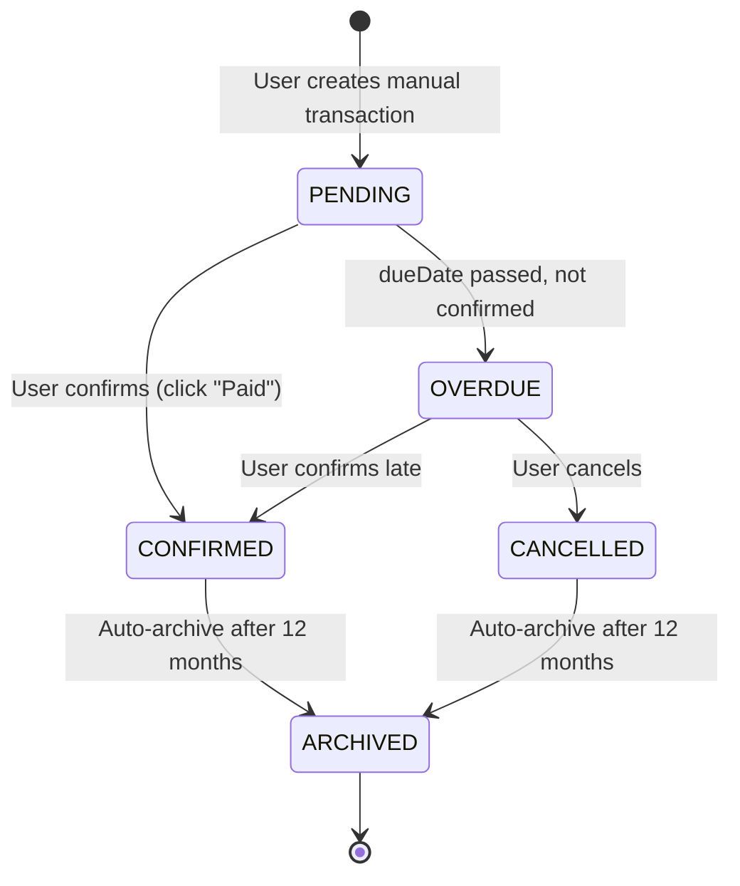
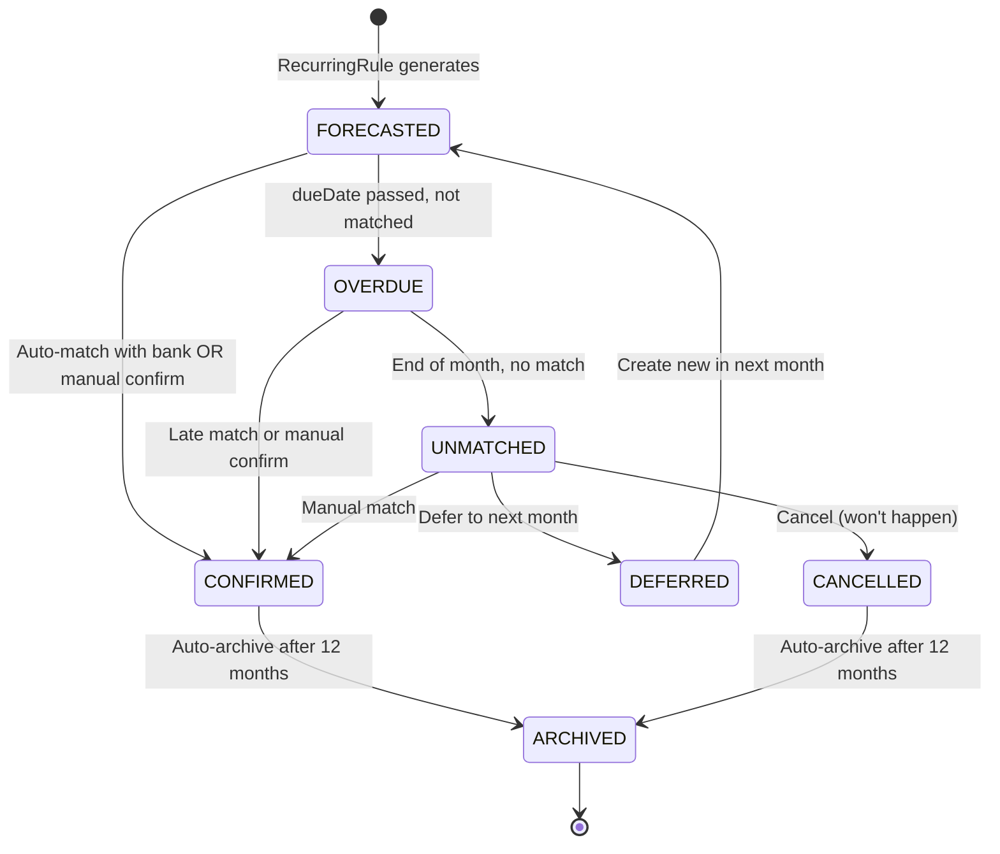

# Business Analysis: Recurring Rules vs Agicap + Alerts & CashChange Lifecycle

**Data utworzenia:** 2026-02-14
**Status:** Analysis & Design Extension
**Autor:** Claude Code + User

---

## Spis treści

1. [Porównanie z Agicap](#1-porównanie-z-agicap)
2. [Porównanie z Float i Pulse](#2-porównanie-z-float-i-pulse)
3. [Ocena biznesowa designu](#3-ocena-biznesowa-designu)
4. [Analiza obecnego CashChange](#4-analiza-obecnego-cashchange)
5. [Rozszerzenie: Statusy CashChange](#5-rozszerzenie-statusy-cashchange)
6. [Lifecycle CashChange](#6-lifecycle-cashchange)
7. [Alert System Design](#7-alert-system-design)
8. [Integracja: Recurring Rules + Alerts](#8-integracja-recurring-rules--alerts)
9. [Business Value Proposition](#9-business-value-proposition)
10. [Rekomendacje implementacyjne](#10-rekomendacje-implementacyjne)

---

## 1. Porównanie z Agicap

### 1.1 Agicap - Features Overview

**Źródła:**
- [Cash flow management software | Agicap](https://agicap.com/en-us/)
- [Cash flow forecasting software | Agicap](https://agicap.com/en-us/features/cashflow-forecast/)
- [Cash Flow Forecast Guide 2025 | Agicap](https://agicap.com/en-us/article/cash-flow-forecast/)

**Kluczowe możliwości:**

#### Multi-horizon forecasting
```
Short-term (4-13 weeks):
  - Based on actual data
  - Integrates AP/AR, payroll, recurring items (rent, wages)
  - Daily/weekly refresh

Medium-term (6 months):
  - Combines actuals + budgets + AP/AR cycles
  - Debt servicing schedules
  - Recurring transactions (rent, salaries, taxes, debts, investments)

Long-term (year-end):
  - Strategic planning
  - M&A scenarios
```

#### Recurring Transactions Handling
```
Data inputs:
  ✅ Supplier/customer invoices
  ✅ Open purchase orders
  ✅ Payment terms
  ✅ Debt schedules
  ✅ Recurring/exceptional transactions

Automation:
  ✅ Real-time bank/ERP/accounting integrations
  ✅ Auto-capture of AP/AR, payroll, tax
  ✅ Smart reconciliation (1:1, 1:N, N:1, N:N matching)
  ✅ DSO-based rules (Days Sales Outstanding)
```

#### Business Rules
```
DSO Rules:
  - Each customer's actual DSO
  - Group-wide DSO rules
  - Payment terms standardization
  - Local adaptation

Reconciliation Engine:
  - 1:1 matching (jedna faktura → jedna płatność)
  - 1:N matching (jedna faktura → wiele rat)
  - N:1 matching (wiele faktur → jedna płatność)
  - N:N matching (complex scenarios)
```

---

### 1.2 Vidulum vs Agicap - Feature Matrix

| Feature | Agicap | Vidulum (current) | Vidulum (with Recurring Rules MVP) |
|---------|--------|-------------------|-------------------------------------|
| **Recurring Transactions** |
| Manual creation | ✅ Yes | ❌ No | ✅ **Yes** |
| Auto-detection from history | ⚠️ Via ERP | ❌ No | ❌ Phase 4 |
| Advanced frequencies | ⚠️ Basic | ❌ No | ✅ **Yes** (better) |
| Seasonal rules | ❌ No | ❌ No | ✅ **Yes** (unique) |
| Business-specific (max occurrences, etc.) | ⚠️ Partial | ❌ No | ✅ **Yes** |
| **Forecasting** |
| Multi-horizon (4-13 weeks, 6 months, year) | ✅ Yes | ⚠️ 12 months | ⚠️ 12 months |
| DSO-based rules | ✅ Yes | ❌ No | ❌ Phase 5 |
| Payment terms | ✅ Yes | ❌ No | ❌ Phase 5 |
| Scenario modeling | ✅ Yes | ❌ No | ❌ Phase 6 |
| **Integration** |
| Bank API (real-time) | ✅ Yes | ❌ No | ❌ Phase 5 |
| ERP integration | ✅ Yes | ❌ No | ❌ Future |
| AP/AR automation | ✅ Yes | ❌ No | ❌ Phase 5 |
| **Reconciliation** |
| Smart matching (1:1, 1:N, N:1, N:N) | ✅ Yes | ❌ No | ❌ Phase 5 |
| Auto-categorization | ✅ Yes | ⚠️ Partial (CSV) | ⚠️ Partial (CSV) |
| **Alerts** |
| Low balance alerts | ✅ Yes | ❌ No | ⚠️ Phase 3 extension |
| Overdue payments | ✅ Yes | ❌ No | ⚠️ Phase 3 extension |
| Pattern anomalies | ✅ Yes | ❌ No | ❌ Phase 6 (AI) |
| **User Experience** |
| Manual entry reduction | ✅ High | ⚠️ Medium | ✅ **High** |
| Error-prone spreadsheets replacement | ✅ Yes | ⚠️ Partial | ✅ **Yes** |
| Multi-user/roles | ✅ Yes | ⚠️ Basic | ⚠️ Basic |
| **Pricing Tier** |
| Target market | Mid-market ($200-500/mo) | SMB/Individuals ($0-50/mo) | SMB/Mid-market ($50-200/mo) |

---

### 1.3 Gap Analysis

#### Where Vidulum LOSES to Agicap:

1. **ERP Integration** - Agicap ma real-time sync z Sage, NetSuite, QuickBooks
2. **AP/AR Automation** - Agicap auto-importuje faktury i terminy płatności
3. **DSO Rules** - Agicap przewiduje kiedy klient rzeczywiście zapłaci (nie tylko invoice due date)
4. **Multi-horizon** - Agicap ma 3 horyzonty (4-13 weeks, 6 months, year)
5. **Scenario modeling** - Agicap ma "what-if" analysis
6. **Smart reconciliation** - Agicap ma N:N matching (złożone scenariusze)

#### Where Vidulum WINS vs Agicap:

1. **Advanced Frequencies** ✅
   - Agicap: monthly, quarterly, yearly (basic)
   - Vidulum: co 2 tygodnie, ostatni piątek miesiąca, każde 14 dni od daty

2. **Seasonal Rules** ✅ (UNIQUE)
   - Agicap: brak
   - Vidulum: activeMonths [9,10,11,12,1,2,3,4,5,6] dla przedszkola

3. **Business-Specific Features** ✅
   - Agicap: limited
   - Vidulum: maxOccurrences (raty kredytu), excludedDates, notes

4. **Transparency** ✅
   - Agicap: black box (user nie widzi jak forecast jest obliczany)
   - Vidulum: full visibility - każda transakcja ma link do RecurringRule

5. **Price** ✅
   - Agicap: $200-500/mo (mid-market)
   - Vidulum: $0-50/mo (SMB tier), $50-200/mo (business tier)

6. **Simplicity** ✅
   - Agicap: complex setup, requires ERP
   - Vidulum: standalone, works without ERP

---

## 2. Porównanie z Float i Pulse

### 2.1 Float Cash Flow Forecasting

**Źródła:**
- [Float Cash Flow Forecasting Software](https://floatapp.com/)
- [Float Features](https://www.floatapp.com/features)

**Kluczowe features:**

```
Automation:
  ✅ Auto-sync with Xero/QuickBooks/FreeAgent (every 24h)
  ✅ Real-time financial data
  ✅ Recurring payment tracking
  ✅ What-if scenarios (toggle on/off)

Recurring Payments:
  ⚠️ Basic - tracks from accounting platform
  ❌ No manual creation
  ❌ No advanced frequencies
  ❌ No seasonal rules

Alerts:
  ⚠️ Limited - highlights cash flow issues
  ❌ No custom alert rules
```

**Vidulum vs Float:**

| Feature | Float | Vidulum MVP |
|---------|-------|-------------|
| Manual recurring rules | ❌ | ✅ **Better** |
| Advanced frequencies | ❌ | ✅ **Better** |
| Seasonal rules | ❌ | ✅ **Unique** |
| Accounting integration | ✅ Better | ⚠️ CSV only |
| What-if scenarios | ✅ | ❌ Phase 6 |
| Price | $49-99/mo | $0-50/mo |

---

### 2.2 Pulse Cash Flow Management

**Źródła:**
- [Pulse Features](https://pulseapp.com/features)
- [Pulse (mypulse.io)](https://mypulse.io/)

**Kluczowe features:**

```
Recurring Logic:
  ✅ Daily, weekly, monthly, yearly
  ✅ Powerful recurring income/expense logic
  ✅ Monitor cash flow by week/month/custom range

Alerts (mypulse.io):
  ✅ Automated alerts for critical updates
  ✅ Cash flow pattern shift detection
  ✅ AI model identifies key event triggers
  ❌ No custom alert rules visible to user

Forecasting:
  ✅ Projects future cash flow
  ✅ Takes into account recurring revenue, expenses, past-due payments
  ⚠️ AI-based but not transparent
```

**Vidulum vs Pulse:**

| Feature | Pulse | Vidulum MVP |
|---------|-------|-------------|
| Recurring frequencies | ⚠️ Basic | ✅ **Advanced** |
| Seasonal rules | ❌ | ✅ **Unique** |
| Alert system | ✅ Better | ⚠️ Phase 3 extension |
| AI forecasting | ✅ | ❌ Phase 6 |
| Transparency | ❌ Black box | ✅ **Full visibility** |
| Price | $29/mo | $0-50/mo |

---

## 3. Ocena biznesowa designu

### 3.1 Mocne strony (Strengths)

#### 1. **Advanced Frequencies** - przewaga konkurencyjna

```yaml
Agicap: monthly, quarterly, yearly (3 opcje)
Float: daily, weekly, monthly, yearly (4 opcje)
Pulse: daily, weekly, monthly, yearly (4 opcje)

Vidulum: 6 opcji + warianty:
  - MONTHLY (+ interval, + last day)
  - WEEKLY (+ interval)
  - YEARLY
  - QUARTERLY (+ which month of quarter)
  - EVERY_N_DAYS (+ day of week constraint)
  - ONCE

Examples:
  ✅ "Co 2 tygodnie w piątki" (wypłata)
  ✅ "Ostatni dzień miesiąca" (telefon)
  ✅ "Każde 14 dni od 7 marca" (rata)
  ✅ "Pierwszy piątek miesiąca" (team lunch)
```

**Business value:** Obsługa nietypowych cykli biznesowych (construction, freelance, agencies)

---

#### 2. **Seasonal Rules** - UNIQUE feature

```yaml
Use cases:
  - Przedszkole: 10 miesięcy (IX-VI)
  - Ogrzewanie: 7 miesięcy (X-IV)
  - Seasonal business: tourism (V-IX), ski resort (XII-III)
  - Academic: university payments (IX-VI)
  - Construction: weather-dependent costs

Implementation:
  activeMonths: [9,10,11,12,1,2,3,4,5,6]

Competitors: NONE has this feature
```

**Business value:** Obsługa sezonowych biznesów (turystyka, budownictwo, edukacja)

---

#### 3. **Business-Specific Features**

```yaml
maxOccurrences:
  - Loan installments: 24 raty
  - Leasing: 36 miesięcy + balon
  - Fixed-term contracts

excludedDates:
  - Holidays: skip Dec 25
  - Vacation: skip August
  - Special events

notes:
  - Business context
  - Justification
  - Approvals
```

**Business value:** Professional use cases (finance, accounting, compliance)

---

#### 4. **Full Transparency**

```yaml
Agicap: Black box - user nie widzi szczegółów
Float: Integration-driven - depends on accounting platform
Pulse: AI-driven - opaque

Vidulum:
  ✅ Każda transakcja ma link do RecurringRule
  ✅ User widzi occurrence number (12/24)
  ✅ Full audit trail
  ✅ Can pause/resume/edit rules
```

**Business value:** Trust, compliance, auditability

---

### 3.2 Słabości (Weaknesses)

#### 1. **Brak ERP Integration**

```
Problem: SMB/mid-market businesses use Xero, QuickBooks, Sage
Agicap: Real-time sync with all major ERPs
Vidulum: CSV import only

Impact: Manual work, data staleness, errors
```

**Mitigation:**
- Phase 5: Add Xero/QuickBooks integrations
- Phase 6: Add Sage, NetSuite (enterprise)

---

#### 2. **Brak DSO Rules**

```
Problem: Invoice due date ≠ actual payment date
Example:
  Invoice due: 30 days
  Customer actually pays: 45 days (DSO = 45)

Agicap: Uses historical DSO to predict actual payment date
Vidulum: Uses dueDate only (naïve forecast)

Impact: Forecast inaccuracy for B2B businesses
```

**Mitigation:**
- Phase 6: Add customer payment behavior tracking
- Phase 7: Add DSO-based forecasting

---

#### 3. **Brak Smart Reconciliation (N:N matching)**

```
Problem: Complex payment scenarios
Examples:
  - 1 invoice → 3 partial payments
  - 5 invoices → 1 bulk payment
  - Split payments across months

Agicap: N:N matching engine
Vidulum: 1:1 matching only (Phase 5)

Impact: Manual reconciliation for complex B2B scenarios
```

**Mitigation:**
- Phase 5: 1:1 matching (MVP)
- Phase 6: 1:N, N:1 matching
- Phase 7: N:N matching (enterprise)

---

#### 4. **Brak Scenario Modeling**

```
Problem: "What if" analysis
Examples:
  - What if customer delays payment by 2 weeks?
  - What if we get new $50k contract?
  - What if we hire 3 more people?

Agicap: Toggle scenarios on/off
Float: Toggle scenarios on/off
Vidulum: None

Impact: Limited strategic planning capability
```

**Mitigation:**
- Phase 6: Scenario modeling
- Phase 7: Monte Carlo simulation (probabilistic forecasting)

---

### 3.3 Market Positioning

```
┌─────────────────────────────────────────────────────────┐
│                                                         │
│  High Complexity / Enterprise                           │
│                                                         │
│      Agicap ($200-500/mo)                              │
│      • ERP integration                                  │
│      • DSO rules                                        │
│      • N:N reconciliation                              │
│      • Multi-entity consolidation                      │
│                                                         │
│  ─────────────────────────────────────────────────     │
│                                                         │
│  Mid-Market / SMB                                       │
│                                                         │
│      Vidulum ($50-200/mo) ← OUR TARGET                 │
│      • Advanced recurring rules ✅                     │
│      • Seasonal features ✅                            │
│      • Business-specific ✅                            │
│      • Manual + semi-automated                          │
│                                                         │
│  ─────────────────────────────────────────────────     │
│                                                         │
│  Low Complexity / Individuals                           │
│                                                         │
│      Pulse ($29/mo), Float ($49/mo)                    │
│      • Basic recurring                                  │
│      • Accounting integration                           │
│      • Limited customization                            │
│                                                         │
│      Vidulum FREE ($0/mo)                              │
│      • Manual recurring rules                           │
│      • CSV import                                       │
│      • Self-service                                     │
│                                                         │
└─────────────────────────────────────────────────────────┘
```

**Positioning statement:**
```
Vidulum = "Advanced recurring rules for SMB/mid-market"

Too simple for enterprise (no ERP)
Too advanced for individuals (overkill features)
PERFECT for SMB/mid-market (sweet spot)
```

---

## 4. Analiza obecnego CashChange

### 4.1 Obecny stan (as-is)

```java
// File: CashChange.java (current implementation)

public class CashChange {
    private CashChangeId cashChangeId;
    private Name name;
    private Description description;
    private Money money;
    private Type type;  // INFLOW / OUTFLOW
    private CategoryName categoryName;
    private CashChangeStatus status;  // PENDING, CONFIRMED, REJECTED, ARCHIVED
    private ZonedDateTime created;
    private ZonedDateTime dueDate;
    private ZonedDateTime endDate;  // when confirmed
}

// Current statuses
public enum CashChangeStatus {
    PENDING,     // Oczekuje na potwierdzenie
    CONFIRMED,   // Potwierdzone (paid)
    REJECTED,    // Odrzucone
    ARCHIVED     // Zarchiwizowane
}
```

**Aktualny lifecycle:**

```
User action: appendExpectedCashChange
  → status = PENDING

User action: confirmCashChange
  → status = CONFIRMED
  → endDate = now()
  → balance updated

User action: rejectCashChange
  → status = REJECTED

(later: archive old transactions)
  → status = ARCHIVED
```

**Problemy z obecnym modelem:**

1. **Brak rozróżnienia EXPECTED vs PAID**
   ```
   PENDING może być:
     - Ręcznie utworzone (expected)
     - Wygenerowane z RecurringRule (forecasted)
     - Imported z banku (uncategorized)

   → Nie wiadomo skąd pochodzi transakcja
   ```

2. **Brak paidDate**
   ```
   endDate jest używane dla:
     - Actual payment date (when confirmed)
     - Rejection date (when rejected)

   → Nie można rozróżnić kiedy faktycznie zapłacono
   ```

3. **Brak link do RecurringRule**
   ```
   Nie wiadomo która transakcja pochodzi z której reguły

   → Nie można:
     - Edytować wszystkich z reguły
     - Usunąć wszystkich z reguły
     - Policzyć ile już wygenerowano (12/24)
   ```

4. **Brak statusu OVERDUE**
   ```
   PENDING po dueDate = ?

   → System nie wie że transakcja jest przeterminowana
   → Brak alertów o overdue
   ```

5. **Brak statusu UNMATCHED**
   ```
   Koniec miesiąca, PENDING nie dopasowane do bank transaction = ?

   → Wymaga manualnej decyzji (match, defer, cancel)
   → Obecnie: wisi w PENDING w nieskończoność
   ```

---

## 5. Rozszerzenie: Statusy CashChange

### 5.1 Proponowane nowe statusy

```java
public enum CashChangeStatus {
    // ========================================
    // EXPECTED (planowane transakcje)
    // ========================================

    PENDING,        // Ręcznie utworzone przez usera
                    // Oczekuje na confirm/reject

    FORECASTED,     // Wygenerowane automatycznie z RecurringRule
                    // Oczekuje na dopasowanie z bankiem lub manual confirm

    // ========================================
    // CONFIRMED (potwierdzone transakcje)
    // ========================================

    CONFIRMED,      // Potwierdzone transakcje
                    // - Manual: user kliknął "confirm"
                    // - Auto: dopasowane do bank transaction

    // ========================================
    // PROBLEM STATES (wymagają akcji)
    // ========================================

    OVERDUE,        // PENDING/FORECASTED po dueDate
                    // Alert: "Transaction overdue"
                    // Actions: confirm late, defer, cancel

    UNMATCHED,      // Koniec miesiąca, brak dopasowania do bank transaction
                    // Alert: "Unmatched transaction"
                    // Actions: match manually, mark as unpaid, cancel

    // ========================================
    // TERMINAL STATES (zakończone)
    // ========================================

    REJECTED,       // Odrzucone przez usera

    CANCELLED,      // Anulowane (np. recurring rule zakończone)

    DEFERRED,       // Przesunięte na inny termin
                    // System tworzy nową transakcję w nowym miesiącu

    ARCHIVED        // Zarchiwizowane (stare transakcje)
}
```

---

### 5.2 Rozszerzenie CashChange Model

```java
public class CashChange {
    // ===== Existing fields =====
    private CashChangeId cashChangeId;
    private Name name;
    private Description description;
    private Money money;
    private Type type;
    private CategoryName categoryName;
    private CashChangeStatus status;  // ROZSZERZONY ENUM
    private ZonedDateTime created;
    private ZonedDateTime dueDate;
    private ZonedDateTime endDate;

    // ===== NEW fields for Recurring Rules =====

    private RecurringRuleId recurringRuleId;  // null = manual, not-null = from rule
    private Boolean generatedFromRule;        // true = FORECASTED, false = PENDING
    private Integer occurrenceNumber;         // 12 (dla maxOccurrences)
    private Integer totalOccurrences;         // 24 (dla maxOccurrences)

    // ===== NEW fields for Bank Reconciliation (Phase 5) =====

    private ZonedDateTime paidDate;           // kiedy faktycznie zapłacono (z banku)
    private BankTransactionId bankTransactionId;  // link do bank transaction
    private Integer matchingScore;            // 0-100 (confidence)

    // ===== NEW fields for Alerts =====

    private ZonedDateTime becameOverdueAt;    // kiedy status → OVERDUE
    private ZonedDateTime becameUnmatchedAt;  // kiedy status → UNMATCHED
    private Boolean alertSent;                // czy wysłano alert
    private ZonedDateTime alertSentAt;        // kiedy wysłano alert
}
```

---

## 6. Lifecycle CashChange

### 6.1 Scenario 1: Manual EXPECTED → CONFIRMED



**Timeline:**
```
Day 0:  User: appendExpectedCashChange
        → status = PENDING
        → dueDate = Feb 10

Day 10: System: check if dueDate passed
        → dueDate = Feb 10 (today)
        → status = PENDING (still ok)

Day 11: System: check if dueDate passed
        → dueDate = Feb 10 (yesterday)
        → status → OVERDUE
        → Alert: "Czynsz overdue (1 day)"

Day 12: User: confirmCashChange
        → status → CONFIRMED
        → endDate = Feb 12
        → paidDate = Feb 12
```

---

### 6.2 Scenario 2: FORECASTED (from RecurringRule) → CONFIRMED



**Timeline:**
```
Feb 1:  System: MonthlyRolloverScheduler
        → RecurringRule: "Czynsz" generates
        → status = FORECASTED
        → dueDate = Feb 10
        → recurringRuleId = RR10000001
        → occurrenceNumber = 12
        → totalOccurrences = null (no maxOccurrences)

Feb 10: System: check if dueDate passed
        → dueDate = Feb 10 (today)
        → status = FORECASTED (still ok)

Feb 11: System: check if dueDate passed
        → dueDate = Feb 10 (yesterday)
        → status → OVERDUE
        → Alert: "Czynsz overdue (1 day)"

Feb 12: Bank API: import transaction
        → 2050 PLN, "ZARZĄDCA NIERUCH"
        → Reconciliation engine:
            - Find EXPECTED/FORECASTED/OVERDUE with category "Mieszkanie"
            - Match by counterpartyAccount
            - Score = 95 (high confidence)
        → Auto-match:
            - status → CONFIRMED
            - paidDate = Feb 12
            - bankTransactionId = BT10000123
            - matchingScore = 95
        → Alert: "Czynsz matched automatically (2 days late, +50 PLN)"

Feb 28: System: End of month check
        → All FORECASTED/OVERDUE in February → UNMATCHED?
        → Czynsz już CONFIRMED, skip
```

---

### 6.3 Scenario 3: FORECASTED → UNMATCHED (not paid)

```
Feb 1:  RecurringRule generates
        → status = FORECASTED
        → dueDate = Feb 10
        → name = "Gym Membership"

Feb 11: System: dueDate passed
        → status → OVERDUE

Feb 28: System: End of month
        → status still OVERDUE
        → No bank match found
        → status → UNMATCHED
        → Alert: "Gym Membership unmatched - action required"

User sees dashboard:
  ⚠️ Unmatched Transactions (1)

  Gym Membership, 150 PLN, due Feb 10

  Options:
    [Match manually] [Mark as unpaid] [Cancel] [Defer to March]

User clicks: "Mark as unpaid"
  → status → CANCELLED
  → reason = "Cancelled membership, not renewed"
```

---

### 6.4 Scenario 4: FORECASTED → DEFERRED (postponed)

```
Feb 1:  RecurringRule generates
        → status = FORECASTED
        → dueDate = Feb 10
        → name = "Czynsz"

Feb 5:  User: "Landlord said pay on Feb 20 this time"
        → User: deferCashChange(to = Feb 20)
        → status → DEFERRED
        → Original transaction cancelled
        → New transaction created:
            - status = PENDING (manual override)
            - dueDate = Feb 20
            - recurringRuleId = null (detached from rule)
            - notes = "Deferred from Feb 10 by user request"

Feb 20: User confirms
        → status → CONFIRMED
```

---

### 6.5 Scenario 5: Loan installment (12/24)

```
Mar 1:  RecurringRule: "Loan - Car"
        → maxOccurrences = 24
        → generatedCount = 11
        → Generate occurrence #12:
            - status = FORECASTED
            - dueDate = Mar 20
            - recurringRuleId = RR10000005
            - occurrenceNumber = 12
            - totalOccurrences = 24

Mar 20: Bank import
        → 500 PLN, "BANK CREDIT"
        → Auto-match
        → status → CONFIRMED
        → UI shows: "Loan 12/24 paid ✓"

... (repeat 12 more times)

Feb 20, 2027: Occurrence #24 confirmed
        → RecurringRule check:
            - generatedCount = 24
            - maxOccurrences = 24
            - generatedCount >= maxOccurrences
        → RecurringRule: status → ENDED
        → No more occurrences generated
```

---

## 7. Alert System Design

### 7.1 Alert Types

```java
public enum AlertType {
    // ===== Cash Flow Alerts =====
    OVERDUE_TRANSACTION,          // Transaction past due date
    UNMATCHED_TRANSACTION,        // End of month, no match found
    LOW_BALANCE_WARNING,          // Balance < threshold
    NEGATIVE_BALANCE_FORECAST,    // Forecast shows negative balance

    // ===== Recurring Rule Alerts =====
    RULE_AUTO_MATCHED,            // Transaction auto-matched (FYI)
    RULE_MATCH_SUGGESTION,        // Low confidence match (60-84)
    RULE_ENDED_AUTO,              // Rule ended (maxOccurrences reached)

    // ===== Anomaly Alerts =====
    AMOUNT_ANOMALY,               // Amount differs significantly from rule
    DATE_ANOMALY,                 // Payment date unusual (e.g., 20 days late)
    MISSING_EXPECTED,             // Expected transaction never happened

    // ===== Business Alerts =====
    CASH_RUNWAY_LOW,              // < 3 months runway
    CATEGORY_BUDGET_EXCEEDED,     // Category spending > budget
    LARGE_TRANSACTION,            // Transaction > threshold (e.g., 10k)
}
```

---

### 7.2 Alert Configuration

```java
public class AlertConfig {
    private UserId userId;
    private CashFlowId cashFlowId;

    // Alert settings per type
    private Map<AlertType, AlertSettings> settings;

    // Global settings
    private boolean emailEnabled;
    private boolean pushEnabled;
    private boolean smsEnabled;
    private boolean inAppOnly;

    // Thresholds
    private Money lowBalanceThreshold;      // e.g., 5000 PLN
    private Integer overdueGracePeriodDays;  // e.g., 3 days
    private Money largeTransactionThreshold; // e.g., 10000 PLN
}

public class AlertSettings {
    private boolean enabled;
    private AlertPriority priority;  // LOW, MEDIUM, HIGH, CRITICAL
    private AlertChannel channel;    // EMAIL, PUSH, SMS, IN_APP
    private boolean digestMode;      // true = daily digest, false = instant
}
```

---

### 7.3 Alert Generation - Examples

#### Alert 1: OVERDUE_TRANSACTION

```java
// Trigger: Daily scheduler (02:00 UTC)
@Scheduled(cron = "0 0 2 * * *")
public void checkOverdueTransactions() {
    LocalDate today = LocalDate.now(clock);

    // Find all PENDING/FORECASTED with dueDate < today
    List<CashChange> overdueTransactions = cashChangeRepository
        .findByStatusIn(List.of(PENDING, FORECASTED))
        .stream()
        .filter(cc -> LocalDate.from(cc.getDueDate()).isBefore(today))
        .toList();

    for (CashChange cc : overdueTransactions) {
        // Check grace period
        AlertConfig config = alertConfigRepository.findByUserId(cc.getUserId());
        int gracePeriod = config.getOverdueGracePeriodDays(); // e.g., 3 days

        long daysOverdue = ChronoUnit.DAYS.between(
            LocalDate.from(cc.getDueDate()),
            today
        );

        if (daysOverdue >= gracePeriod) {
            // Update status
            cc.setStatus(OVERDUE);
            cc.setBecameOverdueAt(ZonedDateTime.now(clock));
            cashChangeRepository.save(cc);

            // Send alert
            Alert alert = Alert.builder()
                .type(AlertType.OVERDUE_TRANSACTION)
                .priority(AlertPriority.HIGH)
                .title("Transaction Overdue")
                .message(String.format(
                    "%s (%s) is %d days overdue",
                    cc.getName(),
                    cc.getMoney(),
                    daysOverdue
                ))
                .relatedCashChangeId(cc.getCashChangeId())
                .build();

            alertService.send(alert);

            cc.setAlertSent(true);
            cc.setAlertSentAt(ZonedDateTime.now(clock));
            cashChangeRepository.save(cc);
        }
    }
}
```

**Email template:**
```
Subject: ⚠️ Transaction Overdue: Czynsz

Hi User,

Your transaction "Czynsz" (2000 PLN) was due on Feb 10, 2026.
It is now 3 days overdue.

Actions you can take:
  - Mark as paid (if you already paid it)
  - Defer to a later date
  - Cancel this transaction

[View Details] [Mark as Paid]

Best regards,
Vidulum
```

---

#### Alert 2: UNMATCHED_TRANSACTION

```java
// Trigger: End of month (last day at 23:00 UTC)
@Scheduled(cron = "0 0 23 L * *")  // Last day of month
public void checkUnmatchedTransactions() {
    YearMonth currentMonth = YearMonth.now(clock);

    // Find all FORECASTED/OVERDUE in current month
    List<CashChange> unmatchedTransactions = cashChangeRepository
        .findByStatusIn(List.of(FORECASTED, OVERDUE))
        .stream()
        .filter(cc -> YearMonth.from(cc.getDueDate()).equals(currentMonth))
        .toList();

    for (CashChange cc : unmatchedTransactions) {
        // Update status
        cc.setStatus(UNMATCHED);
        cc.setBecameUnmatchedAt(ZonedDateTime.now(clock));
        cashChangeRepository.save(cc);

        // Send alert
        Alert alert = Alert.builder()
            .type(AlertType.UNMATCHED_TRANSACTION)
            .priority(AlertPriority.MEDIUM)
            .title("Unmatched Transaction - Action Required")
            .message(String.format(
                "%s (%s) was not matched to any bank transaction this month",
                cc.getName(),
                cc.getMoney()
            ))
            .relatedCashChangeId(cc.getCashChangeId())
            .build();

        alertService.send(alert);
    }
}
```

**UI Dashboard:**
```
⚠️ Unmatched Transactions (3)

┌────────────────────────────────────────────────────────┐
│ Czynsz                                    2000 PLN     │
│ Expected: Feb 10 · No bank match found                │
│                                                        │
│ Possible actions:                                     │
│  ○ Match to bank transaction manually                 │
│  ○ Mark as "Not paid this month"                      │
│  ○ Defer to next month                                │
│  ○ Cancel (won't happen again)                        │
│                                            [Resolve]  │
└────────────────────────────────────────────────────────┘
```

---

#### Alert 3: RULE_AUTO_MATCHED

```java
// Trigger: After auto-matching (Reconciliation Engine)
public void onAutoMatch(CashChange expected, BankTransaction bank, int score) {
    // Alert only if user wants to be notified
    AlertConfig config = alertConfigRepository.findByUserId(expected.getUserId());

    if (config.getSettings().get(AlertType.RULE_AUTO_MATCHED).isEnabled()) {
        // Check for anomalies
        Money amountDiff = expected.getMoney().minus(bank.getAmount()).abs();
        long daysDiff = ChronoUnit.DAYS.between(
            LocalDate.from(expected.getDueDate()),
            bank.getTransactionDate()
        );

        String anomalies = "";
        if (amountDiff.getAmount() > 50) {
            anomalies += String.format("Amount diff: %s. ", amountDiff);
        }
        if (daysDiff > 5) {
            anomalies += String.format("%d days late. ", daysDiff);
        }

        Alert alert = Alert.builder()
            .type(AlertType.RULE_AUTO_MATCHED)
            .priority(anomalies.isEmpty() ? AlertPriority.LOW : AlertPriority.MEDIUM)
            .title("Transaction Auto-Matched")
            .message(String.format(
                "%s matched automatically (score: %d). %s",
                expected.getName(),
                score,
                anomalies.isEmpty() ? "All good!" : anomalies
            ))
            .relatedCashChangeId(expected.getCashChangeId())
            .build();

        alertService.send(alert);
    }
}
```

**Email template (digest mode):**
```
Subject: ✅ 5 Transactions Auto-Matched Today

Hi User,

Vidulum automatically matched these transactions today:

  ✅ Czynsz (2000 PLN) - Matched (score: 95)
     Expected: Feb 10 | Paid: Feb 12 (2 days late)

  ✅ Netflix (29 PLN) - Matched (score: 100)
     Expected: Feb 15 | Paid: Feb 15 (on time)

  ⚠️ Gym (150 PLN) - Matched (score: 75)
     Expected: Feb 1 | Paid: Feb 8 (7 days late, +10 PLN)
     [Review Match]

[View All Transactions]

Best regards,
Vidulum
```

---

#### Alert 4: LOW_BALANCE_WARNING

```java
// Trigger: After any transaction confirmed
public void onTransactionConfirmed(CashChange cc) {
    CashFlow cashFlow = cashFlowRepository.findById(cc.getCashFlowId());
    Money currentBalance = cashFlow.getBankAccount().getBalance();

    AlertConfig config = alertConfigRepository.findByUserId(cashFlow.getUserId());
    Money threshold = config.getLowBalanceThreshold(); // e.g., 5000 PLN

    if (currentBalance.isLessThan(threshold)) {
        Alert alert = Alert.builder()
            .type(AlertType.LOW_BALANCE_WARNING)
            .priority(AlertPriority.HIGH)
            .title("Low Balance Warning")
            .message(String.format(
                "Your balance (%s) is below threshold (%s)",
                currentBalance,
                threshold
            ))
            .build();

        alertService.send(alert);
    }
}
```

---

#### Alert 5: NEGATIVE_BALANCE_FORECAST

```java
// Trigger: Weekly forecast check (every Monday 08:00)
@Scheduled(cron = "0 0 8 ? * MON")
public void checkForecastBalance() {
    List<CashFlow> allCashFlows = cashFlowRepository.findByStatus(CashFlowStatus.OPEN);

    for (CashFlow cashFlow : allCashFlows) {
        // Calculate forecast for next 4 weeks
        Money currentBalance = cashFlow.getBankAccount().getBalance();
        LocalDate today = LocalDate.now(clock);
        LocalDate fourWeeksLater = today.plusWeeks(4);

        // Get all FORECASTED/PENDING in next 4 weeks
        List<CashChange> upcoming = cashChangeRepository
            .findByCashFlowIdAndDueDateBetween(
                cashFlow.getId(),
                today.atStartOfDay(),
                fourWeeksLater.atTime(23, 59, 59)
            );

        Money projectedBalance = currentBalance;
        LocalDate negativeDate = null;

        for (CashChange cc : upcoming.stream()
                .sorted(Comparator.comparing(CashChange::getDueDate))
                .toList()) {

            if (cc.getType() == Type.INFLOW) {
                projectedBalance = projectedBalance.plus(cc.getMoney());
            } else {
                projectedBalance = projectedBalance.minus(cc.getMoney());
            }

            if (projectedBalance.isNegative() && negativeDate == null) {
                negativeDate = LocalDate.from(cc.getDueDate());
            }
        }

        if (negativeDate != null) {
            Alert alert = Alert.builder()
                .type(AlertType.NEGATIVE_BALANCE_FORECAST)
                .priority(AlertPriority.CRITICAL)
                .title("Negative Balance Forecast")
                .message(String.format(
                    "Your balance is projected to go negative on %s",
                    negativeDate
                ))
                .build();

            alertService.send(alert);
        }
    }
}
```

---

### 7.4 Alert Channels

```java
public interface AlertChannel {
    void send(Alert alert, User user);
}

@Component
public class EmailAlertChannel implements AlertChannel {
    @Override
    public void send(Alert alert, User user) {
        emailService.send(
            user.getEmail(),
            alert.getTitle(),
            renderTemplate(alert)
        );
    }
}

@Component
public class PushAlertChannel implements AlertChannel {
    @Override
    public void send(Alert alert, User user) {
        pushNotificationService.send(
            user.getPushToken(),
            alert.getTitle(),
            alert.getMessage()
        );
    }
}

@Component
public class InAppAlertChannel implements AlertChannel {
    @Override
    public void send(Alert alert, User user) {
        alertRepository.save(alert);  // Store for in-app display
    }
}
```

---

## 8. Integracja: Recurring Rules + Alerts

### 8.1 Rozszerz RecurringRule o Alert Settings

```java
public class RecurringRule {
    // ... existing fields

    // Alert preferences for this rule
    private boolean alertOnAutoMatch;        // Notify when auto-matched
    private boolean alertOnSuggestion;       // Notify when low-confidence match
    private boolean alertOnOverdue;          // Notify when overdue
    private boolean alertOnUnmatched;        // Notify when unmatched at month-end
    private boolean alertOnAmountAnomaly;    // Notify if amount differs > X%
    private Money amountAnomalyThreshold;    // e.g., ±10%
}
```

**UI:**
```
┌────────────────────────────────────────────────────────┐
│ Edit Rule: Czynsz                                [×]   │
├────────────────────────────────────────────────────────┤
│                                                        │
│ Alert Preferences for this rule:                      │
│                                                        │
│ ☑ Notify when auto-matched to bank transaction        │
│ ☑ Notify when match requires confirmation (60-84%)    │
│ ☑ Notify when overdue (after 3 days)                  │
│ ☑ Notify when unmatched at end of month               │
│ ☑ Notify if amount differs by more than ┌──┐ %        │
│                                           │10│         │
│                                           └──┘         │
│                                                        │
│ [Save] [Cancel]                                        │
└────────────────────────────────────────────────────────┘
```

---

### 8.2 Alert Flow Diagram

```
RecurringRule generates FORECASTED
        │
        ▼
Check dueDate daily ────────┐
        │                    │
        │ past dueDate       │
        ▼                    │
    OVERDUE ─────────────────┤
        │                    │
        │                    │ Alert: OVERDUE_TRANSACTION
        ▼                    │
Reconciliation Engine        │
        │                    │
  ┌─────┴──────┐            │
  │            │            │
High score   Low score      │
(85-100)     (60-84)        │
  │            │            │
  ▼            ▼            │
AUTO       SUGGEST ─────────┤
MATCH                       │
  │                         │ Alert: RULE_MATCH_SUGGESTION
  │                         │
  ▼                         ▼
CONFIRMED ──────────────────┤
                            │
                            │ Alert: RULE_AUTO_MATCHED
                            │ (if anomaly: amount/date diff)
                            │
End of month ───────────────┤
        │                   │
        │ still OVERDUE     │
        ▼                   │
    UNMATCHED ──────────────┘
                            │
                            │ Alert: UNMATCHED_TRANSACTION
                            │
                            ▼
```

---

## 9. Business Value Proposition

### 9.1 Dla SMB (małe firmy, freelancerzy)

**Problem:**
```
"Spędzam 2-3 godziny tygodniowo na ręcznym wpisywaniu
powtarzających się transakcji do Excela"
```

**Rozwiązanie Vidulum:**
```
✅ Recurring Rules: raz skonfigurujesz, system generuje automatycznie
✅ Advanced Frequencies: co 2 tygodnie (wypłaty), ostatni dzień (rachunki)
✅ Seasonal Rules: przedszkole IX-VI, ogrzewanie X-IV
✅ Alerts: overdue, unmatched, low balance

Oszczędność czasu: 2-3h/tydzień → 15 min/tydzień (95% redukcja)
ROI: $50/mo subscription = $200/mo value (4x return)
```

---

### 9.2 Dla Mid-Market (średnie firmy 10-50 osób)

**Problem:**
```
"Używamy Excela do cash flow forecast. Duplikaty,
błędy, nieaktualne dane. CFO spędza cały tydzień
na przygotowaniu miesięcznego raportu."
```

**Rozwiązanie Vidulum:**
```
✅ Recurring Rules: wynagrodzenia, ZUS, VAT, leasing
✅ Business Features: maxOccurrences (raty), excludedDates (święta)
✅ Alerts: negative balance forecast, large transactions
✅ Audit Trail: pełna widoczność (12/24), notes, approval history

Oszczędność czasu: 1 dzień/miesiąc → 2h/miesiąc (87% redukcja)
ROI: $200/mo subscription = $2000/mo value (10x return)
Compliance: Full audit trail, notes, multi-user access
```

---

### 9.3 Dla Seasonal Businesses (turystyka, budownictwo)

**Problem:**
```
"Nasze koszty są sezonowe. Latem 10 pracowników,
zimą 2. Excel nie radzi sobie z tym."
```

**Rozwiązanie Vidulum:**
```
✅ Seasonal Rules: activeMonths [5,6,7,8,9] dla seasonal staff
✅ Seasonal Rules: activeMonths [10,11,12,1,2,3,4] dla heating
✅ Multiple Rules: different rules for high/low season

UNIQUE FEATURE - nikt inny tego nie ma
```

---

### 9.4 Dla B2B Services (agencies, consulting)

**Problem:**
```
"Klienci płacą z opóźnieniem. Invoice due: 30 dni,
faktycznie płacą: 45-60 dni. Forecast jest nierealistyczny."
```

**Rozwiązanie Vidulum (Phase 6):**
```
✅ DSO Tracking: system uczy się rzeczywistych terminów płatności
✅ Customer Profiles: każdy klient ma swój DSO
✅ Realistic Forecast: forecast uwzględnia historical DSO

Phase 6 feature (not MVP)
```

---

## 10. Rekomendacje implementacyjne

### 10.1 MVP Priority (Phase 3)

**MUST HAVE:**
```
1. Rozszerzenie CashChangeStatus:
   ✅ FORECASTED (new)
   ✅ OVERDUE (new)

2. Rozszerzenie CashChange model:
   ✅ recurringRuleId
   ✅ generatedFromRule
   ✅ occurrenceNumber, totalOccurrences

3. Basic Alerts (2 typy):
   ✅ OVERDUE_TRANSACTION
   ✅ UNMATCHED_TRANSACTION (end of month)

4. Alert Channel:
   ✅ In-app only (no email/push yet)
```

**NICE TO HAVE (can defer):**
```
⏸️ UNMATCHED status - defer to Phase 5 (reconciliation)
⏸️ Email alerts - defer to Phase 4
⏸️ Push notifications - defer to Phase 4
⏸️ Alert digest mode - defer to Phase 4
```

---

### 10.2 Phase Roadmap - Updated

```
Phase 1: Core Domain (2 weeks) ← DONE (from previous design)
Phase 2: Persistence (1 week) ← DONE
Phase 3: Scheduler + Alerts (1 week) ← NEW
  ├─ MonthlyRolloverScheduler integration
  ├─ CashChange status extension (FORECASTED, OVERDUE)
  ├─ Daily overdue checker
  ├─ End-of-month unmatched checker
  ├─ In-app alert storage + display
  └─ Alert REST API (GET /alerts, PATCH /alerts/{id}/mark-read)

Phase 4: REST API (1 week)
Phase 5: UI Integration (2 weeks)
Phase 6: Advanced Alerts (1 week) ← NEW
  ├─ Email channel
  ├─ Push notification channel
  ├─ Alert digest mode
  ├─ Alert configuration UI
  └─ LOW_BALANCE, NEGATIVE_FORECAST alerts
```

---

### 10.3 Database Schema - Alert Extension

```javascript
// Collection: alerts
{
  "_id": ObjectId("..."),
  "alertId": "AL10000001",
  "userId": "U10000001",
  "cashFlowId": "CF10000001",

  "type": "OVERDUE_TRANSACTION",  // AlertType enum
  "priority": "HIGH",  // LOW, MEDIUM, HIGH, CRITICAL

  "title": "Transaction Overdue",
  "message": "Czynsz (2000 PLN) is 3 days overdue",

  "relatedCashChangeId": "CC10000123",
  "relatedRecurringRuleId": "RR10000001",  // optional

  "read": false,
  "readAt": null,

  "dismissed": false,
  "dismissedAt": null,

  "actionTaken": null,  // "CONFIRMED", "CANCELLED", "DEFERRED", etc.
  "actionTakenAt": null,

  "createdAt": ISODate("2026-02-13T02:00:00Z"),
  "expiresAt": ISODate("2026-03-13T02:00:00Z")  // auto-delete after 30 days
}

// Indexes
db.alerts.createIndex({ "userId": 1, "read": 1, "createdAt": -1 })
db.alerts.createIndex({ "cashFlowId": 1, "type": 1 })
db.alerts.createIndex({ "expiresAt": 1 }, { expireAfterSeconds: 0 })  // TTL index
```

---

### 10.4 REST API - Alerts

```http
GET /alerts
Authorization: Bearer {token}

Query params:
  ?read=false
  ?type=OVERDUE_TRANSACTION
  ?priority=HIGH,CRITICAL
  ?limit=20

Response 200 OK:
{
  "alerts": [
    {
      "alertId": "AL10000001",
      "type": "OVERDUE_TRANSACTION",
      "priority": "HIGH",
      "title": "Transaction Overdue",
      "message": "Czynsz (2000 PLN) is 3 days overdue",
      "relatedCashChange": {
        "cashChangeId": "CC10000123",
        "name": "Czynsz",
        "amount": { "amount": 2000.00, "currency": "PLN" },
        "dueDate": "2026-02-10"
      },
      "read": false,
      "createdAt": "2026-02-13T02:00:00Z"
    }
  ],
  "unreadCount": 5
}
```

```http
PATCH /alerts/{alertId}/mark-read
Authorization: Bearer {token}

Response 200 OK:
{
  "alertId": "AL10000001",
  "read": true,
  "readAt": "2026-02-14T10:30:00Z"
}
```

```http
DELETE /alerts/{alertId}
Authorization: Bearer {token}

Response 204 No Content
```

---

## Źródła

### Agicap:
- [Cash flow management software | Agicap](https://agicap.com/en-us/)
- [Cash flow forecasting software | Agicap](https://agicap.com/en-us/features/cashflow-forecast/)
- [Cash Flow Forecast Guide 2025 | Agicap](https://agicap.com/en-us/article/cash-flow-forecast/)

### Float:
- [Float Cash Flow Forecasting Software](https://floatapp.com/)
- [Float Features](https://www.floatapp.com/features)

### Pulse:
- [Pulse Features](https://pulseapp.com/features)
- [Pulse (mypulse.io)](https://mypulse.io/)

---

## Podsumowanie

### Kluczowe wnioski:

1. **Vidulum ma unique features** (seasonal rules, advanced frequencies) które przewyższają konkurencję
2. **Gap vs Agicap**: brak ERP integration, DSO rules, N:N reconciliation
3. **Market positioning**: SMB/mid-market sweet spot ($50-200/mo)
4. **CashChange wymaga rozszerzenia**: FORECASTED, OVERDUE, paidDate, recurringRuleId
5. **Alerts są KLUCZOWE**: Agicap, Float, Pulse - wszyscy mają alerts
6. **MVP scope realistic**: 1 week for alerts (2 types, in-app only)

### Next steps:

1. Implement Phase 3: Scheduler + Basic Alerts (1 week)
2. Add FORECASTED, OVERDUE statuses
3. Add in-app alert system
4. Defer email/push to Phase 6

**Business value:**
- 95% time savings for SMB
- 87% time savings for mid-market
- Unique seasonal features (no competitor has this)
- Full transparency (vs black-box competitors)
