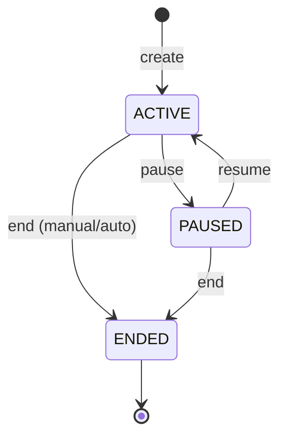

# Recurring Rule Engine - Complete Design Document

**Data utworzenia:** 2026-02-14
**Status:** Design - do implementacji
**Autor:** Claude Code + User
**Priorytet:** Phase 3 (po AI Categorization i Month Rollover)

---

## Spis treści

1. [Executive Summary](#1-executive-summary)
2. [Analiza konkurencji](#2-analiza-konkurencji)
3. [Problemy z istniejącego designu](#3-problemy-z-istniejącego-designu)
4. [Scope - co implementujemy teraz](#4-scope---co-implementujemy-teraz)
5. [Przykłady użycia - User Stories](#5-przykłady-użycia---user-stories)
6. [Model domenowy](#6-model-domenowy)
7. [Stany i przejścia](#7-stany-i-przejścia)
8. [UI Design - od początku do końca](#8-ui-design---od-początku-do-końca)
9. [REST API](#9-rest-api)
10. [Baza danych](#10-baza-danych)
11. [Logika biznesowa](#11-logika-biznesowa)
12. [Walidacje](#12-walidacje)
13. [Integracja z istniejącym system](#13-integracja-z-istniejącym-systemem)
14. [Plan implementacji](#14-plan-implementacji)
15. [Future Features](#15-future-features)

---

## 1. Executive Summary

### Cel

Stworzyć **Rule Engine** do automatycznego generowania expected CashChanges na podstawie **recurring rules** (reguł powtarzalnych transakcji).

### Kluczowe założenia

- **Manual creation** - user tworzy reguły przez UI
- **Auto-generation** - system generuje ExpectedCashChange wg reguł
- **Reconciliation LATER** - dopasowanie bank transactions to osobny komponent (nie teraz)
- **Simple first** - MVP bez AI, bez pattern detection, bez bank matching

### Co dostaje użytkownik

| Funkcjonalność | MVP (teraz) | Future |
|----------------|-------------|--------|
| Tworzenie reguł przez UI | ✅ TAK | - |
| Auto-generowanie expected transactions | ✅ TAK | - |
| Pausowanie/wznawianie reguł | ✅ TAK | - |
| Edycja przyszłych vs wszystkich | ✅ TAK | - |
| Wykrywanie duplikatów | ✅ TAK | - |
| Pattern detection (AI) | ❌ NIE | Phase 4 |
| Auto-matching z bankiem | ❌ NIE | Phase 5 |
| Sugestie reguł | ❌ NIE | Phase 4 |

---

## 2. Analiza konkurencji

### 2.1 YNAB (You Need A Budget)

**Scheduled Transactions:**
- Create recurring transactions with frequency: daily, weekly, monthly, yearly
- Set amount (fixed or variable estimate)
- Auto-match imported bank transactions to scheduled ones
- Bulk approve imported transactions
- "Enter Now" button to create transaction before due date

**Auto-Assign Automation:**
- Auto-calculate budget based on upcoming scheduled transactions
- Suggest assignment order based on targets and priorities
- Alert when category needs more money for upcoming expense

**Strengths:**
- Very mature scheduling system
- Good auto-matching
- Integration with budget targets

**Weaknesses:**
- Requires manual approval of all transactions
- No advanced rule conditions (e.g., "only in summer")
- No split rules
- Basic frequency options only

**Źródła:**
- [Scheduled Transactions in YNAB: A Guide](https://support.ynab.com/en_us/scheduled-transactions-a-guide-BygrAIFA9)
- [How to Use Auto-Assign in YNAB](https://support.ynab.com/en_us/auto-assign-a-guide-r1gBNbBJo)

---

### 2.2 Monarch Money

**Recurring Transactions:**
- **Auto-detection** - scans transactions, finds recurring patterns
- **Recurring Review** - presents detected patterns for approval
- Manual add if auto-detection missed something
- Calendar view with color coding:
  - Green ✓ - paid as expected
  - Yellow - paid different amount
- List view alternative
- Frequency support: weekly, bi-weekly, monthly, yearly

**Transaction Rules (IF-THEN):**

**IF conditions:**
- Merchant (exactly matches / contains)
- Amount (equal, greater than, less than, range)
- Category
- Account

**THEN actions:**
- Rename merchant
- Update category
- Add tags
- Hide transaction
- Review status
- Link to goal
- Split by percentage or dollar amount

**Apply to existing transactions** - retroactive rule application

**Strengths:**
- Auto-detection very good
- Powerful rule engine with splits
- Calendar visualization
- Retroactive rule application

**Weaknesses:**
- Rules and recurrings are separate features
- No advanced scheduling (e.g., "every 2nd Friday")
- No seasonal/conditional rules

**Źródła:**
- [Tracking Recurring Expenses and Bills](https://help.monarch.com/hc/en-us/articles/4890751141908-Tracking-Recurring-Expenses-and-Bills)
- [Creating Transaction Rules](https://help.monarch.com/hc/en-us/articles/360048393372-Creating-Transaction-Rules)

---

### 2.3 Copilot Money

**Recurrings:**
- **Create from existing transaction** - must have base transaction
- Filter settings: transaction name, amount, date
- Frequencies: weekly, bi-weekly, monthly, custom
- AI Categorization with ML learning
- **Shared recurring expenses** - split with other users

**Limitations:**
- Cannot view/manage auto-created rules
- Must contact support to remove/change rule
- No UI for rule management

**Strengths:**
- Very simple UX
- ML learning from user corrections
- Shared expenses (good for couples/families)

**Weaknesses:**
- No rule visibility/management
- Limited customization
- Business features minimal

**Źródła:**
- [Creating Recurrings](https://help.copilot.money/en/articles/3760068-creating-recurrings)
- [Recurrings FAQ](https://help.copilot.money/en/articles/10244751-recurrings-faq)
- [Separating Business and Personal Spending](https://help.copilot.money/en/articles/10760959-separating-business-and-personal-spending)

---

### 2.4 Porównanie - co wybrać dla Vidulum?

| Feature | YNAB | Monarch | Copilot | **Vidulum (MVP)** |
|---------|------|---------|---------|-------------------|
| Manual rule creation | ✅ | ✅ | ⚠️ Limited | ✅ **TAK** |
| Auto-detection | ❌ | ✅ | ✅ | ❌ Phase 4 |
| Advanced frequencies | ❌ | ⚠️ Basic | ⚠️ Basic | ✅ **TAK** |
| Seasonal rules | ❌ | ❌ | ❌ | ✅ **TAK** |
| IF-THEN conditions | ❌ | ✅ | ❌ | ⚠️ Partial |
| Split rules | ❌ | ✅ | ❌ | ❌ Phase 5 |
| Business features | ⚠️ Basic | ⚠️ Basic | ⚠️ Basic | ✅ **TAK** |
| Rule visibility/edit | ✅ | ✅ | ❌ | ✅ **TAK** |

**Nasze przewagi:**
1. **Advanced frequencies** - każde 2 tygodnie, ostatni piątek miesiąca, sezonowe
2. **Seasonal rules** - przedszkole tylko 10 miesięcy, rachunki tylko zimą
3. **Business-friendly** - exclude dates, max occurrences, notes
4. **Full visibility** - pełna kontrola nad regułami

---

## 3. Problemy z istniejącego designu

Z dokumentu `2026-02-06-bank-integration-design.md` wynikają następujące problemy:

### Problem 1: Zbyt wiele funkcji naraz

Design miesza:
- Recurring rules
- Bank API integration
- Reconciliation (matching)
- AI categorization
- Pattern detection

**Rozwiązanie:** Rozdzielić na fazy, MVP = tylko manual rules + auto-generation

### Problem 2: Pattern matching ma niską skuteczność

```
"Opisy transakcji są chaotyczne"
"Różne banki, różne formaty"
```

**Rozwiązanie:** Nie implementować pattern matching w MVP, skupić się na:
- Counterparty account (98% skuteczności dla przelewów)
- Amount + date tolerance

### Problem 3: Podwójne liczenie EXPECTED + PAID

```
EXPECTED: 2000 PLN
PAID: 2050 PLN (osobno)
Suma: 4050 PLN ← BŁĄD!
```

**Rozwiązanie:**
- EXPECTED nie liczy się do "actual" (tylko do "expected")
- Reconciliation wykrywa duplikaty (ale to Phase 5)

### Problem 4: Brak jasnej separacji scheduled vs rules

Design miesza "scheduled transactions" (YNAB) z "rules" (Monarch).

**Rozwiązanie:**
- **RecurringRule** = template (jak często, ile, kategoria)
- **ExpectedCashChange** = konkretna instancja wygenerowana z rule

---

## 4. Scope - co implementujemy teraz

### MVP Scope (Phase 3)

✅ **IN SCOPE:**
1. Manual creation of RecurringRule przez UI
2. CRUD operations na rules
3. Auto-generation ExpectedCashChange podczas:
   - Tworzenia reguły (do końca horyzontu)
   - Month rollover (kolejny miesiąc)
4. Stany: ACTIVE, PAUSED, ENDED
5. Advanced frequencies (co 2 tygodnie, ostatni dzień miesiąca, sezonowe)
6. Walidacje (no overlapping, no past start dates)
7. Edit modes: "only future" vs "all unmatched"

❌ **OUT OF SCOPE (later phases):**
1. Pattern detection z historii
2. Auto-matching z bank transactions
3. Sugestie reguł przez AI
4. Split rules (jedna transakcja → wiele kategorii)
5. Shared rules (multi-user)
6. Import rules z CSV/JSON

---

## 5. Przykłady użycia - User Stories

### 5.1 Przykłady BASIC (zwykły user)

#### Story 1: Czynsz co miesiąc

```yaml
User: "Płacę czynsz 2000 PLN 10-tego każdego miesiąca"

Rule:
  name: "Czynsz"
  amount: 2000 PLN
  category: "Mieszkanie"
  frequency: MONTHLY
  dayOfMonth: 10
  type: OUTFLOW

Generated ExpectedCashChanges:
  - 2026-03-10: Czynsz, 2000 PLN (EXPECTED)
  - 2026-04-10: Czynsz, 2000 PLN (EXPECTED)
  - 2026-05-10: Czynsz, 2000 PLN (EXPECTED)
  ... (do horyzontu: activePeriod + 11 months)
```

#### Story 2: Netflix co miesiąc (subskrypcja)

```yaml
User: "Netflix 29 PLN co miesiąc, 15-tego"

Rule:
  name: "Netflix"
  amount: 29 PLN
  category: "Rozrywka / Streaming"
  frequency: MONTHLY
  dayOfMonth: 15
  type: OUTFLOW
  counterpartyName: "NETFLIX"  # hint dla future reconciliation
```

#### Story 3: Wypłata co 2 tygodnie

```yaml
User: "Wypłata 3500 PLN co 2 tygodnie, w piątki"

Rule:
  name: "Wypłata"
  amount: 3500 PLN
  category: "Wynagrodzenie"
  frequency: EVERY_N_DAYS
  interval: 14
  startDate: 2026-03-07  # pierwszy piątek
  dayOfWeek: FRIDAY  # constraint
  type: INFLOW

Generated:
  - 2026-03-07 (piątek)
  - 2026-03-21 (piątek)
  - 2026-04-04 (piątek)
  - 2026-04-18 (piątek)
  ...
```

#### Story 4: Ubezpieczenie raz w roku

```yaml
User: "Ubezpieczenie samochodu 1200 PLN, 1 stycznia każdego roku"

Rule:
  name: "Ubezpieczenie auto"
  amount: 1200 PLN
  category: "Samochód / Ubezpieczenie"
  frequency: YEARLY
  dayOfMonth: 1
  monthOfYear: 1  # JANUARY
  type: OUTFLOW

Generated:
  - 2026-01-01 (już minęło - nie generuj)
  - 2027-01-01
  - 2028-01-01
  ...
```

#### Story 5: Zakupy spożywcze co tydzień (estimate)

```yaml
User: "Zakupy ~400 PLN co tydzień w soboty"

Rule:
  name: "Zakupy spożywcze"
  amount: 400 PLN
  amountIsEstimate: true  # nie expect exact amount
  category: "Żywność"
  frequency: WEEKLY
  dayOfWeek: SATURDAY
  type: OUTFLOW

Note: reconciliation będzie miał większą tolerancję dla estimate
```

---

### 5.2 Przykłady ADVANCED (power users)

#### Story 6: Przedszkole - sezonowe (9 miesięcy)

```yaml
User: "Przedszkole 800 PLN 5-tego miesiąca, wrzesień-czerwiec"

Rule:
  name: "Przedszkole - Jaś"
  amount: 800 PLN
  category: "Dzieci / Edukacja"
  frequency: MONTHLY
  dayOfMonth: 5
  activeMonths: [9,10,11,12,1,2,3,4,5,6]  # IX-VI
  type: OUTFLOW

Generated:
  - 2025-09-05
  - 2025-10-05
  - ...
  - 2026-06-05
  (SKIP: lipiec, sierpień)
  - 2026-09-05
  - ...
```

#### Story 7: Ogrzewanie tylko zimą

```yaml
User: "Ogrzewanie ~350 PLN miesięcznie, październik-kwiecień"

Rule:
  name: "Ogrzewanie"
  amount: 350 PLN
  amountIsEstimate: true
  category: "Mieszkanie / Media"
  frequency: MONTHLY
  dayOfMonth: 10
  activeMonths: [10,11,12,1,2,3,4]  # X-IV
  type: OUTFLOW
```

#### Story 8: Rata kredytu - 24 miesiące

```yaml
User: "Rata kredytu 500 PLN miesięcznie przez 24 miesiące od marca 2026"

Rule:
  name: "Rata kredytu - samochód"
  amount: 500 PLN
  category: "Kredyty"
  frequency: MONTHLY
  dayOfMonth: 20
  startDate: 2026-03-20
  maxOccurrences: 24  # po 24 ratach kończymy
  type: OUTFLOW

Generated:
  - 2026-03-20 (1/24)
  - 2026-04-20 (2/24)
  ...
  - 2028-02-20 (24/24)
  (STOP - rule auto-ends)
```

#### Story 9: Ostatni dzień miesiąca

```yaml
User: "Rachunek za telefon ostatniego dnia miesiąca"

Rule:
  name: "Telefon"
  amount: 79 PLN
  category: "Media"
  frequency: MONTHLY
  dayOfMonth: -1  # special: last day of month
  type: OUTFLOW

Generated:
  - 2026-03-31 (marzec ma 31 dni)
  - 2026-04-30 (kwiecień ma 30 dni)
  - 2026-05-31 (maj ma 31 dni)
```

#### Story 10: Exclude specific dates

```yaml
User: "Spłata karty co 10-tego, ALE w maju 2026 przeniesiona na 15-tego"

Rule:
  name: "Spłata karty kredytowej"
  amount: 1500 PLN
  category: "Karty kredytowe"
  frequency: MONTHLY
  dayOfMonth: 10
  excludedDates: ["2026-05-10"]  # skip this date
  type: OUTFLOW

Manual fix:
  - User edytuje lub tworzy jednorazową transakcję na 2026-05-15
```

---

### 5.3 Przykłady BUSINESS (firmy)

#### Story 11: Wynagrodzenia - 5 pracowników

```yaml
Firma: "Wypłata pensji 5 pracowników, łącznie 25000 PLN, ostatni dzień miesiąca"

Rule:
  name: "Wynagrodzenia pracowników"
  amount: 25000 PLN
  category: "Koszty osobowe / Wynagrodzenia"
  frequency: MONTHLY
  dayOfMonth: -1  # last day
  type: OUTFLOW
  notes: "5 osób: A(5k), B(5k), C(6k), D(4.5k), E(4.5k)"

Future: Split rule:
  - A: 5000 PLN (subcategory: Pracownik A)
  - B: 5000 PLN (subcategory: Pracownik B)
  - ...
```

#### Story 12: VAT kwartalny

```yaml
Firma: "VAT co kwartał, 25-tego pierwszego miesiąca kwartału"

Rule:
  name: "VAT - kwartalny"
  amount: 0 PLN  # estimate unknown
  amountIsEstimate: true
  category: "Podatki / VAT"
  frequency: QUARTERLY
  quarterMonth: 1  # pierwszy miesiąc kwartału (sty, kwi, lip, paź)
  dayOfMonth: 25
  type: OUTFLOW

Generated:
  - 2026-01-25 (Q1)
  - 2026-04-25 (Q2)
  - 2026-07-25 (Q3)
  - 2026-10-25 (Q4)
```

#### Story 13: ZUS - różne składki

```yaml
Firma: "ZUS różne składki co miesiąc 10-tego"

Rules (multiple):
  1. ZUS - ubezpieczenie społeczne (1200 PLN)
  2. ZUS - ubezpieczenie zdrowotne (450 PLN)
  3. ZUS - FP + FGŚP (100 PLN)

All:
  dayOfMonth: 10
  frequency: MONTHLY
  category: "Koszty osobowe / ZUS"
```

#### Story 14: Leasing - 36 miesięcy z balonem

```yaml
Firma: "Leasing samochodu 2500 PLN/msc przez 36 msc + balon 50000 PLN na końcu"

Rule 1 (raty):
  name: "Leasing - Mercedes Sprinter"
  amount: 2500 PLN
  frequency: MONTHLY
  dayOfMonth: 5
  startDate: 2026-03-05
  maxOccurrences: 36
  category: "Środki trwałe / Leasing"

Rule 2 (balon):
  name: "Wykup - Mercedes Sprinter"
  amount: 50000 PLN
  frequency: ONCE  # jednorazowe
  dueDate: 2029-03-05  # po 36 miesiącach
  category: "Środki trwałe / Wykup"
```

#### Story 15: Abonament office365 - rosnąca liczba licencji

```yaml
Firma: "Office365 - zaczyna 5 licencji (150 PLN), później więcej"

Rule (initial):
  name: "Office365"
  amount: 150 PLN
  frequency: MONTHLY
  dayOfMonth: 1
  category: "IT / Oprogramowanie"

User action gdy zmiana:
  - Edytuj rule → "tylko przyszłe"
  - Kwota: 150 → 210 PLN (7 licencji)
  - System generuje nowe ExpectedCashChanges z nową kwotą
```

---

## 6. Model domenowy

### 6.1 RecurringRule Aggregate

```java
public class RecurringRule {
    // Identity
    private RecurringRuleId id;
    private CashFlowId cashFlowId;
    private UserId userId;  // owner

    // Basic info
    private RuleName name;
    private Description description;
    private Money amount;
    private Boolean amountIsEstimate;  // true = fuzzy matching
    private Type type;  // INFLOW / OUTFLOW
    private CategoryName categoryName;

    // Recurrence configuration
    private RecurrencePattern pattern;

    // Validity period
    private LocalDate startDate;
    private LocalDate endDate;  // optional
    private Integer maxOccurrences;  // optional (e.g., 24 for loan)

    // Seasonal / exclusions
    private List<Month> activeMonths;  // [1..12], empty = all
    private List<LocalDate> excludedDates;  // specific dates to skip

    // Matching hints (for future reconciliation)
    private CounterpartyName counterpartyName;  // optional
    private CounterpartyAccount counterpartyAccount;  // optional
    private MoneyTolerance amountTolerance;  // ±50 PLN
    private Integer dateTolerance;  // ±5 days

    // Metadata
    private RuleStatus status;  // ACTIVE, PAUSED, ENDED
    private Integer generatedCount;  // ile już wygenerowano
    private YearMonth lastGeneratedPeriod;  // do którego miesiąca
    private ZonedDateTime createdAt;
    private ZonedDateTime lastModifiedAt;
    private String notes;  // user notes
}
```

### 6.2 RecurrencePattern Value Object

```java
public sealed interface RecurrencePattern {

    record Monthly(
        int dayOfMonth,  // 1-28, or -1 for last day
        Integer interval  // null=every month, 2=every 2 months, etc.
    ) implements RecurrencePattern {}

    record Weekly(
        DayOfWeek dayOfWeek,
        Integer interval  // 1=weekly, 2=bi-weekly, etc.
    ) implements RecurrencePattern {}

    record Yearly(
        int dayOfMonth,  // 1-28
        Month monthOfYear  // JANUARY, FEBRUARY, etc.
    ) implements RecurrencePattern {}

    record Quarterly(
        int dayOfMonth,  // 1-28
        int quarterMonth  // 1, 2, or 3 (first/mid/last month of quarter)
    ) implements RecurrencePattern {}

    record EveryNDays(
        int interval,  // 14 for every 2 weeks
        DayOfWeek constrainToDayOfWeek  // optional: only Fridays
    ) implements RecurrencePattern {}

    record Once(
        LocalDate dueDate  // jednorazowa transakcja
    ) implements RecurrencePattern {}
}
```

### 6.3 RecurringRule Events

```java
public sealed interface RecurringRuleEvent {

    record RecurringRuleCreatedEvent(
        RecurringRuleId ruleId,
        CashFlowId cashFlowId,
        RuleName name,
        RecurrencePattern pattern,
        Money amount,
        CategoryName category,
        // ... all fields
        ZonedDateTime createdAt
    ) implements RecurringRuleEvent {}

    record RecurringRuleUpdatedEvent(
        RecurringRuleId ruleId,
        UpdateMode updateMode,  // FUTURE_ONLY, ALL_UNMATCHED
        // changed fields
        ZonedDateTime updatedAt
    ) implements RecurringRuleEvent {}

    record RecurringRulePausedEvent(
        RecurringRuleId ruleId,
        ZonedDateTime pausedAt
    ) implements RecurringRuleEvent {}

    record RecurringRuleResumedEvent(
        RecurringRuleId ruleId,
        ZonedDateTime resumedAt
    ) implements RecurringRuleEvent {}

    record RecurringRuleEndedEvent(
        RecurringRuleId ruleId,
        EndReason reason,  // MAX_OCCURRENCES_REACHED, END_DATE_REACHED, MANUAL
        ZonedDateTime endedAt
    ) implements RecurringRuleEvent {}

    record ExpectedCashChangesGeneratedEvent(
        RecurringRuleId ruleId,
        List<CashChangeId> generatedIds,
        YearMonth generatedUpTo,
        ZonedDateTime generatedAt
    ) implements RecurringRuleEvent {}
}
```

---

## 7. Stany i przejścia

### 7.1 Status RecurringRule



| Status | Opis | Generuje ExpectedCashChanges? |
|--------|------|-------------------------------|
| `ACTIVE` | Reguła aktywna | ✅ TAK |
| `PAUSED` | Tymczasowo zatrzymana | ❌ NIE |
| `ENDED` | Zakończona (max occurrences, end date, manual) | ❌ NIE |

### 7.2 Przejścia stanów

#### ACTIVE → PAUSED

```
User action: "Pause rule"

Effect:
  - Status = PAUSED
  - Nie generuj nowych ExpectedCashChanges podczas month rollover
  - Istniejące ExpectedCashChanges (EXPECTED) pozostają (user może je usunąć ręcznie)

Use case: "Zawieszona wypłata przez 3 miesiące (urlop bezpłatny)"
```

#### PAUSED → ACTIVE

```
User action: "Resume rule"

Effect:
  - Status = ACTIVE
  - Wznów generowanie od activePeriod do horyzontu
  - Pytanie: "Czy wygenerować za minione miesiące od pause?"
    → NO: generuj od dziś
    → YES: generuj za cały okres (może być opóźnienie)
```

#### ACTIVE/PAUSED → ENDED

**Trigger 1: Manual**
```
User action: "End rule"
Status → ENDED
Reason: MANUAL
```

**Trigger 2: maxOccurrences reached**
```
System detects: generatedCount >= maxOccurrences
Status → ENDED
Reason: MAX_OCCURRENCES_REACHED

Example: Loan paid off (24/24 installments)
```

**Trigger 3: endDate reached**
```
System detects: current date > endDate
Status → ENDED
Reason: END_DATE_REACHED

Example: Fixed-term subscription expired
```

---

## 8. UI Design - od początku do końca

### 8.1 List View - Dashboard

```
┌──────────────────────────────────────────────────────────────┐
│ Recurring Rules                                    [+ New Rule]│
├──────────────────────────────────────────────────────────────┤
│                                                               │
│ 🟢 ACTIVE (5 rules)                                          │
│                                                               │
│ ┌────────────────────────────────────────────────┐           │
│ │ Czynsz                               2000 PLN  │ [Edit] [⋮]│
│ │ Every month on 10th                            │           │
│ │ Category: Mieszkanie                           │           │
│ │ Next: Mar 10, 2026 · Generated: 12 upcoming    │           │
│ └────────────────────────────────────────────────┘           │
│                                                               │
│ ┌────────────────────────────────────────────────┐           │
│ │ Netflix                                 29 PLN │ [Edit] [⋮]│
│ │ Every month on 15th                            │           │
│ │ Category: Rozrywka / Streaming                 │           │
│ │ Next: Mar 15, 2026 · Generated: 12 upcoming    │           │
│ └────────────────────────────────────────────────┘           │
│                                                               │
│ ⏸️ PAUSED (1 rule)                                           │
│                                                               │
│ ┌────────────────────────────────────────────────┐           │
│ │ Gym Membership                          150 PLN│ [Resume]  │
│ │ Every month on 1st                             │           │
│ │ Paused since: Jan 15, 2026                     │           │
│ └────────────────────────────────────────────────┘           │
│                                                               │
│ ✅ ENDED (2 rules) [Show]                                    │
│                                                               │
└──────────────────────────────────────────────────────────────┘
```

**Actions menu [⋮]:**
- Edit rule
- Pause rule
- View generated transactions
- Duplicate rule
- Delete rule

---

### 8.2 Create Rule - Step-by-step Wizard

#### Step 1: Basic Info

```
┌──────────────────────────────────────────────────────────────┐
│ Create Recurring Rule                                  [1/3] │
├──────────────────────────────────────────────────────────────┤
│                                                               │
│ Rule Name *                                                   │
│ ┌───────────────────────────────────────────────────────┐   │
│ │ Czynsz                                                 │   │
│ └───────────────────────────────────────────────────────┘   │
│                                                               │
│ Description (optional)                                        │
│ ┌───────────────────────────────────────────────────────┐   │
│ │ Opłata za mieszkanie przy ul. Kwiatowej 5             │   │
│ └───────────────────────────────────────────────────────┘   │
│                                                               │
│ Amount *                                                      │
│ ┌──────────┐ ┌──────────────────────────────────────┐       │
│ │ 2000     │ │ PLN ▼                                 │       │
│ └──────────┘ └──────────────────────────────────────┘       │
│ ☐ This is an estimate (amount may vary)                      │
│                                                               │
│ Type *                                                        │
│ ◉ Outflow (expense)                                           │
│ ○ Inflow (income)                                             │
│                                                               │
│ Category *                                                    │
│ ┌───────────────────────────────────────────────────────┐   │
│ │ Mieszkanie                                          ▼ │   │
│ └───────────────────────────────────────────────────────┘   │
│                                                               │
│                                     [Cancel]  [Next: Timing →]│
└──────────────────────────────────────────────────────────────┘
```

#### Step 2: Timing & Frequency

```
┌──────────────────────────────────────────────────────────────┐
│ Create Recurring Rule                                  [2/3] │
├──────────────────────────────────────────────────────────────┤
│                                                               │
│ Frequency *                                                   │
│ ┌───────────────────────────────────────────────────────┐   │
│ │ ◉ Monthly                                             │   │
│ │ ○ Weekly                                              │   │
│ │ ○ Every N days                                        │   │
│ │ ○ Yearly                                              │   │
│ │ ○ Quarterly                                           │   │
│ │ ○ Once (single transaction)                           │   │
│ └───────────────────────────────────────────────────────┘   │
│                                                               │
│ ↓ Monthly Options                                             │
│                                                               │
│ Day of month *                                                │
│ ◉ Specific day: ┌──┐                                         │
│                  │10│                                         │
│                  └──┘                                         │
│ ○ Last day of month                                           │
│                                                               │
│ Repeat every:                                                 │
│ ┌──┐ month(s)    (1 = every month, 2 = every other month)   │
│ │ 1│                                                          │
│ └──┘                                                          │
│                                                               │
│ Start date *                                                  │
│ ┌───────────────┐                                            │
│ │ Mar 10, 2026  │ 📅                                         │
│ └───────────────┘                                            │
│                                                               │
│ End condition                                                 │
│ ◉ No end date                                                 │
│ ○ End after ┌──┐ occurrences                                 │
│             └──┘                                              │
│ ○ End on specific date ┌───────────────┐                     │
│                         │               │ 📅                 │
│                         └───────────────┘                     │
│                                                               │
│                                [← Back]  [Next: Advanced →]   │
└──────────────────────────────────────────────────────────────┘
```

**Weekly variant:**
```
Day of week: ○ Mon ○ Tue ○ Wed ○ Thu ◉ Fri ○ Sat ○ Sun
Repeat every: [2] week(s)
```

**Yearly variant:**
```
Month: [January ▼]
Day: [1]
```

**Quarterly variant:**
```
Day of month: [25]
Which month: ○ First month (Jan, Apr, Jul, Oct)
             ◉ Second month (Feb, May, Aug, Nov)
             ○ Third month (Mar, Jun, Sep, Dec)
```

#### Step 3: Advanced Options (optional)

```
┌──────────────────────────────────────────────────────────────┐
│ Create Recurring Rule                                  [3/3] │
├──────────────────────────────────────────────────────────────┤
│                                                               │
│ Active months (leave empty for all months)                   │
│ ☐ Jan ☐ Feb ☐ Mar ☐ Apr ☐ May ☐ Jun                        │
│ ☐ Jul ☐ Aug ☐ Sep ☐ Oct ☐ Nov ☐ Dec                        │
│                                                               │
│ Example: Heating only Oct-Apr, Daycare only Sep-Jun          │
│                                                               │
│ ─────────────────────────────────────────────────────────────│
│                                                               │
│ Exclude specific dates (optional)                            │
│ ┌───────────────────────────────────────────────────────┐   │
│ │ [Add date]                                             │   │
│ │                                                         │   │
│ │ Mar 10, 2026 [×]  (reason: moved to Mar 15)           │   │
│ └───────────────────────────────────────────────────────┘   │
│                                                               │
│ ─────────────────────────────────────────────────────────────│
│                                                               │
│ Matching hints (for future auto-matching with bank)          │
│                                                               │
│ Counterparty name (optional)                                 │
│ ┌───────────────────────────────────────────────────────┐   │
│ │ ZARZĄDCA NIERUCHOMOŚCI                                 │   │
│ └───────────────────────────────────────────────────────┘   │
│                                                               │
│ Counterparty account (optional)                              │
│ ┌───────────────────────────────────────────────────────┐   │
│ │ PL12 3456 7890 1234 5678 9012 3456                    │   │
│ └───────────────────────────────────────────────────────┘   │
│                                                               │
│ Amount tolerance: ± ┌──────┐ PLN                            │
│                      │  50  │                                │
│                      └──────┘                                │
│ Date tolerance: ± ┌──┐ days                                 │
│                    │ 5│                                      │
│                    └──┘                                      │
│                                                               │
│ ─────────────────────────────────────────────────────────────│
│                                                               │
│ Notes (optional)                                              │
│ ┌───────────────────────────────────────────────────────┐   │
│ │                                                         │   │
│ └───────────────────────────────────────────────────────┘   │
│                                                               │
│                                [← Back]  [Create Rule]        │
└──────────────────────────────────────────────────────────────┘
```

**Preview before create:**
```
✓ Rule will generate 12 upcoming transactions
  Next 3: Mar 10, Apr 10, May 10

[Create Rule]
```

---

### 8.3 Edit Rule Dialog

```
┌──────────────────────────────────────────────────────────────┐
│ Edit Rule: Czynsz                                      [×]    │
├──────────────────────────────────────────────────────────────┤
│                                                               │
│ ⚠️ This rule has 12 unmatched expected transactions.         │
│    How should we apply changes?                              │
│                                                               │
│ ◉ Update only future transactions (recommended)              │
│   Changes apply from next occurrence onwards.                │
│   Existing transactions remain unchanged.                    │
│                                                               │
│ ○ Update ALL unmatched transactions                          │
│   Changes apply to all 12 existing + future transactions.    │
│   Use this if rent amount changed retroactively.             │
│                                                               │
│ ─────────────────────────────────────────────────────────────│
│                                                               │
│ Amount: [2000] → [2100] PLN  (+100 PLN increase)            │
│                                                               │
│ [Cancel]                                       [Apply Changes]│
└──────────────────────────────────────────────────────────────┘
```

**UpdateMode options:**
- `FUTURE_ONLY` - tylko przyszłe (od następnego occurrence)
- `ALL_UNMATCHED` - wszystkie EXPECTED (nie matched/confirmed)

---

### 8.4 Calendar View Integration

```
┌──────────────────────────────────────────────────────────────┐
│ March 2026                             [Month ▼] [Filters]   │
├──────────────────────────────────────────────────────────────┤
│ Mon    Tue    Wed    Thu    Fri    Sat    Sun                │
│                                     1      2                  │
│                                                               │
│ 3      4      5      6      7      8      9                  │
│                                                               │
│ 10     11     12     13     14     15     16                 │
│ ●2000          ●29                                           │
│ Czynsz         Netflix                                        │
│ (EXPECTED)     (EXPECTED)                                     │
│                                                               │
│ 17     18     19     20     21     22     23                 │
│                     ●500                                      │
│                     Loan                                      │
│                     (12/24)                                   │
│                                                               │
│ 24     25     26     27     28     29     30                 │
│                                                               │
│ 31                                                            │
│                                                               │
└──────────────────────────────────────────────────────────────┘

Legend:
● = Expected from recurring rule
✓ = Matched/confirmed
⚠ = Overdue
```

---

## 9. REST API

### 9.1 Endpoints

#### Create Recurring Rule

```http
POST /cash-flow/{cashFlowId}/recurring-rules
Authorization: Bearer {token}
Content-Type: application/json

{
  "name": "Czynsz",
  "description": "Opłata za mieszkanie",
  "amount": { "amount": 2000.00, "currency": "PLN" },
  "amountIsEstimate": false,
  "type": "OUTFLOW",
  "categoryName": "Mieszkanie",

  "pattern": {
    "type": "MONTHLY",
    "dayOfMonth": 10,
    "interval": 1
  },

  "startDate": "2026-03-10",
  "endDate": null,
  "maxOccurrences": null,

  "activeMonths": [],
  "excludedDates": [],

  "counterpartyName": "ZARZĄDCA NIERUCHOMOŚCI",
  "counterpartyAccount": "PL12345678901234567890123456",
  "amountTolerance": { "amount": 50.00, "currency": "PLN" },
  "dateTolerance": 5,

  "notes": ""
}

Response 201 Created:
{
  "ruleId": "RR10000001",
  "status": "ACTIVE",
  "generatedCount": 12,
  "lastGeneratedPeriod": "2027-02",
  "createdAt": "2026-02-14T10:00:00Z"
}
```

#### List Recurring Rules

```http
GET /cash-flow/{cashFlowId}/recurring-rules
Authorization: Bearer {token}

Query params:
  ?status=ACTIVE,PAUSED
  ?type=OUTFLOW
  ?categoryName=Mieszkanie

Response 200 OK:
{
  "rules": [
    {
      "ruleId": "RR10000001",
      "name": "Czynsz",
      "amount": { "amount": 2000.00, "currency": "PLN" },
      "type": "OUTFLOW",
      "categoryName": "Mieszkanie",
      "pattern": { "type": "MONTHLY", "dayOfMonth": 10 },
      "status": "ACTIVE",
      "nextOccurrence": "2026-03-10",
      "generatedCount": 12,
      "createdAt": "2026-02-14T10:00:00Z"
    }
  ]
}
```

#### Get Rule Details

```http
GET /cash-flow/{cashFlowId}/recurring-rules/{ruleId}
Authorization: Bearer {token}

Response 200 OK:
{
  "ruleId": "RR10000001",
  // ... all fields including:
  "generatedTransactions": [
    {
      "cashChangeId": "CC10000123",
      "dueDate": "2026-03-10",
      "status": "EXPECTED"
    },
    {
      "cashChangeId": "CC10000124",
      "dueDate": "2026-04-10",
      "status": "EXPECTED"
    }
  ]
}
```

#### Update Recurring Rule

```http
PUT /cash-flow/{cashFlowId}/recurring-rules/{ruleId}
Authorization: Bearer {token}
Content-Type: application/json

{
  "updateMode": "FUTURE_ONLY",  // or "ALL_UNMATCHED"
  "amount": { "amount": 2100.00, "currency": "PLN" },
  "categoryName": "Mieszkanie / Czynsz"
}

Response 200 OK:
{
  "ruleId": "RR10000001",
  "updatedFields": ["amount", "categoryName"],
  "affectedTransactionsCount": 12,
  "updatedAt": "2026-02-14T11:00:00Z"
}
```

#### Pause Rule

```http
POST /cash-flow/{cashFlowId}/recurring-rules/{ruleId}/pause
Authorization: Bearer {token}

Response 200 OK:
{
  "ruleId": "RR10000001",
  "status": "PAUSED",
  "pausedAt": "2026-02-14T11:30:00Z"
}
```

#### Resume Rule

```http
POST /cash-flow/{cashFlowId}/recurring-rules/{ruleId}/resume
Authorization: Bearer {token}
Content-Type: application/json

{
  "generateForMissedPeriods": false
}

Response 200 OK:
{
  "ruleId": "RR10000001",
  "status": "ACTIVE",
  "resumedAt": "2026-02-14T12:00:00Z",
  "generatedCount": 8  // if generateForMissedPeriods=true
}
```

#### End Rule

```http
POST /cash-flow/{cashFlowId}/recurring-rules/{ruleId}/end
Authorization: Bearer {token}

Response 200 OK:
{
  "ruleId": "RR10000001",
  "status": "ENDED",
  "reason": "MANUAL",
  "endedAt": "2026-02-14T12:30:00Z"
}
```

#### Delete Rule

```http
DELETE /cash-flow/{cashFlowId}/recurring-rules/{ruleId}
Authorization: Bearer {token}

Query param:
  ?deleteGeneratedTransactions=false

Response 204 No Content
```

**Behavior:**
- `deleteGeneratedTransactions=true`: usuń regułę + wszystkie EXPECTED wygenerowane z niej
- `deleteGeneratedTransactions=false`: usuń tylko regułę, EXPECTED pozostają (jako orphaned)

---

### 9.2 Error Responses

```json
{
  "errorCode": "RULE_VALIDATION_ERROR",
  "message": "Start date cannot be in the past",
  "details": {
    "field": "startDate",
    "value": "2026-01-01",
    "constraint": "must be >= 2026-02-14"
  }
}
```

**Error codes:**
- `RULE_VALIDATION_ERROR` - walidacja nie powiodła się
- `OVERLAPPING_RULE_EXISTS` - istnieje reguła dla tej samej kategorii/pattern
- `RULE_NOT_FOUND` - reguła nie istnieje
- `RULE_ALREADY_ENDED` - nie można edytować zakończonej reguły
- `INVALID_UPDATE_MODE` - nieprawidłowy tryb update
- `GENERATION_FAILED` - błąd podczas generowania transakcji

---

## 10. Baza danych

### 10.1 MongoDB Collection Schema

```javascript
// Collection: recurring_rules
{
  "_id": ObjectId("..."),
  "ruleId": "RR10000001",
  "cashFlowId": "CF10000001",
  "userId": "U10000001",

  "name": "Czynsz",
  "description": "Opłata za mieszkanie przy ul. Kwiatowej 5",
  "amount": { "amount": 2000.00, "currency": "PLN" },
  "amountIsEstimate": false,
  "type": "OUTFLOW",
  "categoryName": "Mieszkanie",

  "pattern": {
    "type": "MONTHLY",
    "dayOfMonth": 10,
    "interval": 1,
    // for other types:
    // "dayOfWeek": "FRIDAY",
    // "monthOfYear": 1,
    // "quarterMonth": 1,
    // "dueDate": ISODate("2026-12-31")
  },

  "startDate": ISODate("2026-03-10"),
  "endDate": null,
  "maxOccurrences": null,

  "activeMonths": [],  // empty = all months
  "excludedDates": [],  // ["2026-05-10"]

  "counterpartyName": "ZARZĄDCA NIERUCHOMOŚCI",
  "counterpartyAccount": "PL12345678901234567890123456",
  "amountTolerance": { "amount": 50.00, "currency": "PLN" },
  "dateTolerance": 5,

  "status": "ACTIVE",  // ACTIVE, PAUSED, ENDED
  "generatedCount": 12,
  "lastGeneratedPeriod": "2027-02",

  "createdAt": ISODate("2026-02-14T10:00:00Z"),
  "lastModifiedAt": ISODate("2026-02-14T10:00:00Z"),
  "endedAt": null,
  "endReason": null,  // MAX_OCCURRENCES_REACHED, END_DATE_REACHED, MANUAL

  "notes": "",

  "version": 1,  // optimistic locking
  "deleted": false  // soft delete
}
```

### 10.2 Indexes

```javascript
// Primary lookup
db.recurring_rules.createIndex({ "ruleId": 1 }, { unique: true })

// By CashFlow
db.recurring_rules.createIndex({ "cashFlowId": 1, "status": 1 })

// By User
db.recurring_rules.createIndex({ "userId": 1 })

// Generation scheduler
db.recurring_rules.createIndex({
  "status": 1,
  "lastGeneratedPeriod": 1
})

// Soft delete
db.recurring_rules.createIndex({ "deleted": 1 })
```

### 10.3 Rozszerzenie CashChange

W istniejącej kolekcji `cash_changes` dodajemy nowe pole:

```javascript
{
  // ... existing fields
  "recurringRuleId": "RR10000001",  // optional - link to rule
  "generatedFromRule": true,  // czy auto-wygenerowane
  "occurrenceNumber": 12,  // 12/24 (dla maxOccurrences)
}
```

---

## 11. Logika biznesowa

### 11.1 Generowanie ExpectedCashChange

**Trigger 1: Utworzenie reguły**

```java
@Component
public class RecurringRuleCreatedEventHandler {

    public void handle(RecurringRuleCreatedEvent event) {
        RecurringRule rule = // reconstruct from event

        // Generate up to forecast horizon (activePeriod + 11 months)
        YearMonth activePeriod = getActivePeriod(event.cashFlowId());
        YearMonth horizon = activePeriod.plusMonths(11);

        List<LocalDate> dueDates = calculateOccurrences(
            rule.getPattern(),
            rule.getStartDate(),
            horizon.atEndOfMonth(),
            rule.getActiveMonths(),
            rule.getExcludedDates()
        );

        int count = 0;
        for (LocalDate dueDate : dueDates) {
            if (rule.getMaxOccurrences() != null && count >= rule.getMaxOccurrences()) {
                break;
            }

            commandGateway.send(new AppendExpectedCashChangeCommand(
                event.cashFlowId(),
                event.categoryName(),
                CashChangeId.generate(),
                event.name(),
                event.description(),
                event.amount(),
                event.type(),
                ZonedDateTime.now(clock),
                dueDate.atStartOfDay(ZoneId.systemDefault())
            ));

            count++;
        }

        // Update rule
        rule.setGeneratedCount(count);
        rule.setLastGeneratedPeriod(YearMonth.from(dueDates.get(dueDates.size() - 1)));
        repository.save(rule);
    }
}
```

**Trigger 2: Month Rollover**

```java
@Component
public class MonthlyRolloverScheduler {

    @Scheduled(cron = "0 0 2 1 * *")
    public void performMonthlyRollover() {
        // ... existing rollover logic

        // NEW: Generate next month for all active rules
        generateNextMonthFromRules(currentMonth);
    }

    private void generateNextMonthFromRules(YearMonth newMonth) {
        List<RecurringRule> activeRules = ruleRepository.findByStatus(RuleStatus.ACTIVE);

        for (RecurringRule rule : activeRules) {
            // Skip if already generated for this month
            if (rule.getLastGeneratedPeriod().compareTo(newMonth) >= 0) {
                continue;
            }

            // Calculate next 1 month worth of occurrences
            List<LocalDate> dueDates = calculateOccurrencesForMonth(rule, newMonth);

            for (LocalDate dueDate : dueDates) {
                generateExpectedCashChange(rule, dueDate);
            }

            rule.setLastGeneratedPeriod(newMonth);

            // Check if rule should end
            if (shouldEndRule(rule)) {
                rule.setStatus(RuleStatus.ENDED);
                rule.setEndReason(determineEndReason(rule));
            }

            repository.save(rule);
        }
    }
}
```

---

### 11.2 Calculation Logic

```java
public class OccurrenceCalculator {

    public List<LocalDate> calculateOccurrences(
        RecurrencePattern pattern,
        LocalDate startDate,
        LocalDate endDate,
        List<Month> activeMonths,
        List<LocalDate> excludedDates
    ) {
        return switch (pattern) {
            case Monthly monthly -> calculateMonthly(monthly, startDate, endDate, activeMonths, excludedDates);
            case Weekly weekly -> calculateWeekly(weekly, startDate, endDate, activeMonths, excludedDates);
            case Yearly yearly -> calculateYearly(yearly, startDate, endDate, excludedDates);
            case Quarterly quarterly -> calculateQuarterly(quarterly, startDate, endDate, excludedDates);
            case EveryNDays everyNDays -> calculateEveryNDays(everyNDays, startDate, endDate, activeMonths, excludedDates);
            case Once once -> List.of(once.dueDate());
        };
    }

    private List<LocalDate> calculateMonthly(
        RecurrencePattern.Monthly pattern,
        LocalDate start,
        LocalDate end,
        List<Month> activeMonths,
        List<LocalDate> excluded
    ) {
        List<LocalDate> dates = new ArrayList<>();

        YearMonth current = YearMonth.from(start);
        YearMonth endMonth = YearMonth.from(end);

        while (!current.isAfter(endMonth)) {
            // Skip if not in active months
            if (!activeMonths.isEmpty() && !activeMonths.contains(current.getMonth())) {
                current = current.plusMonths(pattern.interval() != null ? pattern.interval() : 1);
                continue;
            }

            LocalDate occurrence = calculateDayOfMonth(current, pattern.dayOfMonth());

            // Skip if before start or after end
            if (occurrence.isBefore(start) || occurrence.isAfter(end)) {
                current = current.plusMonths(pattern.interval() != null ? pattern.interval() : 1);
                continue;
            }

            // Skip if excluded
            if (excluded.contains(occurrence)) {
                current = current.plusMonths(pattern.interval() != null ? pattern.interval() : 1);
                continue;
            }

            dates.add(occurrence);

            current = current.plusMonths(pattern.interval() != null ? pattern.interval() : 1);
        }

        return dates;
    }

    private LocalDate calculateDayOfMonth(YearMonth yearMonth, int dayOfMonth) {
        if (dayOfMonth == -1) {
            // Last day of month
            return yearMonth.atEndOfMonth();
        } else if (dayOfMonth > yearMonth.lengthOfMonth()) {
            // Day doesn't exist in this month (e.g., 31 in February)
            // Use last day instead
            return yearMonth.atEndOfMonth();
        } else {
            return yearMonth.atDay(dayOfMonth);
        }
    }

    private List<LocalDate> calculateEveryNDays(
        RecurrencePattern.EveryNDays pattern,
        LocalDate start,
        LocalDate end,
        List<Month> activeMonths,
        List<LocalDate> excluded
    ) {
        List<LocalDate> dates = new ArrayList<>();
        LocalDate current = start;

        while (!current.isAfter(end)) {
            // If dayOfWeek constraint, skip if doesn't match
            if (pattern.constrainToDayOfWeek() != null) {
                if (current.getDayOfWeek() != pattern.constrainToDayOfWeek()) {
                    current = current.plusDays(1);
                    continue;
                }
            }

            // Skip if not in active months
            if (!activeMonths.isEmpty() && !activeMonths.contains(current.getMonth())) {
                current = current.plusDays(pattern.interval());
                continue;
            }

            // Skip if excluded
            if (excluded.contains(current)) {
                current = current.plusDays(pattern.interval());
                continue;
            }

            dates.add(current);
            current = current.plusDays(pattern.interval());
        }

        return dates;
    }

    // ... similar for Weekly, Yearly, Quarterly
}
```

---

### 11.3 Update Logic - FUTURE_ONLY vs ALL_UNMATCHED

```java
@Component
public class UpdateRecurringRuleCommandHandler {

    public void handle(UpdateRecurringRuleCommand command) {
        RecurringRule rule = ruleRepository.findById(command.ruleId())
            .orElseThrow(() -> new RuleNotFoundException(command.ruleId()));

        if (rule.getStatus() == RuleStatus.ENDED) {
            throw new RuleAlreadyEndedException(command.ruleId());
        }

        UpdateMode mode = command.updateMode();

        // Update rule itself
        rule.update(command);
        ruleRepository.save(rule);

        // Update generated ExpectedCashChanges
        if (mode == UpdateMode.FUTURE_ONLY) {
            updateFutureOnly(rule, command);
        } else if (mode == UpdateMode.ALL_UNMATCHED) {
            updateAllUnmatched(rule, command);
        }

        // Emit event
        eventEmitter.emit(new RecurringRuleUpdatedEvent(/* ... */));
    }

    private void updateFutureOnly(RecurringRule rule, UpdateRecurringRuleCommand command) {
        // Find all EXPECTED with dueDate >= now
        LocalDate now = LocalDate.now(clock);

        List<CashChange> futureExpected = cashChangeRepository.findByRecurringRuleId(
            rule.getId(),
            CashChangeStatus.EXPECTED
        ).stream()
         .filter(cc -> LocalDate.from(cc.getDueDate()).isAfter(now) ||
                       LocalDate.from(cc.getDueDate()).isEqual(now))
         .toList();

        for (CashChange cc : futureExpected) {
            cc.setAmount(rule.getAmount());  // if changed
            cc.setCategoryName(rule.getCategoryName());  // if changed
            // ... update other fields
            cashChangeRepository.save(cc);
        }
    }

    private void updateAllUnmatched(RecurringRule rule, UpdateRecurringRuleCommand command) {
        // Find all EXPECTED (regardless of dueDate)
        List<CashChange> allExpected = cashChangeRepository.findByRecurringRuleId(
            rule.getId(),
            CashChangeStatus.EXPECTED
        );

        for (CashChange cc : allExpected) {
            cc.setAmount(rule.getAmount());
            cc.setCategoryName(rule.getCategoryName());
            // ... update other fields
            cashChangeRepository.save(cc);
        }
    }
}
```

---

## 12. Walidacje

### 12.1 Create Rule Validation

```java
@Component
public class CreateRecurringRuleValidator {

    public void validate(CreateRecurringRuleCommand command) {
        // 1. Basic field validation
        if (command.name() == null || command.name().isBlank()) {
            throw new ValidationException("name", "Rule name is required");
        }

        if (command.name().length() > 100) {
            throw new ValidationException("name", "Rule name max 100 characters");
        }

        if (command.amount().isNegative()) {
            throw new ValidationException("amount", "Amount must be positive");
        }

        // 2. Start date cannot be in the past
        if (command.startDate().isBefore(LocalDate.now(clock))) {
            throw new ValidationException("startDate", "Start date cannot be in the past");
        }

        // 3. End date must be after start date
        if (command.endDate() != null && command.endDate().isBefore(command.startDate())) {
            throw new ValidationException("endDate", "End date must be after start date");
        }

        // 4. MaxOccurrences must be positive
        if (command.maxOccurrences() != null && command.maxOccurrences() <= 0) {
            throw new ValidationException("maxOccurrences", "Max occurrences must be positive");
        }

        // 5. ActiveMonths must be valid (1-12)
        for (Month month : command.activeMonths()) {
            if (month.getValue() < 1 || month.getValue() > 12) {
                throw new ValidationException("activeMonths", "Invalid month: " + month);
            }
        }

        // 6. Pattern-specific validation
        validatePattern(command.pattern());

        // 7. Category must exist
        if (!categoryExists(command.cashFlowId(), command.categoryName(), command.type())) {
            throw new ValidationException("categoryName", "Category does not exist: " + command.categoryName());
        }

        // 8. Check for overlapping rules (optional warning)
        checkOverlappingRules(command);
    }

    private void validatePattern(RecurrencePattern pattern) {
        switch (pattern) {
            case RecurrencePattern.Monthly monthly -> {
                if (monthly.dayOfMonth() < 1 || monthly.dayOfMonth() > 28) {
                    if (monthly.dayOfMonth() != -1) {  // -1 = last day is ok
                        throw new ValidationException("dayOfMonth", "Day must be 1-28 or -1 (last day)");
                    }
                }
                if (monthly.interval() != null && monthly.interval() < 1) {
                    throw new ValidationException("interval", "Interval must be >= 1");
                }
            }
            case RecurrencePattern.Weekly weekly -> {
                if (weekly.dayOfWeek() == null) {
                    throw new ValidationException("dayOfWeek", "Day of week is required");
                }
            }
            case RecurrencePattern.EveryNDays everyNDays -> {
                if (everyNDays.interval() < 1) {
                    throw new ValidationException("interval", "Interval must be >= 1");
                }
            }
            // ... other patterns
        }
    }

    private void checkOverlappingRules(CreateRecurringRuleCommand command) {
        List<RecurringRule> existing = ruleRepository.findByCashFlowIdAndStatus(
            command.cashFlowId(),
            RuleStatus.ACTIVE
        );

        for (RecurringRule rule : existing) {
            if (rule.getCategoryName().equals(command.categoryName()) &&
                rule.getPattern().getClass().equals(command.pattern().getClass())) {

                // Similar pattern + same category = potential duplicate
                logger.warn("Potential overlapping rule detected: {} vs {}",
                    rule.getName(), command.name());
                // Could throw or just warn
            }
        }
    }
}
```

### 12.2 Generation Validation

```java
// Before generating ExpectedCashChange, check:

public void validateBeforeGeneration(RecurringRule rule, LocalDate dueDate) {
    // 1. DueDate must be within allowed range (activePeriod to horizon)
    YearMonth activePeriod = getActivePeriod(rule.getCashFlowId());
    YearMonth horizon = activePeriod.plusMonths(11);
    YearMonth dueDateMonth = YearMonth.from(dueDate);

    if (dueDateMonth.isBefore(activePeriod) || dueDateMonth.isAfter(horizon)) {
        throw new GenerationValidationException(
            "DueDate outside allowed range: " + dueDate +
            " (range: " + activePeriod + " to " + horizon + ")"
        );
    }

    // 2. Check for duplicate ExpectedCashChange with same dueDate
    boolean duplicateExists = cashChangeRepository.existsByRecurringRuleIdAndDueDate(
        rule.getId(),
        dueDate.atStartOfDay()
    );

    if (duplicateExists) {
        logger.warn("Skipping duplicate generation for rule {} on {}",
            rule.getId(), dueDate);
        return;  // skip silently
    }

    // 3. Category still exists?
    if (!categoryExists(rule.getCashFlowId(), rule.getCategoryName(), rule.getType())) {
        throw new GenerationValidationException(
            "Category no longer exists: " + rule.getCategoryName()
        );
    }
}
```

---

## 13. Integracja z istniejącym systemem

### 13.1 Rozszerzenie MonthlyRolloverScheduler

```java
// File: MonthlyRolloverScheduler.java

@Scheduled(cron = "0 0 2 1 * *")
public void performMonthlyRollover() {
    // ... existing rollover logic for CashFlows

    // NEW: Generate next month for recurring rules
    generateRecurringRulesForNewMonth(currentMonth);
}

private void generateRecurringRulesForNewMonth(YearMonth newMonth) {
    recurringRuleService.generateForMonth(newMonth);
}
```

### 13.2 Rozszerzenie CashFlowDto

```java
// File: CashFlowDto.java

public record CashFlowDto(
    // ... existing fields

    // NEW: Recurring rules count
    int activeRecurringRulesCount,
    int pausedRecurringRulesCount
) {}
```

### 13.3 Rozszerzenie CashChangeSummaryJson

```java
// File: CashChangeSummaryJson.java

public record CashChangeSummaryJson(
    // ... existing fields

    // NEW: Link to recurring rule
    String recurringRuleId,  // optional
    Boolean generatedFromRule,
    Integer occurrenceNumber,  // e.g., "12/24" for loans
    Integer totalOccurrences  // optional
) {}
```

### 13.4 Nowy REST Controller

```java
@RestController
@RequestMapping("/cash-flow/{cashFlowId}/recurring-rules")
public class RecurringRuleRestController {

    private final CommandGateway commandGateway;
    private final QueryGateway queryGateway;

    @PostMapping
    public ResponseEntity<CreateRuleResponse> createRule(
        @PathVariable String cashFlowId,
        @RequestBody CreateRuleRequest request
    ) {
        CreateRecurringRuleCommand command = // map from request
        RecurringRuleId ruleId = commandGateway.send(command);

        return ResponseEntity.status(201).body(
            new CreateRuleResponse(ruleId, // ...)
        );
    }

    @GetMapping
    public List<RecurringRuleDto> listRules(
        @PathVariable String cashFlowId,
        @RequestParam(required = false) RuleStatus status
    ) {
        return queryGateway.send(new GetRecurringRulesQuery(cashFlowId, status));
    }

    // ... other endpoints
}
```

---

## 14. Plan implementacji

### Phase 1: Core Domain (2 tygodnie)

**PR#1: Domain model + events**
- [ ] `RecurringRule` aggregate
- [ ] `RecurrencePattern` value objects
- [ ] `RecurringRuleEvent` sealed interface
- [ ] Testy jednostkowe aggregatu

**PR#2: Generation logic**
- [ ] `OccurrenceCalculator` service
- [ ] Testy dla all pattern types (Monthly, Weekly, etc.)
- [ ] Edge cases (leap year, last day of month, etc.)

**PR#3: Command handlers**
- [ ] `CreateRecurringRuleCommandHandler`
- [ ] `UpdateRecurringRuleCommandHandler`
- [ ] `PauseRecurringRuleCommandHandler`
- [ ] `ResumeRecurringRuleCommandHandler`
- [ ] `EndRecurringRuleCommandHandler`
- [ ] Walidatory

### Phase 2: Persistence (1 tydzień)

**PR#4: MongoDB integration**
- [ ] `RecurringRuleEntity`
- [ ] `RecurringRuleRepository`
- [ ] Indexes
- [ ] Migracja istniejących danych (jeśli potrzebna)

**PR#5: Event handlers**
- [ ] `RecurringRuleCreatedEventHandler` (generowanie ExpectedCashChanges)
- [ ] `RecurringRuleUpdatedEventHandler` (update existing transactions)
- [ ] Integracja z Kafka

### Phase 3: Scheduler (3 dni)

**PR#6: Month rollover integration**
- [ ] Rozszerzenie `MonthlyRolloverScheduler`
- [ ] Generowanie next month dla active rules
- [ ] Auto-ending rules (maxOccurrences, endDate)
- [ ] Testy integracyjne

### Phase 4: REST API (1 tydzień)

**PR#7: REST endpoints**
- [ ] `RecurringRuleRestController`
- [ ] DTOs (Request/Response)
- [ ] Query handlers
- [ ] OpenAPI documentation

**PR#8: Error handling + validation**
- [ ] Exception handlers
- [ ] Validation logic
- [ ] Error codes
- [ ] Testy API

### Phase 5: UI Integration (2 tygodnie)

**PR#9: Frontend components** (osobny repo?)
- [ ] List view
- [ ] Create wizard (3 steps)
- [ ] Edit dialog
- [ ] Calendar integration
- [ ] Pause/Resume/End actions

### Phase 6: Testing & Polish (1 tydzień)

**PR#10: Integration tests**
- [ ] E2E scenarios (all user stories)
- [ ] Performance tests (1000 rules, 10000 transactions)
- [ ] Edge cases
- [ ] Documentation update

**TOTAL: ~6 tygodni (1.5 miesiąca)**

---

## 15. Future Features (Phase 4+)

### 15.1 AI Pattern Detection

```
Analyze imported transactions from last 3-6 months
Detect recurring patterns:
  - Same merchant + similar amount + regular frequency
  - Suggest: "Create rule for Netflix (29 PLN monthly)?"

Use case: Onboarding - pre-populate rules from history
```

### 15.2 Smart Matching z Bank Transactions

```
When bank transaction arrives:
  1. Find candidate EXPECTED (by counterparty account - 98% accuracy)
  2. Auto-match if score > 85
  3. Suggest if score 60-85
  4. Manual if < 60

Integration with Reconciliation component (Phase 5)
```

### 15.3 Split Rules

```
One rule → multiple categories

Example: "Grocery shopping 400 PLN"
  - 70% Food
  - 20% Household
  - 10% Pet supplies

Useful for: Complex expenses, business/personal split
```

### 15.4 Conditional Rules

```
IF-THEN logic:

"IF electricity bill > 200 PLN THEN alert me"
"IF salary < 5000 PLN THEN postpone gym payment"

Advanced business logic
```

### 15.5 Rule Templates Library

```
Pre-made templates:
  - "Monthly rent (Poland)"
  - "Netflix subscription"
  - "Biweekly payroll (US)"
  - "Quarterly VAT (EU)"

Import from community/marketplace
```

### 15.6 Shared Rules (Multi-user)

```
Family/business scenario:
  - Shared rent rule (split 50/50)
  - Shared utilities
  - Employee sees payroll rule (read-only)

Permission system required
```

---

## Sources

### Competition Analysis Sources:

**YNAB:**
- [Scheduled Transactions in YNAB: A Guide](https://support.ynab.com/en_us/scheduled-transactions-a-guide-BygrAIFA9)
- [How to Use Auto-Assign in YNAB](https://support.ynab.com/en_us/auto-assign-a-guide-r1gBNbBJo)

**Monarch Money:**
- [Tracking Recurring Expenses and Bills](https://help.monarch.com/hc/en-us/articles/4890751141908-Tracking-Recurring-Expenses-and-Bills)
- [Creating Transaction Rules](https://help.monarch.com/hc/en-us/articles/360048393372-Creating-Transaction-Rules)

**Copilot Money:**
- [Creating Recurrings](https://help.copilot.money/en/articles/3760068-creating-recurrings)
- [Recurrings FAQ](https://help.copilot.money/en/articles/10244751-recurrings-faq)
- [Separating Business and Personal Spending](https://help.copilot.money/en/articles/10760959-separating-business-and-personal-spending)

---

## Changelog

| Data | Zmiana |
|------|--------|
| 2026-02-14 | Initial design - complete specification for MVP |
