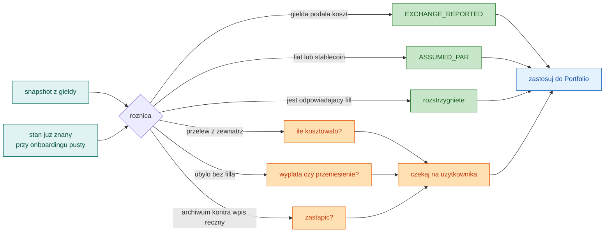
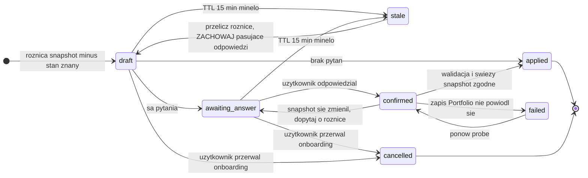
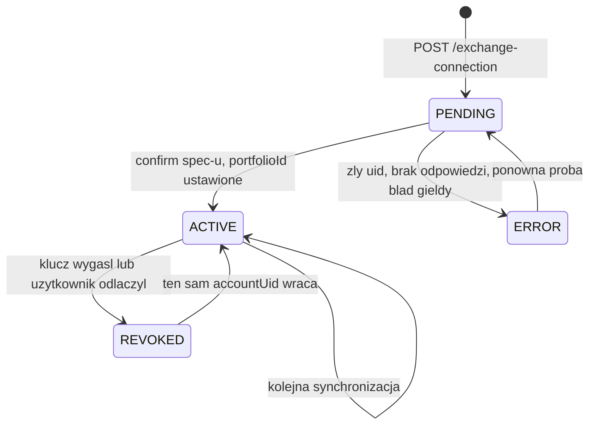
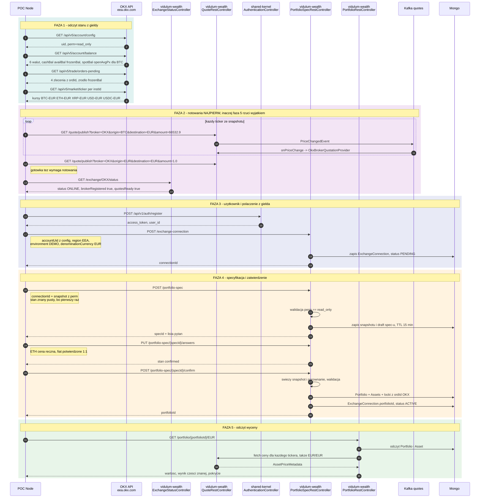
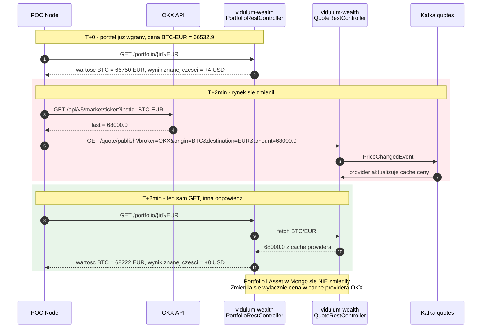
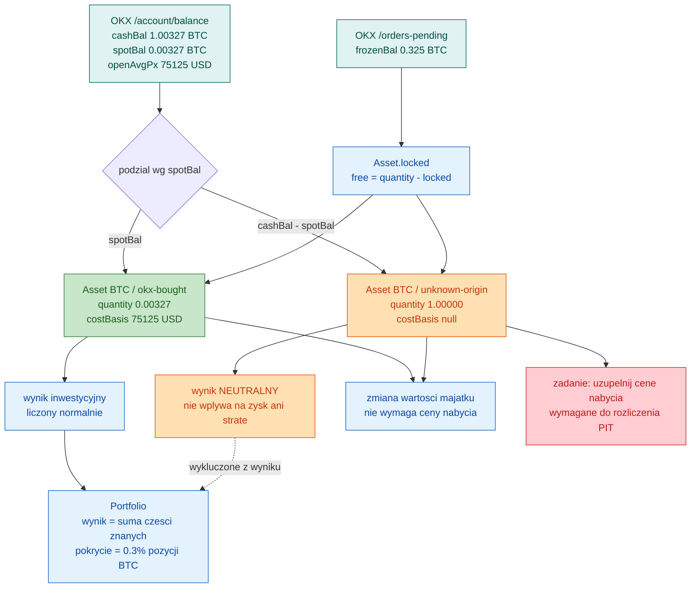

# Podłączenie giełdy OKX do backendu Vidulum

Analiza krok po kroku: od zarejestrowania brokera OKX, przez zmiany w modelu `Portfolio`/`Asset`,
po listę atomowych zadań. Punkt wyjścia to prototyp w `tools/okx/` (Node 22, read-only) — działający,
zweryfikowany na żywym koncie demo, ale kończący się na plikach i logu.

Dokumenty źródłowe: `tools/okx/PODSUMOWANIE.md` (ustalenia o API), `tools/okx/OKX-CONTEXT.md`
(fakty techniczne), `tools/okx/IMPROVEMENTS.md` (34 poprawki prototypu).

> **Decyzja architektoniczna:** dane z OKX **nie dostają osobnego read-modelu**. Przechodzą przez
> istniejące klasy domenowe `Portfolio` i `Asset`; zmieniamy te klasy tak, żeby lepiej opisywały
> rzeczywistość (koszt nabycia z własną ilością, pozycje znane i nieznane), zamiast omijać je
> równoległym modelem. Wszystkie zadania w tym dokumencie zakładają tę drogę.

---

## 0. Punkt startowy — jak zacząć od zera

Sekcja dla kogoś, kto dostaje ten dokument i repozytorium, i nic poza tym.

### 0.1 Stan na dziś

| co | stan |
|---|---|
| prototyp OKX w Node (`tools/okx/`) | **działa**, zweryfikowany na żywym koncie demo, 70 asercji |
| moduł `okx` w Javie | **nie istnieje** — zero klas `.java` zawierających „okx" |
| `OkxBrokerQuotationProvider` | **nie istnieje** — zarejestrowani: Degiro, PM, Binance, Exante |
| `PortfolioSpec`, `ExchangeConnection` | **nie istnieją** — zaprojektowane w §4 i §5 |
| endpoint snapshotu / spec-u | **nie istnieje** |
| zmiany w `Portfolio` / `Asset` | **nie wprowadzone** — opisane w §3 i §8 |

Innymi słowy: **po stronie Javy nie zaczęto**. Wszystko poniżej to projekt, nie opis istniejącego kodu.
Jedyne, co działa, to prototyp w Node.

### 0.2 Czego potrzebujesz

- **Java 21** z preview features (skonfigurowane w `pom.xml`)
- **Node ≥ 22** — prototyp używa natywnego `WebSocket`, na Node 20 nie wystartuje
- **Docker** — MongoDB i Kafka
- **Konto OKX Demo Trading** z kluczem API o uprawnieniu `read_only`

### 0.3 Uruchomienie backendu

```bash
# infrastruktura + aplikacja w kontenerach
docker-compose -f docker-compose-final.yml up -d      # backend na localhost:9090

# albo lokalnie, przy działającej infrastrukturze
./mvnw spring-boot:run -pl vidulum-app                # backend na localhost:8080
```

**Uwaga: port zależy od sposobu uruchomienia.** `docker-compose-final.yml` mapuje `9090:8080`,
a `application.yml` nie ustawia `server.port`, więc lokalnie obowiązuje domyślne `8080`. POC musi
mieć adres backendu jako parametr, nie zaszyty na sztywno.

Pełne instrukcje budowania per moduł, przebudowy obrazu Dockera i zasady projektu (CQRS, DDD,
`DataCleaner`, `ErrorHttpHandler`) są w głównym `CLAUDE.md` — **obowiązują też tutaj**.

### 0.4 Uruchomienie prototypu OKX

```bash
cd tools/okx
cp .env.example .env.demo     # uzupełnij OKX_DEMO_KEY/SECRET/PASSPHRASE
npm test                      # 70 asercji, bez sieci i bez poświadczeń
npm run check:demo            # test poświadczeń: 19 wywołań REST
npm run ws:demo               # nasłuch na żywo
```

Klucz twórz w sekcji **Demo Trading** OKX, wyłącznie z uprawnieniem odczytu. Konto z `my.okx.com`
(region EEA) wymaga `OKX_DOMAIN=eea.okx.com` — bez tego dostaniesz `60032`. Passphrase zawierające
`#` **musi być w cudzysłowach**, inaczej `node --env-file` utnie wartość i dostaniesz `50105`.

### 0.5 Jak weryfikować tezy z tego dokumentu

Każde twierdzenie o istniejącym kodzie wskazuje plik i linię — sprawdzaj je, zamiast wierzyć.
Najczęściej używane punkty odniesienia:

| teza | gdzie sprawdzić |
|---|---|
| brak providera OKX | `QuotationService.java:54` |
| fill wymaga `Order` | `MakeTradeCommandHandler.java:25`, `FillOrderCommandHandler.java:25` |
| depozyt tylko w jednej walucie | `Portfolio.java:225` |
| `avgPurchasePrice = 1` przy depozycie | `Portfolio.java:236` |
| wycena pobiera cenę dla każdego aktywa | `PortfolioSummaryMapper.java:124` |
| tylko `/api/v1/auth/**` jest publiczne | `SecurityConfiguration.java:34` |
| `investedBalance` tylko z `deposit`/`withdraw` | `Portfolio.java:244,276` |

### 0.6 Dokumenty powiązane

| plik | co zawiera |
|---|---|
| `tools/okx/PODSUMOWANIE.md` | **słownik pojęć** (payload, koperta, watermark, proweniencja), ustalenia o API OKX, architektura synchronizacji |
| `tools/okx/OKX-CONTEXT.md` | fakty techniczne o API: regiony, hosty, retencja, kontrakty kanałów |
| `tools/okx/IMPROVEMENTS.md` | 34 poprawki prototypu z dowodami — po co każda powstała |
| `tools/okx/README.md` | jak uruchomić narzędzia, ograniczenia i pułapki |
| `CLAUDE.md` | zasady projektu — build per moduł, CQRS, `DataCleaner`, `ErrorHttpHandler` |

Jeśli nie znasz pojęć **payload**, **koperta**, **watermark** albo **proweniencja** używanych niżej,
zacznij od słownika w `PODSUMOWANIE.md` §1.

---

## 1. Rola skryptu JS — POC, nie cel

Na tym etapie kod w `tools/okx/` pozostaje w Node i pełni rolę **proof of concept**, który po
zmianach w backendzie będzie z nim rozmawiał po HTTP:

1. łączy się z OKX (profil `demo`) i czyta stan konta,
2. woła backend, żeby **zarejestrować użytkownika**,
3. zakłada mu **portfolio ze snapshotu** danych z OKX,
4. publikuje **notowania** dla aktywów znajdujących się w tym portfelu,
5. pozwala pobrać portfel przez `GET` i zobaczyć **aktualną wycenę**.

To świadomie tymczasowe. Docelowo, zgodnie z planem w `OKX-CONTEXT.md`, połączenie należy do
backendu: poświadczenia zaszyfrowane w Mongo, jedno WS na użytkownika, publikacja na Kafkę.
POC ma udowodnić przepływ end-to-end, nie zostać architekturą.

Konsekwencja praktyczna: POC musi umieć **uwierzytelnić się w backendzie** (JWT z rejestracji),
bo chronione endpointy tego wymagają.

---

## 2. Co blokuje dzisiaj

Trzy rzeczy, każda potwierdzona w kodzie:

**Brak brokera OKX w wycenie.** `QuotationService.findBrokerOrRaiseException` rzuca
`BrokerNotFoundException`, jeśli dla `Broker("OKX")` nie ma zarejestrowanego providera.
Zarejestrowani są dziś: Degiro, PM, Binance, Exante.

**Brak drogi wprowadzenia aktywów.** Do `Portfolio` prowadzą tylko dwie ścieżki: `deposit`
(ograniczony do jednej `allowedDepositCurrency`) i trade (wymaga istniejącego `Order`).
Konto OKX ma sześć walut — pięciu nie da się wprowadzić.

**Jedna cena nabycia na aktywo.** OKX zna koszt nabycia **tylko dla części kupionej u nich**
(`spotBal`), a nie dla całego salda (`cashBal`). Na koncie testowym: `cashBal` 1,00327 BTC wobec
`spotBal` 0,00327 BTC. Wpisanie jednej ceny dla całości zawyża zainwestowaną kwotę ~300-krotnie.

---

## 3. Decyzja modelowa: dwie pozycje zamiast jednej

Aktywa są identyfikowane parą `(ticker, subName)` — `Portfolio.findAssetByTickerAndSubName`.
Model **już dopuszcza** kilka pozycji tego samego waloru; dziś `subName` jest wszędzie `none()`.

Wykorzystujemy to:

| pozycja | ilość | koszt nabycia | wynik |
|---|---|---|---|
| `BTC / okx-bought` | 0,00327 | 75 125 USD (z `openAvgPx`) | liczony normalnie |
| `BTC / unknown-origin` | 1,00000 | nieznany | **neutralny** |

Każda pozycja jest w całości znana albo w całości nieznana, więc istniejący wzór na wynik
(`cena_bieżąca × ilość − cena_nabycia × ilość`) pozostaje poprawny bez zmian w ~20 miejscach,
które go używają.

**Reguła wyniku:** zysk/strata liczony wyłącznie ze znanej części; część nieznana nie wpływa
ani na zysk, ani na stratę.

Trzy zastrzeżenia do tej reguły, obsługiwane osobnymi zadaniami:

- „Neutralna" nie znaczy „nie wpływa na majątek". Nieznana część realnie zyskuje i traci na
  wartości — stąd osobna miara **zmiany wartości majątku**, niewymagająca ceny nabycia (C5).
- Przy każdej liczbie wyniku musi być widoczne **pokrycie** — ilu procent pozycji dotyczy (C4).
- „Nieznane" to **zadanie do uzupełnienia**, nie stan docelowy. Bez tego użytkownik nie odliczy
  kosztów przy rozliczeniu (C8).


### 3.1 `CostBasis` — typ, który uniemożliwia zmyślenie kosztu (C1)

Reguła z §3 („wynik tylko ze znanej części") nie obroni się sama, dopóki koszt nabycia jest
obowiązkowym `Price`. C1 zamienia ją w niezmiennik typu.

#### Co dokładnie jest zepsute dzisiaj

Cztery miejsca, nie jedno:

| miejsce | co robi | dlaczego to błąd |
|---|---|---|
| `PortfolioSummaryMapper:127` | `oldValue = avgPurchasePrice × quantity`, potem `profit = currentValue − oldValue` | mnoży cenę **znanej części** przez **całe saldo** — przy 0,3 kupionego ze 100 zysk jest zmyślony |
| `AggregatedPortfolio:126` | `Price.zero("USD")` | sentinel „nie wiem" nieodróżnialny od ceny zero, do tego waluta zaszyta niezależnie od portfela |
| `Portfolio:236` (depozyt) | `Price.one(currency)` | semantycznie prawda, ale zapisana jako liczba nieodróżnialna od prawdziwej ceny 1 |
| `Portfolio:178`, `:211` | średnia ważona przez `getValue()` | dołożenie pozycji o koszcie zero po cichu rozcieńcza średnią — odwrotny wariant tego samego błędu |

Przy okazji rozbrajana jest pułapka: `Money.diffPct` ma strażnika na `this.amount`, ale **nie na
dzielniku**. Zerowy `oldValue` przy niezerowej wartości bieżącej to `ArithmeticException`.
Dziś trudno tam trafić, bo ceny biorą się z transakcji; staje się osiągalne w chwili, gdy
cokolwiek zapisze koszt zero.

#### Typ

```java
public record CostBasis(
        Quantity quantity,      // ilu sztuk ten koszt dotyczy
        Price avgPrice,         // średnia cena nabycia TEJ ilości
        Provenance provenance   // skąd ta liczba
) {}
```

`Asset.costBasis` jest **nullowalne**. `null` znaczy „nie znamy kosztu" i jest **jedynym**
sposobem wyrażenia niewiedzy.

**Dlaczego `quantity` w środku, skoro `Asset` już ją ma.** Bo mogą się różnić: trzymasz 100,
znasz koszt 0,3. To jedyny sposób, żeby policzyć `oldValue` na tym, czego koszt faktycznie
znamy. Po C2 w większości przypadków będą równe, ale **C1 wchodzi przed C2** i właśnie wtedy
własne `quantity` jest niezbędne. Później zostaje jako sprawdzalny niezmiennik
`costBasis.quantity <= asset.quantity`.

#### Proweniencja — cztery wartości

| wartość | kto produkuje | co wolno |
|---|---|---|
| `EXCHANGE_REPORTED` | `openAvgPx` / `accAvgPx` z giełdy | nadpisywalne po cichu |
| `DERIVED_FROM_FILLS` | własna historia transakcji (`handleExecutedTrade`) | nadpisywalne po cichu |
| `ASSUMED_PAR` | gotówka i stablecoiny — zastępuje `Price.one` | nadpisywalne po cichu |
| `USER_PROVIDED` | człowiek odpowiedział „kosztowało 2400 EUR" | **nigdy bez pytania** (D6) |

**`UNKNOWN` z pierwotnego szkicu zostaje usunięte.** Nie ma producenta: skoro `null` znaczy
„nie wiemy", to `UNKNOWN` jest drugim sposobem powiedzenia tego samego, a dwa sposoby gwarantują,
że kod będzie sprawdzał jeden i pomijał drugi. Jedyne uzasadnienie to dane zastane o nieznanym
pochodzeniu — a tych nie ma, bo aplikacja nie ma użytkowników.

#### Zmiana w `Asset`

```java
public Money getValue() {                       // usuwane
    return avgPurchasePrice.multiply(quantity);
}

public Optional<Money> knownCost()              // costBasis.avgPrice × costBasis.quantity
public Quantity coveredQuantity()               // ile z pozycji ma znany koszt
```

`getValue()` jest dwuznaczne — brzmi jak wartość rynkowa, a znaczy koszt nabycia. Ta
dwuznaczność jest w połowie odpowiedzialna za błąd w `PortfolioSummaryMapper`. `Optional` zmusza
każde wywołanie do rozstrzygnięcia, co zrobić z brakiem kosztu, zamiast dostać zmyślone zero.

Interfejs `Valuable` ma **jednego** implementującego (`Asset`), więc znika razem z metodą.

#### 26 miejsc wywołań

**Mechaniczne przeniesienie (11):** `PortfolioSnapshot.AssetSnapshot`, `PortfolioEntity` ×3,
`Portfolio:48`, `Portfolio:80`, `RiskManagementMapper`, `AssetRiskManagementStatement`,
`RiskManagementDto`, `PortfolioDto`, `PortfolioSummaryMapper:144`.

Dwie decyzje w tej grupie: w **encji Mongo spłaszczyć do trzech pól** (`costQuantity`,
`costPrice`, `costProvenance`), żeby dokument został czytelny, a `null` jednoznaczny; w **DTO
wystawić jako obiekt zagnieżdżony** z proweniencją, bo interfejs musi umieć pokazać „ta liczba
pochodzi od ciebie" kontra „z giełdy".

**Arytmetyka wymagająca decyzji (7):** `Asset.getValue`, `Portfolio.increaseAsset`,
`Portfolio.reduceAsset`, `AggregatedPortfolio` ×3, `PortfolioSummaryMapper:127`.

- `increaseAsset` / `reduceAsset` — średnia ważona liczona **tylko po znanych częściach**;
  dołożenie porcji o nieznanym koszcie nie rusza średniej, tylko zmniejsza pokrycie.
- `PortfolioSummaryMapper:127` — `oldValue` z `knownCost()`, a przy `Optional.empty()` zysk
  **nie jest liczony wcale**. Nie zero, nie null-jako-zero: pole nieobecne. Docelowo to C3 i C4,
  ale C1 musi już nie kłamać.
- `AggregatedPortfolio:126` — `Price.zero("USD")` znika, zastępuje je `null`.

**Producenci (2):** `Portfolio:187` (transakcja → `DERIVED_FROM_FILLS`), `Portfolio:236`
(depozyt → `ASSUMED_PAR`).

#### Otwarte przy wdrożeniu

1. Czy `reduceAsset` zmniejsza `costBasis.quantity` proporcjonalnie przy sprzedaży części —
   tak przy `DERIVED_FROM_FILLS`; sprzedaż pozycji **bez** kosztu to zdarzenie podatkowe,
   którego nie policzymy, i należy do C7. W C1 wystarczy nie przyjąć zera.
2. Waluta kosztu kontra waluta wyceny. `Price` niesie własną walutę, więc koszt w USDC przy
   wycenie w EUR wymaga przeliczenia. `PortfolioSummaryMapper` już to robi przez
   `denominateInCurrency`; C1 tego nie zmienia, ale kurs historyczny kontra bieżący to osobny
   problem.

#### Znalezione przy wdrożeniu

**Wypłata nie aktualizowała kosztu.** `apply(MoneyWithdrawEvent)` zmniejszał ilość, ale nie
`costBasis`, więc po wypłacie całości koszt nadal twierdził, że pokrywa 10 000 sztuk, których
już nie ma. Wykrył to test, którego oczekiwanie powstało mechanicznie z ilości — czyli dokładnie
ta własność, dla której `CLAUDE.md` każe porównywać całe obiekty.

**Średnia cena zakupu pochłaniała wpływy ze sprzedaży — i podwajała zysk.** Stary `reduceAsset`
odejmował od kosztu pozostałej pozycji to, co sprzedana część przyniosła:

```java
Money totalValue = soldAsset.getValue().minus(soldPortion.getValue());
Price updatedAvgPurchasePrice = Price.of(totalValue.divide(decreasedQuantity));
```

Skutek na realnym przypadku z `shouldBuyBitcoinTest`: kupione 1 BTC po 60 000, sprzedane 0,25 po
80 000. Zysk zrealizowany raportowany osobno jako 4 750 USD — a koszt reszty spadał z 60 000 do
53 333, więc ta sama nadwyżka wracała drugi raz jako 5 000 USD zysku niezrealizowanego. Łącznie
9 750 zamiast 5 000.

Po zmianie **to, co zapłaciłeś, nie zmienia się dlatego, że sprzedałeś część**. Koszt jest
przycinany do pozostałej ilości, a nie przeliczany. Oczekiwania w trzech testach zostały
poprawione wraz z komentarzem — stare liczby kodowały starą, błędną semantykę.

Formalnie wykracza to poza „wprowadź typ", ale mieści się w tym, po co C1 istnieje: koszt, który
pochłania wpływy ze sprzedaży, jest kosztem, który kłamie.

#### Czego C1 nie robi

Nie rozdziela pozycji (C2), nie wyłącza nieznanej części z wyniku (C3), nie liczy pokrycia (C4),
nie rusza `investedBalance` (C9) ani pozostałych sentineli (F3). C1 to **typ plus przeprowadzenie
go przez 26 miejsc** tak, żeby nic nie zmyślało liczby.

### 3.2 Rozdzielenie pozycji po `subName` (C2)

#### Po co, skoro C1 już wystarcza

C1 sprawił, że częściowa wiedza **da się wyrazić** — `CostBasis.quantity` bywa mniejsza od
`Asset.quantity`. To jest jednak proteza: każdy konsument musi *pamiętać* o sprawdzeniu pokrycia,
a wystarczy, że jeden zapomni, i wraca zmyślona liczba — tylko trudniejsza do znalezienia.

Po rozdzieleniu **każda pozycja jest w całości znana albo w całości nieznana**, więc wzór
`cena_bieżąca × ilość − cena_nabycia × ilość` znów jest poprawny bez warunków, a pokrycie staje
się sumą na poziomie portfela zamiast pułapki przy każdym mnożeniu.

Powód niezależny od arytmetyki: te dwie części **zachowują się inaczej prawnie**. Nieznana to
zobowiązanie podatkowe, którego nie policzymy. Jako jeden wiersz nigdy nie sprzedasz „tylko tej
znanej części", a to jest operacja, którą ludzie realnie wykonują.

#### Słownik

| `subName` | znaczenie |
|---|---|
| `traded` | nabyte transakcją, którą zapisaliśmy — koszt znany z fillów |
| `transferred-in` | przyszło z zewnątrz — koszt nieznany, dopóki użytkownik go nie poda |
| `none` | **gotówka**; nie ma pochodzenia do rozdzielania, koszt zawsze po parze |

Gotówka zostaje przy `none` świadomie: strona pieniężna każdej transakcji ma zaszyte
`SubName.none()` (`Portfolio:137`, `:159`) i tak ma pozostać.

**„Gotówka" znaczy: waluta wyceny tego portfela — i nic więcej.** To zawężenie kosztowało nas
C10. Kusi, żeby do `none` wpuścić wszystko po parze, ale USDC też jest po parze, a nie jest
jednostką rozliczeniową portfela; wrzucony do `none` rozmyłby ten slot do „coś wartego mniej
więcej jeden". Regułą jest więc jeden ticker na portfel — ten z `denominationCurrency` — a każdy
inny walor, choćby najstabilniejszy, zostaje zwykłą pozycją dzieloną na `traded` i
`transferred-in`.

#### Trzy rzeczy, które podział psuje

**1. Wyszukiwanie po samym tickerze przestaje być jednoznaczne.**

```java
private Optional<Asset> findAssetByTicker(Ticker ticker) {
    return assets.stream().filter(a -> a.getTicker().equals(ticker)).findFirst();
}
```

`findFirst()` przy dwóch pozycjach BTC wybiera **według kolejności w liście**, czyli przypadkowo.
Używają tego cztery operacje w sześciu miejscach: depozyt (`:237`), wypłata (`:275`),
`lockAsset` (`:327`, `:336`), `unlockAsset` (`:343`, `:354`).

Przy blokadach jest to najgroźniejsze, bo `activeLocks` to zbiór **per pozycja**: blokada trafi
na `transferred-in`, odblokowanie na `traded` i rzuci `CannotUnlockAssetException` — albo odwrotnie,
`locked`/`free` rozjadą się po cichu.

**2. Ścieżka zleceń twardo wpisuje `SubName.none()`.** `ExecuteOrderCommandHandler:41` i
`FillOrderCommandHandler:44`. Transakcja z definicji dotyczy pozycji `traded`, więc to tam ma
trafiać — inaczej egzekucja nie znajdzie żadnej z pozycji i utworzy **trzecią**, pustą.

**3. Nic nie pilnuje unikalności `(ticker, subName)`.** Cała reszta stoi na tym niezmienniku.

#### Co C2 robi

- **Niezmiennik**: najwyżej jedna pozycja na `(ticker, subName)`, wymuszony przy dodawaniu.
- **Rozdzielenie `findAssetByTicker` na trzy intencje**: pozycja gotówkowa (depozyt, wypłata),
  konkretna pozycja (blokady), wszystkie pozycje tickera (widoki i wycena).
- **Blokady dostają `subName`**, opcjonalny w API: gdy ticker ma jedną pozycję, rozstrzyga się
  sam; gdy ma więcej, a nie podano której — **głośny błąd zamiast losowego wyboru**.
- **Transakcje celują w `traded`** zamiast w `none` dla strony niepieniężnej.

Zamiana cichego uszkodzenia na jawny błąd jest tu ważniejsza niż wygoda: portfel, w którym
`locked` nie zgadza się z rzeczywistością, jest gorszy niż odrzucone żądanie.

#### Znalezione przy wdrożeniu

**`Ticker` w zdarzeniach nie wystarczał.** `AssetLockedEvent` i `AssetUnlockedEvent` niosły sam
ticker, więc odtworzenie stanu ze zdarzeń trafiałoby w przypadkową pozycję dokładnie tak samo jak
żywa operacja. Oba dostały `subName`, ustalany **raz** przy `lockAsset`/`unlockAsset` i zapisany
w zdarzeniu — rozstrzyganie dwa razy (przy wywołaniu i przy odtwarzaniu) mogłoby dać dwa różne
wyniki, gdyby portfel w międzyczasie się zmienił.

**Zgodność wsteczna wyszła sama.** `SubName.none()` na stronie niepieniężnej transakcji jest
tłumaczone na `traded` (`tradedPosition`), więc `ExecuteOrderCommandHandler` i
`FillOrderCommandHandler` nie wymagały zmiany — a mimo to przestały tworzyć trzecią, pustą
pozycję. Metody `lockAsset`/`unlockAsset` bez `subName` zostały jako przeciążenia: rozstrzygają
się same, gdy pozycja jest jedna, i rzucają `AmbiguousAssetSelectionException`, gdy jest ich
więcej.

**Ślad w testach, który warto znać.** `TradeProcessedEvent` zapisuje `subName` **tak, jak podał
go wołający** (`none`), a nie pozycję, na którą trafił (`traded`). Zdarzenie jest zapisem
żądania, nie jego skutku — i tak ma zostać.

#### Czego C2 nie robi

Nie zmienia liczenia wyniku (C3), nie pokazuje pokrycia (C4), nie naprawia scalania po samym
tickerze w `AggregatedPortfolio` (C6) i **nie rozstrzyga, z której pozycji sprzedajesz**, gdy
trzymasz obie (C7). C2 ma sprawić, że dwie pozycje jednego waloru współistnieją, nie psując
blokad ani zleceń.
---

## 4. PortfolioSpec — onboarding jako pierwszy przypadek synchronizacji

Portfel **nie powstaje wprost ze snapshotu**. Powstaje ze specyfikacji, którą użytkownik zatwierdził.

### 4.1 Przeformułowanie

Kuszące jest zaprojektowanie tego jako jednorazowego kroku „podłącz giełdę". Byłby to błąd, bo za
miesiąc trzeba by zbudować drugi, bardzo podobny mechanizm dla synchronizacji — i utrzymywać dwa
komplety reguł, które muszą się zgadzać.

Właściwe ujęcie jest ogólniejsze:

> Za każdym razem, gdy giełda mówi coś, czego **nie umiemy zinterpretować sami**, powstaje zestaw
> pytań do użytkownika. `PortfolioSpec` to ten zestaw.

Silnik jest zawsze ten sam:

```
snapshot z giełdy  −  stan, który już znamy  =  różnica
różnica  →  reguły  →  {rozstrzygnięte automatycznie}  +  {pytania do użytkownika}
```

**Onboarding to po prostu przypadek, w którym „co już wiemy" jest puste** — dlatego pytań jest
wtedy dużo. Przy dziesiątej synchronizacji zwykle nie ma żadnego.

### 4.2 Kiedy pytanie jest potrzebne, a kiedy nie

To jest kluczowa tabela: pokazuje, że mechanizm **nie nęka użytkownika**, tylko pyta wtedy, gdy
jest on jedynym źródłem odpowiedzi.

| co pokazuje różnica | pytać? | proweniencja |
|---|---|---|
| pozycja urosła, OKX podał `openAvgPx` | **nie** | `EXCHANGE_REPORTED` |
| pozycja urosła, brak `openAvgPx` (przelew z zewnątrz) | **tak** — ile kosztowało? | `USER_PROVIDED` |
| pozycja zmalała, jest odpowiadający fill | **nie** | — |
| pozycja zmalała bez filla (przelew na zewnątrz) | **tak** — wypłata czy przeniesienie? | — |
| pojawiła się nowa waluta fiat | **nie** | `ASSUMED_PAR` |
| pojawiło się nowe krypto bez historii | **tak** | `USER_PROVIDED` |
| archiwum kwartalne ujawniło koszt pozycji wycenionej ręcznie | **tak** — zastąpić? | `DERIVED_FROM_FILLS` |
| nic się nie zmieniło | **nie** — spec w ogóle nie powstaje | — |



### 4.3 Oś czasu — realne konto

Liczby z konta demo, na którym prototyp był weryfikowany.

**Dzień 1 · podłączenie giełdy** → `Spec #1`, stan znany jest pusty

```
snapshot: BTC 1,00327 (0,00327 kupione) · ETH 1 · XRP 50000 · EUR 4386 · USD 5000 · USDC 5000
pytania:  BTC   — potwierdz podzial 0,00327 znane / 1,00000 nieznane
          ETH 1 — skad i ile kosztowalo?
          fiat  — przyjmujemy 1:1, potwierdz
wynik:    Portfolio powstaje po zatwierdzeniu
```

**Dzień 3 · kupno 0,01 BTC na OKX** → `Spec #2`

```
roznica:  BTC okx-bought 0,00327 -> 0,01327, OKX podal nowy openAvgPx
pytania:  BRAK
wynik:    zastosowane automatycznie, uzytkownik nic nie widzi
```

To jest przypadek rozstrzygający o sensie całej konstrukcji: **zwykły handel na giełdzie nie
generuje żadnego pytania**, bo giełda zna cenę.

**Dzień 10 · przelew 2 ETH z portfela sprzętowego** → `Spec #3`

```
roznica:  ETH 1 -> 3, brak openAvgPx dla nowej czesci
pytania:  2 ETH pojawily sie bez transakcji — ile kosztowaly?
wynik:    uzytkownik wpisuje 2 400 EUR, proweniencja USER_PROVIDED
```

**Dzień 15 · sprzedaż 0,5 ETH** → `Spec #4`

```
roznica:  ETH 3 -> 2,5, jest fill
pytania:  z ktorej pozycji? 1 ETH nieznane vs 2 ETH po 1 200 EUR
wynik:    pytanie ma skutek podatkowy, wiec musi pasc
```

**Dzień 40 · archiwum kwartalne dociągnęło starsze fille** → `Spec #5`

```
roznica:  znaleziono historie zakupu 1 ETH — 1 850 EUR
pytania:  masz tam reczna wycene. Zastapic danymi z gieldy?
wynik:    tu proweniencja robi robote
```

### 4.4 Dlaczego dzień 40 jest dowodem na sens proweniencji

Bez zapisanego „skąd to wiem" system ma w tym momencie dwie liczby i **żadnej podstawy do wyboru**.
Z proweniencją reguła jest oczywista i daje się zakodować:

| proweniencja istniejącej wartości | co zrobić z nowszymi danymi |
|---|---|
| `ASSUMED_PAR` | nadpisz po cichu — to było tylko założenie |
| `EXCHANGE_REPORTED` | nadpisz — nowsze dane giełdy są lepsze |
| `USER_PROVIDED` | **nigdy nie nadpisuj bez pytania** — użytkownik coś wiedział |

To różnica między systemem, który szanuje wiedzę użytkownika, a takim, który mu ją kasuje przy
nocnym jobie.

### 4.5 Cykl życia specyfikacji



Ścieżka `draft → applied` bez udziału człowieka to ta, którą pójdzie większość synchronizacji.

**TTL specyfikacji: 15 minut (decyzja na POC).** Trzy rzeczy, które trzeba przy tym rozumieć:

- **Przeterminowuje się snapshot, nie odpowiedzi.** Spec zawiera dwa rodzaje danych o zupełnie
  różnej trwałości. **Snapshot** to „co giełda mówiła o 10:00" — starzeje się z każdą transakcją na
  koncie. **Odpowiedź** to „za to ETH zapłaciłem 2 400 EUR" — jest prawdziwa niezależnie od tego,
  co dzieje się z saldem. Wygaszenie całego spec-u wyrzuca obie, choć psuje się tylko jedna.
  Wejście w `stale` przelicza różnicę od nowa i **zachowuje odpowiedzi, których kotwica nadal
  obowiązuje** — pyta wyłącznie o to, co doszło.

  Odpowiedź jest przypisana do **partii** (`ticker`, `subName`, ilość w chwili odpowiedzi), nie do
  całej pozycji. Dzięki temu dokupienie ETH nie unieważnia wyceny wcześniejszej partii — tworzy
  nową partię z własnym pytaniem. Odpowiedź traci ważność tylko wtedy, gdy jej partia zniknęła
  albo zmalała.
- **Czas jest tylko przybliżeniem tego, co nas interesuje.** Snapshot sprzed dwóch godzin na
  nieruchomym koncie jest aktualny; sprzed trzydziestu sekund na aktywnie handlowanym — już nie.
  Dlatego `confirm` **zawsze** pobiera świeży snapshot i porównuje, niezależnie od wieku spec-u.
  Zgodny — stosuj. Różny — wróć do `awaiting_answer` z pytaniem o różnicę. TTL jest wtedy
  podpowiedzią dla interfejsu, a nie mechanizmem poprawności.
- **Token JWT może wygasnąć szybciej niż spec.** Wtedy `confirm` padnie z powodu niezwiązanego
  z danymi. POC musi to rozróżniać w komunikacie.

Stan `cancelled` jest terminalny i świadomy: użytkownik przerwał onboarding. Bez niego spec-y
wiszą w nieskończoność w `awaiting_answer` i nie da się odróżnić „myśli" od „odszedł".

### 4.6 Co ta konstrukcja daje poza rozwiązaniem problemu ceny

- **Historia decyzji.** Ciąg spec-ów to zapis, *dlaczego* portfel wygląda tak, jak wygląda —
  z datą i źródłem. Przy kontroli albo reklamacji użytkownika masz odpowiedź.
- **Jedno miejsce na kolejne giełdy.** Binance nie daje `openAvgPx` wcale; u niego po prostu
  więcej różnic wpadnie w wiersze „tak, pytaj". Mechanizm bez zmian.
- **Bezpieczna automatyzacja.** Nocną synchronizację można włączyć bez obawy: wszystko, czego
  system nie umie rozstrzygnąć, **czeka** zamiast zgadywać.
- **Naturalne miejsce na cofnięcie.** Skoro spec jest trwały, „cofnij tę synchronizację" jest
  wykonalne — wiadomo, co i dlaczego zmieniła.

### 4.7 Granice, których trzeba pilnować

**Spec nie może stać się drugim modelem portfela.** Jeśli zacznie trzymać komplet pól każdego
aktywa, powstanie przypadkiem ten read-model, z którego świadomie zrezygnowaliśmy — tylko pod inną
nazwą. Granica: **spec trzyma decyzje i proweniencję**, referencję do snapshotu, a `quantity` co
najwyżej po to, żeby zwalidować, że użytkownik nie wymyślił salda.

**Spec musi być trwały, nie DTO.** Jako ciało requestu traci całą wartość w sekundzie utworzenia
portfela. Własna encja, własny cykl życia, `Portfolio` niesie referencję do spec-u, który go zrodził.

**Proweniencja to słownik zamknięty**, nie pole tekstowe. Wolne „dlaczego" jest bezużyteczne dla
późniejszej logiki w rodzaju „przelicz wszystko, co było tylko założone".

**Snapshot się starzeje** między pobraniem a zatwierdzeniem. Stan `stale` i przeliczenie różnicy od
nowa, zamiast stosowania nieaktualnych odpowiedzi.

**Spec jest niezaufanym wejściem, snapshot jest kotwicą.** Walidacja: ilości muszą zgadzać się ze
snapshotem, ilość objęta kosztem nie może przekraczać ilości pozycji, waluta musi być rozwiązywalna,
a pozycje bez ceny muszą być **jawnie potwierdzone jako nieznane**, nie pominięte milczeniem.


### 4.8 Łańcuch D1 → D4 → D2 → D3 — zakres i granice

#### Podział pracy

| # | co dokłada | dlaczego nie da się bez niego |
|---|---|---|
| **D1** | encja + silnik różnicy, `POST`/`GET /portfolio-spec` | bez niego nie ma czego zatwierdzać |
| **D4** | reguły z §4.2 — które różnice **nie** wymagają człowieka | bez niego spec pyta o **każdy zwykły zakup** |
| **D2** | `PUT .../answers` z proweniencją i kotwicą w partii | bez niego nie da się odpowiedzieć |
| **D3** | `confirm` → `Portfolio` + `ExchangeConnection.confirm` | bez niego nic się nie materializuje |

**D1 i D4 są nierozdzielne w praktyce.** D1 bez D4 jest weryfikowalny wyłącznie testem, bo
ścieżka `draft → applied` — ta, którą pójdzie większość synchronizacji — po prostu nie powstaje.

#### Co D4 dziedziczy po C1

Cztery z pięciu proweniencji **już istnieją** jako enum, a `CostBasis.isOverwritableSilently()`
implementuje regułę nadpisywania. D4 jest więc mapowaniem różnicy na istniejące pojęcia, nie
projektowaniem od zera.

Jedna reguła jest droższa, niż wygląda. **„Pozycja zmalała, jest odpowiadający fill — nie pytaj"**
wymaga historii transakcji z okresu przerwy. OKX trzyma `fills-history` **3 miesiące**; dłuższa
przerwa bez archiwum kwartalnego sprawia, że każdy spadek wygląda jak przelew na zewnątrz
(§5.8). W POC historii filli nie ma w ogóle, więc **spadek zawsze rodzi pytanie** — to jest
świadome ograniczenie, nie przeoczenie.

#### Kształt snapshotu jest podyktowany przez OKX

Giełda podaje `cashBal` (całość), `spotBal` (część handlowana) i `openAvgPx` (średnia dla części
handlowanej). To odwzorowuje się jeden do jednego na podział z C2:

```
pozycja traded          = spotBal            , CostBasis(EXCHANGE_REPORTED)
pozycja transferred-in  = cashBal - spotBal  , brak kosztu
```

Silnik nie musi niczego zgadywać — produkuje dwa wiersze, bo giełda podaje dwie liczby.

Z jednym wyjątkiem: **linia w walucie wyceny nie jest dzielona wcale**. Daje jeden wiersz
`none` o wartości `cashBal`, z kosztem po parze i bez pytania — `openAvgPx` jest tu ignorowane,
bo cena numeraire względem siebie samej niczego nie mówi. Powód nie jest estetyczny: `deposit`
i `withdraw` szukają gotówki pod `none` i nigdzie indziej (C10).

#### Trzy decyzje podjęte przed kodem

**`Portfolio` nie niesie `specId`.** §4.7 mówi „`Portfolio` niesie referencję do spec-u, który go
zrodził"; odwracamy ten kierunek — referencję trzyma `spec.portfolioId`, który i tak jest
zaplanowany. Powód praktyczny: nowe pole w `Portfolio` przechodzi przez `PortfolioSnapshot`,
`PortfolioEntity` i **12 miejsc w testach porównujących cały portfel**, i dokłada koszt każdemu,
kto portfela używa, dla informacji potrzebnej rzadko. Pytanie „który spec zrodził ten portfel"
obsługuje zapytanie, nie pole.

**Świeży snapshot przy `confirm` przychodzi w ciele żądania.** Backend w POC nie ma poświadczeń,
więc nie pobierze go sam. To nadal kontrola **spójności**, nie autentyczności — dokładnie to samo
rozróżnienie co przy `reportedKeyPermissions` w §5.3. Trzeba to wiedzieć, zanim ktoś uzna, że
`confirm` weryfikuje coś, czego nie może.

**Spec nie kopiuje pól aktywa.** Trzyma `quantity` wyłącznie po to, żeby zwalidować odpowiedź
przeciwko snapshotowi (§4.7). Bez tej dyscypliny powstanie drugi model portfela pod inną nazwą.

#### Znalezione przy wdrożeniu D2 i D3

**`vidulum-wealth` nie miało zależności od `vidulum-exchange`.** §5.9 przewidywało ten kierunek
przy wydzielaniu modułu, ale wpis w `pom.xml` nigdy nie powstał — bo do D3 nic go nie
potrzebowało. Dodany; kierunek jest zgodny z planem, `exchange` zależy wyłącznie od
`shared-kernel`.

**Brak transakcji obejmującej portfel i połączenie.** Pierwsza wersja `confirm` zapisywała
portfel, oznaczała spec jako `applied`, a dopiero potem potwierdzała połączenie — awaria na
ostatnim kroku zostawiała portfel bez połączenia i nic nie odróżniało go od prawdziwego.
Połączenie jest teraz **sprawdzane, zanim cokolwiek zostanie zapisane**, co zawęża okno do
minimum. Test `shouldNotCreateAPortfolioWhenTheConnectionCannotBeConfirmed` to utrwala.

**`Difference` musiał urosnąć o trzeci stan.** Odpowiedź „nie wiem" to różnica bez kosztu
**i** bez otwartego pytania — poprzedni niezmiennik „albo koszt, albo pytanie, nigdy oba ani
żadne" tego nie dopuszczał. Teraz są trzy kształty: rozstrzygnięty przez reguły, otwarty,
odpowiedziany.

**D3 obejmuje tworzenie, nie stosowanie do istniejącego portfela.** Spec policzony względem
istniejącego portfela kończy się jawnym `CannotApplySpecToExistingPortfolioException` (501),
bo zmniejszanie pozycji o nieznanym koszcie to zdarzenie podatkowe, którego nie policzymy (C7).
Głośna odmowa jest lepsza od zastosowania połowy.

#### Waluta i broker należą do połączenia, nie do żądania

Pierwsza wersja `confirm` brała jedno i drugie **z ciała żądania**, choć `ExchangeConnection`
już je niesie. Te same dwa fakty miały dwa źródła i nic ich nie porównywało.

Szkoda była realna i przesunięta w czasie. Notowania publikuje się **przeciwko walucie wyceny**
i muszą być w cache przed utworzeniem portfela (decyzja 9). Żądanie z inną walutą kończyło się
sukcesem, a awaria wychodziła dopiero przy `GET /portfolio` — na notowaniu, którego nikt nie
opublikował. Przy brokerze analogicznie: decyduje on, **czyj cache notowań** obsługuje portfel,
więc połączenie OKX mogło zasilać portfel zapisany pod inną giełdą — co podważa unifikację
`Exchange` z `Broker` z C2.

Teraz **połączenie wygrywa, a żądanie służy do potwierdzenia**: rozjazd kończy się
`ConnectionMismatchException` (409), nie cichym nadpisaniem. To ten sam wzorzec, co
`confirmedBalance` przy atestacji cashflow — wołający deklaruje, w co wierzy, a backend
konfrontuje to z prawdą. Gdy spec nie ma połączenia, oba pola z żądania są jedynym źródłem.

#### Co w testach trzeba będzie ruszyć

**Nic się nie psuje przy D1 i D4** — to nowy pakiet obok istniejących. `PortfolioFactory.empty`
zostaje, `POST /portfolio` bez zmian, testy `vidulum-exchange` nietknięte.

Przy **D3** dochodzi `ConfirmExchangeConnectionCommand` w `vidulum-exchange` (D3 musi mieć jak
zamknąć drugą stronę) oraz `PortfolioSpecEntity` w `WealthDataCleaner` i w tabeli `CLAUDE.md`.
To są dopisania, nie poprawki — pod warunkiem, że `Portfolio` nie dostanie `specId`.
---

## 5. ExchangeConnection i gotowość giełdy

### 5.1 Po co osobna encja

Silnik z §4 liczy `snapshot − stan znany`. Przy drugim uruchomieniu backend musi wiedzieć, **który
portfel odpowiada któremu kontu giełdowemu** — inaczej „stan znany" jest zawsze pusty i każda
synchronizacja wygląda jak onboarding.

W POC jest to niejawne: jeden skrypt, jedno konto. Przy pierwszej synchronizacji przestaje działać.

### 5.2 Model

| pole | typ | uwagi |
|---|---|---|
| `id` | `ExchangeConnectionId` | |
| `userId` | `UserId` | |
| `broker` | `Broker` | z shared-kernel — **ten sam typ, którym `Portfolio` nazywa giełdę**; id normalizowane do wielkich liter |
| `accountUid` | `String` | `uid` z `GET /account/config`; część klucza naturalnego |
| `environment` | enum | `DEMO` / `LIVE` |
| `region` | `String` | nieprzezroczysta wskazówka routingu; dla OKX `EEA` / `GLOBAL` / `US` (enum `OkxRegion` w module giełdy) — patrz §5.9 |
| `reportedKeyPermissions` | `ReportedKeyPermissions` | `perm` zgłoszone przez klienta; typ **wymusza `read_only` przy konstrukcji**, trzyma też surowy string do audytu. Przedrostek `reported` jest świadomy — patrz §5.3 |
| `credentialsMode` | enum | `EXTERNAL` (POC — klucze zostają w skrypcie) / `STORED_ENCRYPTED` (docelowo) |
| `portfolioId` | `PortfolioId` | ustawiane po `confirm`; puste do tego czasu. Kardynalność **1:1** — patrz §5.8 |
| `denominationCurrency` | `Currency` | **wejście**, nie wynik — patrz §5.4 |
| `status` | enum | `PENDING` / `ACTIVE` / `ERROR` / `REVOKED`. **Żaden nie jest terminalny** — patrz §5.8 |
| `statusReason` | `String` | czemu `ERROR` albo `REVOKED`; bez tego oba stany są nieczytelne dla użytkownika |
| `lastSnapshotAt` | `ZonedDateTime` | kiedy ostatnio **odczytaliśmy** stan z giełdy; podstawa TTL spec-u |
| `lastSyncAt` | `ZonedDateTime` | kiedy ostatnio **zastosowaliśmy** snapshot do portfela |
| `createdAt` | `ZonedDateTime` | |

Typ czasu to `ZonedDateTime`, nie `Instant` — cała reszta repozytorium używa tego pierwszego
(`UserFinancialProfile`, `CashFlow`, konwertery w `shared-kernel`, `FixedClockConfig` w testach).

Dwie decyzje warte uzasadnienia:

**Klucz naturalny to `(userId, broker, environment, accountUid)`.** Bez niego nie wykryjesz, że
użytkownik podpina to samo konto po raz drugi — i zrobisz mu dwa portfele z tymi samymi aktywami.
OKX oddaje `uid` w `GET /account/config`, więc to nic nie kosztuje.

Klucz jest **złożony, nie sam `accountUid`**, z dwóch powodów. `environment` musi w nim być, bo
demo i live to osobne konta z osobnymi saldami. `userId` musi w nim być, bo klucz globalny
pozwoliłby pierwszemu użytkownikowi zablokować wszystkim innym podłączenie tego samego konta —
to problem supportowy, nie zabezpieczenie, skoro portfele i tak są per-user i nic nie jest
liczone podwójnie między użytkownikami.

**Indeks unikalności zakładany jest jawnie, nie adnotacją.** `spring.data.mongodb.auto-index-creation`
domyślnie jest wyłączone i ten projekt nigdzie go nie włącza — wszystkie istniejące `@Indexed`
w repozytorium **nie tworzą żadnego indeksu** (to samo obserwuje F1). Adnotacja byłaby więc
deklaracją, która nigdy nie dociera do bazy, a niezmiennik wyglądałby na wymuszony. Indeks zakłada
`ExchangeConnectionIndexInitializer` jako `ApplicationRunner` — po `DataCleaner`, który kasuje
kolekcję w trakcie budowy kontekstu.

**`credentialsMode` jawnie mówi, że w POC kluczy nie mamy.** To nie jest brak, tylko stan świadomy.
Bez tego pola ktoś za pół roku uzna, że szyfrowanie „zapomniano dodać".

### 5.3 Wymuszenie read-only w POC

`OKX-CONTEXT.md` stawia warunek nienegocjowalny: klucz użytkownika ma mieć wyłącznie `read_only`,
a backend to weryfikuje. W POC backend **nie ma poświadczeń**, więc nie zrobi wywołania sam.

Rozwiązanie: snapshot **musi nieść pole `reportedKeyPermissions`**, a backend odrzuca żądanie,
jeśli to nie `read_only`.

**Gdzie ta reguła mieszka (zrobione w A6).** Nie w kontrolerze i nie w serwisie, tylko w typie
`ReportedKeyPermissions`, którego `of(...)` odmawia zbudowania wartości szerszej niż `read_only`.
`ExchangeConnection` trzyma ten typ zamiast `String`, więc **nie istnieje ścieżka, która omija
kontrolę** — ani przez nowy endpoint, ani przez odczyt z bazy (`toDomain()` też przechodzi przez
`of(...)`, co odrzuca dokument podmieniony ręcznie). Konsekwencja projektowa: połączenie z
za szerokim kluczem **nigdy nie powstaje**, więc nie ma rekordu w stanie `ERROR` z tego powodu —
żądanie jest odrzucane, zanim cokolwiek zostanie zapisane.

OKX zwraca `perm` jako listę po przecinku, więc sprawdzenie idzie po każdym wpisie, nie po całym
napisie: `"read_only,trade"` zaczyna się od właściwego słowa i musi zostać odrzucone. Białe znaki
i wielkość liter są normalizowane, ale surowy string zostaje zapisany bez zmian — to, co klient
zadeklarował, ma być audytowalne co do znaku.

Dwa różne błędy, nie jeden: `EXCHANGE_KEY_PERMISSIONS_NOT_REPORTED` (400 — nie podano niczego) i
`EXCHANGE_KEY_PERMISSIONS_TOO_BROAD` (422 — klucz, którego nie przyjmujemy). Komunikat drugiego
wymienia zgłoszone uprawnienia, żeby użytkownik wiedział, co usunąć przy wydawaniu klucza. Nazwa jest celowo niewygodna: samym brzmieniem mówi, że to
wartość **zgłoszona przez klienta**, a nie zweryfikowana przez nas. Gdy POC zostanie zastąpiony
kodem w Javie i backend zacznie pobierać `perm` sam, nazwa straci przedrostek `reported`. To nadal nie jest dowód (dane pochodzą od tego samego
klienta), ale zamienia deklarację w kontrolę, którą widać w logu i w testach.

**Czym ta walidacja jest, a czym nie jest.** Warto rozróżnić dwie rzeczy, które łatwo pomylić:

| rodzaj kontroli | pytanie | czy POC to daje |
|---|---|---|
| **spójność** | czy odpowiedzi pasują do snapshotu, który dostaliśmy? | **tak** |
| **autentyczność** | czy ten snapshot to naprawdę to, co powiedziała giełda? | **nie** |

W POC snapshot i odpowiedzi przychodzą z **tego samego źródła** — ze skryptu. Porównywanie jednego
z drugim wychwyci więc błąd (odpowiedź odnosząca się do pozycji, której w snapshocie nie ma), ale
nie wychwyci kłamstwa (skrypt mógłby wysłać `perm: "read_only"`, trzymając klucz z uprawnieniem
`trade`).

Co to daje mimo wszystko: **reguła istnieje jako kod, a nie jako zdanie w dokumencie**. Jest ścieżka,
która odrzuca spec, jest test, który to sprawdza, i jest wpis w logu. Gdy backend zacznie sam
pobierać snapshot, ta sama walidacja staje się prawdziwą kontrolą — zmienia się tylko źródło
danych wejściowych, nie logika.

### 5.4 Waluta wyceny jest wejściem, nie wynikiem

Decyzja z §6 mówi: notowania muszą być w cache **zanim** powstanie portfel. Ale notowania publikuje
się przeciwko walucie wyceny — nie da się załadować `BTC/EUR`, nie wiedząc, że walutą jest EUR.

Stąd: `denominationCurrency` należy do `ExchangeConnection` i jest **parametrem podłączenia**,
ustalanym przed pobraniem pierwszego snapshotu. Spec go nie wybiera — spec go używa.

### 5.5 Funding kontra Trading — zweryfikowane na żywo

Sprawdzone 2026-09-18 przelewem 10 USDC w obie strony na koncie demo.

**Nie mają osobnych identyfikatorów.** Oba należą do tego samego `uid`, a aktywa adresuje się w obu
tym samym `ccy`. „Typ konta" to wyłącznie kod używany przy przelewach: **`6` = Funding, `18` = Trading**.
Nie istnieje nic w rodzaju identyfikatora subkonta.

**Różnią się dramatycznie bogactwem danych:**

```
FUNDING   {"availBal":"10","bal":"10","ccy":"USDC","frozenBal":"0"}       ← 4 pola
TRADING   {ccy, cashBal, availBal, frozenBal, spotBal, openAvgPx, eq,
           upl, imr, mmr, liab, interest, twap, colRes, ...}              ← 50 pól
```

Kluczowa konsekwencja dla modelu: **Funding nie ma żadnych pól kosztu nabycia ani wyniku** — brak
`spotBal`, `openAvgPx`, `spotUpl`. Aktywo leżące na Funding jest więc zawsze pozycją nieznanego
pochodzenia.

| | Trading | Funding |
|---|---|---|
| handel | tak | nie |
| `frozenBal` znaczy | blokada przez otwarte zlecenie | oczekująca wypłata |
| koszt nabycia | jest, dla części kupionej | **brak** |
| wpłaty z zewnątrz | nie trafiają tu | **tu lądują** |
| wypłaty | nie stąd | **stąd wychodzą** |

Przelew między nimi pojawia się w `asset/bills` jako `type=130` (przychód) i `type=131` (rozchód).
**To nie jest wpłata ani wypłata** — nie może zmieniać `investedBalance`.

**Decyzja: jedno `Portfolio` na oba.** Ekonomicznie to jedna kieszeń; rozbicie na dwa portfele
sprawiłoby, że przelew wewnętrzny wyglądałby jak wypłata z jednego i wpłata do drugiego, fałszując
`investedBalance` po obu stronach. Widok zbiorczy i tak scala pozycje po tickerze.

**Zastrzeżenie: nie upychać przegródki w `subName`.** To pole niesie już jeden wymiar — pochodzenie
kosztu (`okx-bought` / `unknown-origin`). Dorzucenie drugiego dałoby ciągi typu
`okx-trading-bought`, po których nie da się filtrować. Jeśli kiedyś trzeba będzie odpowiedzieć na
pytanie „ile mam na Funding", powinien to być **osobny atrybut aktywa**, nie fragment nazwy.
W praktyce wymiar i tak się skraca, bo pozycja z Funding jest zawsze nieznanego pochodzenia.

W POC Funding jest poza zakresem (jest pusty, decyzja: najpierw Trading).

### 5.6 Dwa niezależne zegary nieświeżości

`AssetPriceMetadata` niesie własny `dateTime`, niezależny od momentu synchronizacji konta. W systemie
tykają więc **dwa zegary, które trzeba pokazywać osobno**:

| znacznik | za co odpowiada | typowy wiek |
|---|---|---|
| `portfolioSyncedAt` | kiedy ostatnio odczytaliśmy **stan konta** z giełdy — ilości, salda, locki | godziny, dni |
| `quotesAsOf` | kiedy ostatnio dostaliśmy **cenę** użytą do wyceny | sekundy, minuty |

Rozjeżdżają się w obie strony. Salda sprzed trzech dni wycenione ceną sprzed pięciu sekund wyglądają
na świeże, a opierają się na nieaktualnych ilościach. Odwrotnie: świeży snapshot i notowania sprzed
dwóch godzin, bo połączenie padło po synchronizacji.

**Interfejs nie może zlać ich w jedno „zaktualizowano o 14:32".** `GET /portfolio` zwraca oba,
a kontrolka przy giełdzie wskazuje, który z nich jest problemem. „Offline od 10 minut" znaczy co
innego przy saldach sprzed minuty, a co innego przy saldach sprzed tygodnia.

**Brak połączenia nie blokuje odczytu portfela.** Zwracamy ostatnią znaną wycenę, oznaczoną jako
potencjalnie nieaktualną — nie błąd.

### 5.7 Endpoint statusu giełdy

Przydatny przy testach, w monitoringu i docelowo jako kontrolka w interfejsie.

```
GET /exchange/status            -> lista wszystkich
GET /exchange/{name}/status     -> jedna giełda
```

```json
{
  "exchange": "OKX",
  "displayName": "OKX",
  "status": "ONLINE",
  "lastCheckAt": "2026-09-18T10:31:02Z",
  "lastSuccessAt": "2026-09-18T10:31:02Z",
  "latencyMs": 142,
  "message": null,
  "quotesReady": true,
  "quotedSymbols": ["BTC/EUR", "ETH/EUR", "XRP/EUR", "USD/EUR", "USDC/EUR", "EUR/EUR"],
  "brokerRegistered": true
}
```

Wartości `status`: `ONLINE` · `DEGRADED` (odpowiada, ale wolno lub częściowo) · `OFFLINE` ·
`UNKNOWN` (jeszcze nie sprawdzano).

**Kluczowa decyzja projektowa: status to nie tylko osiągalność, ale i gotowość.** Trzy pola
odpowiadają na trzy różne pytania, które w praktyce zlewają się w jedno „czy mogę teraz założyć
portfel?":

| pole | pytanie |
|---|---|
| `status`, `latencyMs` | czy giełda odpowiada |
| `brokerRegistered` | czy `QuotationService` zna `Broker("OKX")` |
| `quotesReady`, `quotedSymbols` | czy notowania są w cache |

Bez `brokerRegistered` i `quotesReady` endpoint mówiłby „ONLINE", a zakładanie portfela i tak by
padło — bo pada nie na giełdzie, tylko po naszej stronie.


### 5.8 Cykl życia połączenia

Trzy ustalenia, które domykają encję.

**Jedno połączenie, jeden portfel.** Kardynalność `ExchangeConnection : Portfolio` to **1:1**.
Wynika to wprost z decyzji 16 — Funding i Trading idą do jednego portfela, więc nie ma drugiego
powodu, dla którego jedno konto giełdowe miałoby rodzić dwa. `portfolioId` zostaje pojedynczym
polem, nie listą. Gdyby to się kiedyś zmieniło, zmiana pola na kolekcję jest migracją danych,
a nie przeprojektowaniem — dlatego można ją odłożyć bez ryzyka.

**`REVOKED` nie jest stanem terminalnym.** Brak połączenia z giełdą to **przerwa**, nie koniec:
klucz wygasł, użytkownik go skasował, giełda zwróciła `401`. Połączenie zachowuje `accountUid`
i `portfolioId`, a portfel zostaje nietknięty ze znacznikiem `portfolioSyncedAt` z momentu
ostatniej udanej synchronizacji. Nic się nie kasuje i nie archiwizuje.

**Ponowne podłączenie to synchronizacja, nie onboarding.** Po powrocie tego samego `accountUid`
backend odnajduje istniejące połączenie, przywraca `ACTIVE` i tworzy spec-a — z **niepustym**
stanem znanym, czyli portfelem sprzed przerwy. Cała maszyneria z §4 działa bez zmian:



Różnica po przerwie jest większa, ale **jakościowo taka sama** jak po godzinie. Tabela z §4.2
obsługuje oba kierunki: pozycja urosła z `openAvgPx` rozstrzyga się sama, pozycja zmalała bez
odpowiadającego filla staje się pytaniem „wypłata czy przeniesienie?". To właśnie znaczy
„portfel wyrównany z giełdą" — zbieżność wymuszona przez ten sam silnik, który obsługuje
zwykły dzień.

**Dwa różne „statusy", których nie wolno mylić.** `GET /exchange/{name}/status` z §5.7 odpowiada
na pytanie systemowe — czy giełda w ogóle jest użyteczna: czy odpowiada, czy broker jest
zarejestrowany, czy notowania są w cache. Nie zna użytkownika i jest taki sam dla wszystkich.
`GET /exchange-connection/{id}` odpowiada na pytanie osobiste — w jakim stanie jest **moje**
połączenie i czy mój portfel jest aktualny. Giełda może być `ONLINE`, a połączenie `REVOKED`;
i odwrotnie — połączenie `ACTIVE`, a giełda chwilowo `OFFLINE`, co §5.6 opisuje jako rozjazd
`portfolioSyncedAt` i `quotesAsOf`. Zlanie ich w jeden endpoint zabiera użytkownikowi możliwość
odróżnienia „giełda ma awarię" od „twój klucz wygasł".

**Jedno ograniczenie warte zapisania.** Reguła „zmalało, ale jest odpowiadający fill — nie pytaj"
wymaga historii transakcji z okresu przerwy. OKX trzyma `fills-history` przez **3 miesiące**;
starsze okresy wymagają archiwum kwartalnego, które pobiera się osobnym żądaniem. Przy przerwie
dłuższej niż kwartał — bez tego archiwum — każdy spadek pozycji wygląda jak przelew na zewnątrz
i staje się pytaniem do użytkownika. Nie jest to błąd modelu, tylko koszt długiej przerwy,
który trzeba pokazać w interfejsie zamiast ukryć.

### 5.9 Podział na moduły — co jest wspólne, a co giełdowe

Model połączenia nie ma w sobie nic z OKX-a, więc mieszka w osobnym module **`vidulum-exchange`**,
a `vidulum-okx` jest jednym z adapterów nad nim.

**Powód jest strukturalny, nie estetyczny.** Dopóki `ExchangeConnection` leżał w `vidulum-okx`,
pierwszy moduł drugiej giełdy musiałby zależeć od modułu OKX-a — wyłącznie po to, żeby sięgnąć po
wspólny agregat. Odwrócona zależność bez uzasadnienia.

```
shared-kernel ← exchange ←┬── wealth ← okx ← app
                          └── okx
```

`vidulum-exchange` zależy **tylko od `shared-kernel`**, bo `ExchangeConnection` używa wyłącznie
`UserId`, `PortfolioId`, `Currency` i `Broker`. Dzięki temu stoi w reaktorze **przed**
`vidulum-wealth` — a to jest warunek konieczny, bo `PortfolioSpec` (D1) ma żyć w `wealth` i musi
czytać połączenie, żeby poznać „stan znany".

| co | gdzie | dlaczego |
|---|---|---|
| `ExchangeConnection` i cały jego cykl życia | `exchange` | powiązanie user ↔ konto ↔ portfel nie zależy od giełdy |
| encja Mongo, repozytorium, indeks, `DataCleaner` | `exchange` | jedna kolekcja `exchange_connections` dla wszystkich giełd; dwa moduły kasujące ją same byłoby błędem |
| `ReportedKeyPermissions` | `exchange` | to **słownik Vidulum**, nie format giełdy — patrz niżej |
| `OkxRegion` | `okx` | `EEA`/`GLOBAL`/`US` to podział OKX-a i nie generalizuje się |
| `OkxBrokerQuotationProvider` | `okx` | z definicji |

**Dlaczego uprawnienia zostały wspólne, a region nie.** Każda giełda koduje uprawnienia inaczej
(OKX — lista po przecinku, Binance — booleany, Coinbase — scope'y), ale to znaczy tylko tyle, że
**tłumaczenie** należy do adaptera. Decyzja, co Vidulum akceptuje, jest jedna dla całego systemu
i musi być nieusuwalna — gdyby `KeyPermissions` było interfejsem implementowanym per giełda, nowa
giełda mogłaby przyjechać z własną, słabszą definicją „read-only". Region jest odwrotnie: agregat
nic z nim nie robi, tylko go przenosi, więc nie ma czego uwspólniać i zostaje tekstem.

**`Broker` zamiast własnego enuma `Exchange`.** `Portfolio` już ma pole `broker` typu `Broker`
z shared-kernel, a `OkxBrokerQuotationProvider` używa `Broker.of("OKX")`. Własny enum oznaczał
dwa niepowiązane identyfikatory tej samej giełdy — połączenie mówiące `Exchange.OKX` i portfel
mówiący `Broker.of("OKX")`, bez niczego, co gwarantuje zgodność. Do tego enum wymuszałby edycję
modułu wspólnego przy każdej nowej giełdzie; stała `Broker` jest deklarowana w module giełdy.
Id jest normalizowane do wielkich liter przy tworzeniu połączenia, bo wchodzi do klucza
naturalnego — `"okx"` nie może stać się drugim kontem obok `"OKX"`.

Zadanie **A8** dokłada nad tym serwis onboardingu: część wspólna (utworzenie i odszukanie
połączenia) w `exchange`, część OKX-owa (walidacja regionu, pobranie snapshotu) w `okx`.


### 5.10 Jak moduł giełdy podłącza się do onboardingu

Serwis onboardingu jest wspólny, ale rejestracja konta ma jedną część, która naprawdę różni się
między giełdami: **słownik regionów**. Reszta — id konta, środowisko, uprawnienia, waluta wyceny
— jest wszędzie taka sama.

Stąd port `ExchangeAdapter` w `vidulum-exchange`, celowo minimalny:

```java
public interface ExchangeAdapter {
    Broker broker();
    void validateRegion(String region);
}
```

`OkxExchangeAdapter` implementuje go w `vidulum-okx` i sprawdza region przeciwko `OkxRegion`.
Serwis zbiera adaptery przez `List<ExchangeAdapter>` — tak samo jak `KafkaTopicConfig` zbiera
dostawców notowań — więc **dodanie giełdy to dodanie modułu, a nie edycja modułu wspólnego**.

Zbiór zarejestrowanych adapterów odpowiada przy okazji na pytanie „które giełdy w ogóle da się
podłączyć", które serwis i tak musi znać, żeby odrzucić nieznanego brokera. Zwraca je
`GET /exchange-connection` jako `supportedExchanges`. To **inne pytanie** niż
`GET /exchange/{name}/status` z §5.7: tamto mówi, czy giełda odpowiada i czy jej notowania są
w cache *teraz*.

**Dlaczego region jest sprawdzany przy rejestracji, a nie później.** Klucz wydany dla jednego
regionu OKX nie uwierzytelni się w innym. Bez tej walidacji błąd wyszedłby dopiero jako `401`
z giełdy przy pierwszym pobraniu snapshotu — czyli długo po tym, jak użytkownik uznał, że konto
jest podłączone.

**Układ pakietów jest taki sam jak w `vidulum-cashflow`.** Kontroler nie zna serwisu — składa
komendę albo zapytanie i wysyła je przez `CommandGateway` / `QueryGateway`, a logika mieszka
w handlerach:

```
exchange_connection/
├── app/
│   ├── ExchangeConnectionDto.java            — wszystkie modele JSON w jednej klasie
│   ├── ExchangeConnectionRestController.java — mapuje JSON → komenda, wysyła przez gateway
│   ├── commands/
│   │   ├── connect/    ConnectExchangeCommand + Handler
│   │   └── reconnect/  ReconnectExchangeCommand + Handler
│   └── queries/        GetExchangeConnectionQuery + Handler,
│                       GetExchangeConnectionsOfUserQuery + Handler
├── domain/
└── infrastructure/
```

Reguła „połączenie widzi tylko jego właściciel" siedzi w jednym miejscu — jako metoda domyślna
`findOwnedOrThrow` na repozytorium domenowym — więc każdy handler wymusza ją tak samo.

**Odmowy i ich kody.** Każda kończy się statusem, na który klient może zareagować:

| sytuacja | status | kod |
|---|---|---|
| nieznany broker | 400 | `EXCHANGE_NOT_SUPPORTED` |
| region, którego giełda nie obsługuje | 400 | `EXCHANGE_REGION_UNKNOWN` |
| puste pole w żądaniu | 400 | `VALIDATION_ERROR` + `fieldErrors` |
| klucz szerszy niż `read_only` | 422 | `EXCHANGE_KEY_PERMISSIONS_TOO_BROAD` |
| konto już podłączone | 409 | `EXCHANGE_ACCOUNT_ALREADY_CONNECTED` |
| `reconnect` połączenia, które nie jest `REVOKED` | 409 | `EXCHANGE_CONNECTION_INVALID_TRANSITION` |
| cudze albo nieistniejące połączenie | 404 | `EXCHANGE_CONNECTION_NOT_FOUND` |

Dwie rzeczy w tej tabeli są świadome. **Puste pole daje 400, a nie 500** — `ExchangeConnection`
broni tych samych niezmienników `IllegalArgumentException`em, ale to asercja ostatniej szansy;
walidacja na `ConnectExchangeRequest` zamienia ten sam błąd w odpowiedź nazywającą pole.
**Cudze połączenie daje 404, nie 403** — `403` potwierdziłoby, że dane `id` istnieje.

---

## 6. Inwentarz endpointów

Kto woła, co woła i z której części systemu to pochodzi.

### 4.1 OKX — czytane przez POC

Host REST: `eea.okx.com` (region EEA). Profil demo dokłada nagłówek `x-simulated-trading: 1`.
Wszystko wyłącznie `GET` — narzędzie w `tools/okx` nie ma metody POST.

| URL | co daje | użycie w przepływie |
|---|---|---|
| `GET /api/v5/account/config` | `uid`, `perm`, poziom konta | weryfikacja, że klucz jest `read_only` |
| `GET /api/v5/account/balance` | salda Trading: `cashBal`, `availBal`, `frozenBal`, **`spotBal`**, **`openAvgPx`** | źródło pozycji i kosztu nabycia |
| `GET /api/v5/asset/balances` | salda Funding | poza zakresem POC, patrz §12 |
| `GET /api/v5/trade/orders-pending` | otwarte zlecenia | uzasadnienie `frozenBal` → `Asset.locked` |
| `GET /api/v5/market/ticker?instId=` | `last` dla pary | publiczne, bez klucza — źródło notowań |

### 4.2 Vidulum — wołane przez POC

| URL | metoda | moduł | status |
|---|---|---|---|
| `/api/v1/auth/register` | POST | `vidulum-shared-kernel` · `AuthenticationController` | istnieje — **jedyny publiczny**, reszta wymaga JWT |
| `/portfolio` | POST | `vidulum-wealth` · `PortfolioRestController` | istnieje |
| `/exchange-connection` | POST | `vidulum-exchange` · `ExchangeConnectionRestController` | istnieje (A8) — rejestruje konto, zwraca cały stan połączenia |
| `/exchange-connection/{id}/revoke` | POST | `vidulum-exchange` · `ExchangeConnectionRestController` | istnieje (A11) — rozłączenie, portfel zostaje |
| `/exchange-connection/{id}/reconnect` | POST | `vidulum-exchange` · `ExchangeConnectionRestController` | istnieje (A8) — powrót po przerwie, zachowuje portfel |
| `/exchange-connection/{id}` | GET | `vidulum-exchange` · `ExchangeConnectionRestController` | istnieje (A9) — stan jednego połączenia |
| `/exchange-connection` | GET | `vidulum-exchange` · `ExchangeConnectionRestController` | istnieje (A9) — połączenia użytkownika + `supportedExchanges` |
| `/portfolio-spec` | POST | `vidulum-wealth` · `PortfolioSpecRestController` | istnieje (D1) — liczy różnicę, snapshot w ciele żądania |
| `/portfolio-spec/{id}` | GET | `vidulum-wealth` · `PortfolioSpecRestController` | istnieje (D1) — czego brakuje |
| `/portfolio-spec/{id}/answers` | PUT | `vidulum-wealth` · `PortfolioSpecRestController` | istnieje (D2) — odpowiedzi zakotwiczone w partii |
| `/portfolio-spec/{id}/confirm` | POST | `vidulum-wealth` · `PortfolioSpecRestController` | istnieje (D3) — świeży snapshot w ciele, tworzy portfel, potwierdza połączenie |
| `/portfolio/{id}/{currency}` | GET | `vidulum-wealth` · `PortfolioRestController` | istnieje |
| `/portfolio/asset/lock` | POST | `vidulum-wealth` · `PortfolioRestController` | istnieje, alternatywa dla D3 |
| `/quote/publish` | GET | `vidulum-wealth` · `QuoteRestController` | istnieje |
| `/quote/{broker}/{origin}/{destination}` | GET | `vidulum-wealth` · `QuoteRestController` | istnieje, do weryfikacji providera |

Uwaga do `/quote/publish`: jest to `GET` ze skutkiem ubocznym (publikuje na Kafkę). Wystarczy dla
POC, ale nie jest to API do produkcyjnej ingesty notowań.

### 4.3 Wewnętrzne — bez udziału POC

| kanał | zdarzenie | producent → konsument |
|---|---|---|
| Kafka `quotes` | `PriceChangedEvent` | `QuoteRestController` → `QuotationService.onPriceChange` → `OkxBrokerQuotationProvider` |

---

## 7. Przepływ HTTP — uruchomienie POC

**Kolejność faz nie jest dowolna — i wymusza ją nie tylko wycena, ale i bezpieczeństwo.**

Publiczne są **wyłącznie** `/api/v1/auth/**` i `/actuator/health`; `SecurityConfiguration` kończy się
na `anyRequest().authenticated()`. Oznacza to, że **`/quote/publish` też wymaga tokenu**, więc
notowań nie da się opublikować przed rejestracją użytkownika. Kolejność jest zatem:
rejestracja → notowania → połączenie → spec → zatwierdzenie → odczyt.

**Token zwykłego użytkownika wystarcza.** `Role.USER` ma pusty zbiór uprawnień, a żaden endpoint
`vidulum-wealth` nie sprawdza roli — rolę weryfikuje wyłącznie `/api/v1/management/**`, którego POC
nie dotyka. Konto administracyjne ani seed nie są potrzebne.

Notowania muszą trafić do cache providera **zanim powstanie portfel** — `GET /portfolio/{id}/{currency}` pobiera cenę dla **każdego** aktywa, łącznie z gotówką.
Dla euro w portfelu wycenianym w euro to symbol `EUR/EUR`, a `BrokerQuotationProvider.fetch` nie ma
dla gotówki żadnego przypadku szczególnego: brak w cache → `QuoteNotFoundException`.

Sześć notowań wymaganych dla konta testowego, w tym **`EUR/EUR = 1.0`**:

```
BTC/EUR · ETH/EUR · XRP/EUR · USD/EUR · USDC/EUR · EUR/EUR = 1.0
```



### Case: przeszacowanie po dwóch minutach



To jest istotna własność: **snapshot zapisuje ilości, nie wartości**. Wycena powstaje dopiero przy
odczycie, z bieżących notowań. Dlatego ten sam `GET` dwie minuty później zwraca inną kwotę bez
żadnego zapisu do bazy.

---

## 8. Zmiany w modelu danych



### Punkty do poprawy znalezione po drodze

| obszar | problem | zadanie |
|---|---|---|
| `AggregatedPortfolio` | scala pozycje po samym `ticker`, więc obie pozycje BTC znów się zlepią i wróci rozcieńczenie średniej | C6 |
| `Quantity` | `double` przy stringach OKX z 8+ miejscami; `Price` i `Money` mają `BigDecimal` | F2 |
| `OriginTradeId` | istnieje, ale **zero** indeksów unikalności w `vidulum-wealth`; OKX powtarza komunikaty | F1 |
| `ErrorHttpHandler` | 7 obsłużonych wyjątków, **żaden z `vidulum-wealth`**; `CLAUDE.md` tego wymaga | A3 |
| `Price.one` / `Price.zero` | używane jako ukryte znaczniki „nie wiem" przy depozycie i agregacji | F3 |
| `websocket-gateway` | ma własny `pom.xml`, ale **nie ma go w `<modules>` roota** | F4 |
| `BrokerQuotationProvider` | fallback przyjmuje kurs USDT jako USD 1:1, bez przeliczenia | B4 |
| `Portfolio.investedBalance` | aktualizowane **wyłącznie** w `deposit` i `withdraw`; ścieżka spec-u omija obie | C9 — świadomie zero w POC |
| `Asset.AssetLock` | wymaga `orderId` — na szczęście `orders-pending` z OKX go daje, więc lock może nieść **prawdziwy** identyfikator zlecenia giełdowego | D5 |

---

## 9. Lista zadań

Statusy **nie są tutaj** — trzyma je [tablica zadań](2026-09-18-okx-tasks.md), żeby nie
rozjeżdżały się między dwoma plikami. Ta lista mówi, **co** każde zadanie obejmuje.

> **Statusy śledzimy w osobnym pliku:** [`2026-09-18-okx-tasks.md`](2026-09-18-okx-tasks.md) —
> tablica z postępem, zadaniami gotowymi do wzięcia i grafem zależności. Tamten plik jest **źródłem
> prawdy o statusach**; poniższe tabele trzymają opisy i uzasadnienia. Zmieniając status, edytuj
> tablicę, nie tę sekcję.


Priorytety: **P0** blokuje POC · **P1** potrzebne do poprawnych liczb · **P2** poprawność długoterminowa · **P3** dług techniczny.

### Ścieżka A — fundamenty modułu

| # | zadanie | opis | prio | zależy od |
|---|---|---|---|---|
| A1 | Decyzja o module Maven `okx` | Gdzie leży (`vidulum-wealth/okx` czy top-level), jak podlega regule `shared-kernel ← wealth ← app`. Repo ma precedens: `vidulum-cashflow` ma 2 submoduły. | P0 | — |
| A2 | Szkielet modułu + rejestracja w reaktorze | `pom.xml`, wpis w `<modules>`, pusty pakiet, build przechodzi. | P0 | A1 |
| A10 | Moduł `vidulum-exchange` i przeniesienie modelu połączenia | Nowy moduł zależny **tylko** od `shared-kernel`, wstawiony w reaktorze przed `vidulum-wealth`. Przeniesienie `ExchangeConnection` z całą infrastrukturą, `Exchange` → `Broker`, `region` → `String`, `ExchangeRegion` → `OkxRegion` w module giełdy. Patrz §5.9. | P0 | A5 |
| A3 | `ErrorHttpHandler` + `ErrorCode` | `BrokerNotFoundException`, `OrderNotFoundException` i `QuoteNotFoundException` dziedziczyły po `RuntimeException`, więc dawały 500. Teraz po `BusinessException` z własnymi kodami; sam handler nie wymagał zmiany, bo mapuje `BusinessException` generycznie. | P1 | A2 |
| A5 | Encja `ExchangeConnection` | Model z §5.2: `accountUid` jako klucz naturalny (**indeks unikalności**), `credentialsMode`, `denominationCurrency`, `portfolioId`, `status`. Bez niej druga synchronizacja nie znajdzie „stanu znanego". Wnosi pierwszą kolekcję Mongo w module (→ A4) i pierwsze wyjątki biznesowe (→ A3). | P0 | A2 |
| A6 | Walidacja `perm == read_only` | Snapshot niesie `perm`; backend odrzuca spec, jeśli klucz ma szersze uprawnienia. Wymóg nienegocjowalny z `OKX-CONTEXT.md`. | P0 | A5 |
| A8 | Onboarding połączenia — komendy i endpointy | `POST /exchange-connection` i `POST /exchange-connection/{id}/reconnect` przez `CommandGateway`, plus port `ExchangeAdapter` dla części giełdowej. Domyka dwie dziury: podwójne podłączenie dawało `DuplicateKeyException` (500), a puste pole — `IllegalArgumentException` (500). Patrz §5.10. | P0 | A5, A6, A10 |
| A9 | Odczyt stanu połączenia | `GET /exchange-connection/{id}` i `GET /exchange-connection` przez `QueryGateway`. Zwraca `status`, `statusReason`, `portfolioId` oraz **oba** znaczniki czasu osobno (§5.6) — interfejs nie może ich zlać w jedno „zaktualizowano o 14:32". Nie myli się z `GET /exchange/{name}/status` z §5.7, które jest systemowe i nie zna użytkownika. | P1 | A8 |
| A4 | `DataCleaner` dla `ExchangeConnection` | Każda nowa `@Document` musi trafić do cleanera modułu — wymóg z `CLAUDE.md`. Mieszka w `vidulum-exchange`, bo kolekcja `exchange_connections` jest wspólna dla wszystkich giełd. | P1 | A2 |
| A13 | Kod błędu recurring-rules odpowiadał na każdy brakujący parametr | Globalny `@ExceptionHandler(MissingServletRequestParameterException)` zwracał `RECURRING_RULE_MISSING_CASHFLOW_ID` dla **każdego** brakującego parametru w całej aplikacji — stąd `POST /orders` odpowiadało błędem reguł cyklicznych na brak ciała żądania. Sam kod jest w porządku: niesie komunikat „cashFlowId parameter is required" i jest asercją w `RecurringRulesHttpIntegrationTest`. Przypadkowy był **zasięg**, nie kod. Zawężony do parametru o tej nazwie — wymaganym `@RequestParam cashFlowId` dysponują dwa endpointy `RecurringRulesController` i nic więcej. Ładniejszy kształt to `@ControllerAdvice` przypisane do tamtego kontrolera, ale `ErrorHttpHandler` siedzi na `HIGHEST_PRECEDENCE` i nic go nie przebije bez przestawienia kolejności rozwiązywania wszystkich błędów; to jest zmiana do zrobienia dopiero, gdy drugi moduł zechce własny kod. **Zapis na przyszłość:** poprawiłem to najpierw źle — skasowałem regułę zamiast ją zawęzić, i przepuściłem testy tylko przez trzy moduły. Zmiana w `shared-kernel` dotyka wszystkich; kontraktu pilnowało 696 testów w `vidulum-cashflow`. | P2 | A3 |
| A11 | Rozłączenie połączenia (`revoke`) | `POST /exchange-connection/{id}/revoke`. Bez niego `REVOKED` nie miało producenta, więc `reconnect` — poprawny i przetestowany — był nieosiągalny w działającym systemie. Nic nie jest kasowane: `accountUid` i `portfolioId` zostają. | P0 | A8 |
| A12 | Producent statusu `ERROR` | Jedyny status bez wywołania produkcyjnego. Naturalnym producentem jest nieudane pobranie snapshotu, a backend w POC snapshotu nie pobiera — więc dopóki poświadczenia są po stronie skryptu, `ERROR` i `retry` zostają nieosiągalne. Odnotowane, nie przeoczone. | P2 | A8 |
| A7 | Ponowne podłączenie po przerwie | Wyszukanie połączenia po `accountUid`, przejście `REVOKED → ACTIVE` z zachowaniem `portfolioId`, utworzenie spec-u z **niepustym** stanem znanym. Patrz §5.8. Poza zakresem POC (decyzja 20). | P1 | A5, D1 |

### Ścieżka B — broker i notowania

| # | zadanie | opis | prio | zależy od |
|---|---|---|---|---|
| B1 | `OkxBrokerQuotationProvider` | Implementacja `BrokerQuotationProvider` dla `Broker("OKX")`: cache cen, `onPriceChange`, `fetch`. | P0 | A2 |
| B2 | Rejestracja providera | `QuotationService.registerBroker(...)` przy starcie. Bez tego `PriceChangedEvent` dla OKX wybucha przy konsumpcji z Kafki. | P0 | B1 |
| B3 | Weryfikacja ścieżki publikacji | Sprawdzić `GET /quote/publish?broker=OKX&...` end-to-end: REST → Kafka `quotes` → provider → `GET /quote/OKX/BTC/EUR`. | P0 | B2 |
| B5 | Notowania dla gotówki | Para tożsamościowa (`X/X`) jest liczona, **nie publikowana**: to arytmetyka, nie dane rynkowe. Sprawdzana **przed** cache, żeby publikacja nie mogła jej zaprzeczyć. Pozostałe waluty portfela (`USD/EUR`, `USDC/EUR`) wymagają prawdziwych kursów jak dotąd. | P0 | B3 |
| B6 | Endpoint statusu giełdy | `GET /exchange/status` i `GET /exchange/{name}/status` wg §5.7. **`brokerRegistered` i `quotesReady` są prawdziwe; `reachability` zwraca `UNKNOWN`**, bo nic w backendzie nie woła giełdy — patrz B7. Nieznany broker dostaje odpowiedź, nie 404: „nie obsługujemy tej giełdy" jest użyteczną odpowiedzią na „czy mogę jej użyć". | P1 | B2 |
| B7 | Sonda osiągalności giełdy | Wypełnia `reachability` i `latencyMs`. Należy do modułu giełdy — to on zna hosty i limity — więc jako metoda na `ExchangeAdapter`. Bez niej status mówi tylko o gotowości po naszej stronie, co jest zapisane w komunikacie zamiast domyślane. | P2 | B6 |
| B4 | Łańcuch denominacji do PLN | `openAvgPx` jest w USD niezależnie od pary; OKX nie ma par PLN. Potrzebny kurs USD/PLN z NBP i rozszerzenie fallbacku (dziś tylko `X/USD → X/USDT` z założeniem 1:1). | P2 | B3 |

### Ścieżka C — model `Portfolio` i `Asset`

| # | zadanie | opis | prio | zależy od |
|---|---|---|---|---|
| C1 | Typ `CostBasis` | Koszt nabycia niosący **własną ilość, walutę i proweniencję**: `{quantity, avgPrice{amount, currency}, provenance}` albo `null`. Proweniencja ze słownika zamkniętego: `EXCHANGE_REPORTED`, `USER_PROVIDED`, `ASSUMED_PAR`, `DERIVED_FROM_FILLS`, `UNKNOWN`. Uniemożliwia pomnożenie ceny znanej części przez całe saldo i pozwala rozstrzygać, co wolno nadpisać. | P0 | — |
| C2 | Rozdzielenie pozycji po `subName` | `okx-bought` / `unknown-origin`. Model już wspiera `(ticker, subName)` — bez zmian w `findAssetByTickerAndSubName`. | P0 | C1 |
| C10 | Gotówka ze snapshotu trafia do `transferred-in`, nie do `none` | **Znalezione na żywym uruchomieniu**, nie przez testy — i to jest w tym najciekawsze. `DifferenceEngine` dzielił każdą linię snapshotu na `traded` i `transferred-in` i nigdy nie produkował `none`, choć C2 przeznacza `none` dla gotówki, a `findCashAsset` (depozyt, wypłata) szuka właśnie tam. Skutek zweryfikowany: portfel ze snapshotu miał 4386 EUR w `transferred-in`, a wpłata 100 EUR odpowiadała `200 OK` i **drugą** pozycją EUR w `none`; wypłata widziała tylko mniejszą z dwóch. Żaden test tego nie łapał, bo każda połowa była zgodna ze swoją konwencją — `PortfolioSplitPositionsTest` budował gotówkę fixture'em wprost w `none`, a `PortfolioSpecEngineTest` sprawdzał jedynie, że fiat dostaje `ASSUMED_PAR`, nie pytając gdzie. Błąd mieszkał na styku. **Rozstrzygnięcie:** silnik kieruje do `none` wyłącznie walutę wyceny portfela (nie każde aktywo po parze — patrz §3.2), a `PortfolioSpec` niesie `denominationCurrency`, bo to ona decyduje o kluczu pozycji i musi być znana przy liczeniu różnicy, nie dopiero przy `confirm`. `confirm` odrzuca próbę zmiany waluty względem spec-u, a `create` konfrontuje żądanie z połączeniem **zanim** cokolwiek policzy — bo kontrola dopiero przy `confirm` jest za późna: spec zbudowany na złej walucie zadaje złe pytania, a po odpowiedzeniu na nie żadna wartość już nie przechodzi (jedna kontrola odrzuca to, co przeczy połączeniu, druga to, co przeczy spec-owi). Przy okazji, przepisując test pod nową walidację, wyszedł osobny błąd — wydzielony jako D12. | P0 | C2, D1 |
| C3 | Wynik tylko ze znanej części | Pozycja bez `costBasis` nie wnosi zysku ani straty. **Na poziomie pozycji zrobione już przy C1; zostawało podsumowanie**, które liczyło `currentValue - investedBalance`. Tylko `deposit` i `withdraw` ruszają `investedBalance`, a portfel ze snapshotu nie przechodzi przez żadne — więc raportował **całą swoją wartość** jako zysk. Suma bierze teraz liczby z pozycji i dziedziczy ich uczciwość. Cena: znika składnik **zrealizowany** (dawne `profit` niosło go mimochodem), dlatego pola nazywają się `unrealisedProfit` / `pctUnrealisedProfit` — przemianowane, nie przedefiniowane, żeby klient czytający `profit` nie dostał po cichu innej wielkości. Zrealizowany wynik to F6. | P1 | C2 |
| C4 | Pokrycie wyniku | Przy każdej liczbie wyniku: ilu procent wartości dotyczy. **Poprawna liczba to za mało** — portfel wart 147 000 EUR potrafi podać bezbłędny wynik 19 EUR policzony z jednej pozycji, a czytelnik weźmie go za wynik całości. Pokrycie jest **ważone wartością**, nie uśrednione: pozycja 1% pokryta w całości obok 99% niepokrytej daje 1%, nie 50%. Poniżej progu (`ProfitCoverage.MEANINGFUL_FROM`, w POC 0,5) liczba jest **wstrzymywana**, a `ProfitStatus` mówi którym z trzech milczeń to jest: `WITHHELD_LOW_COVERAGE`, `NO_KNOWN_COST`, `NOTHING_HELD`. Wstrzymanie zamiast adnotacji, bo adnotację klient może pominąć — mylącą liczbę przeżyłaby. Na poziomie **pozycji** liczba nie jest wstrzymywana: `costBasis.quantity` leży tam obok `quantity`, więc widać, że wycenione jest 0,3 ze 100. | P1 | C3 |
| C5 | Zmiana wartości majątku | Osobna miara, **niewymagająca ceny nabycia** — odpowiada na „o ile zmienił się mój majątek", gdzie część nieznana jest pełnoprawna. | P1 | C2 |
| C6 | Naprawa `AggregatedPortfolio` | Scalanie po `(ticker, subName)` zamiast po samym `ticker`, inaczej widok zbiorczy rozcieńcza średnią. | P1 | C2 |
| C7 | Reguła sprzedaży nieznanej części | Sprzedaż pozycji bez kosztu to zdarzenie podatkowe, którego nie policzymy. Zażądać ceny albo zapisać z jawnie brakującym kosztem — nigdy nie przyjmować zera. | P2 | C2 |
| G5 | Wpłata kasuje blokadę na gotówce | **Potwierdzone na żywym backendzie**, nie tylko wyczytane: przy 10 000 z blokadą 4 000 wpłata 1 000 dawała `quantity 11 000`, `locked 4 000`, `free 11 000` — suma części 15 000. `apply(MoneyDepositedEvent)` ustawiało `free` na całe saldo zamiast dopisać wpłatę do dotychczasowego. Te same środki dawały się wydać dwa razy, a zlecenie, które je rezerwowało, stawało się niewykonalne. Sekwencja jest najprostsza z możliwych: złóż zlecenie, wpłać pieniądze. Dokładnie ten niezmiennik, który VID-180 obwarowało w teście PM, łamany inną drogą. | P2 | — |
| G2 | Kontrola własności na endpointach portfela i transakcji | **Pokazane na żywym backendzie:** drugi użytkownik własnym tokenem wpłacił 999 999 USD do cudzego portfela, odczytał go w całości i dopisał do niego transakcję — trzy wywołania, wszystkie `200`. Transakcja niosła przy tym jego `userId` wewnątrz jej portfela, więc rejestr i portfel nie zgadzały się co do tego, czyje to jest. Tożsamość szła z ciała żądania albo ze ścieżki i nikt jej nie konfrontował z tokenem. Teraz pochodzi wyłącznie z `AuthenticatedUserProvider`, a cudzy portfel odpowiada **404, nie 403** — odmowa potwierdzająca istnienie identyfikatora sama jest wyciekiem (reguła z A9). **Egzekwowane na granicy kontrolera, świadomie nie w handlerach:** te same handlery obsługują ścieżki bez zalogowanego użytkownika — blokadę zakłada `PlaceOrderCommandHandler`, a transakcja z Kafki dochodzi do `ProcessTradeCommandHandler`. Kontrola w handlerze albo zepsułaby te ścieżki, albo wymusiła podstawienie fikcyjnej tożsamości, a fikcyjna tożsamość w kontroli własności jest gorsza niż jej brak. Pola `userId` zniknęły z `CreateEmptyPortfolioJson`, `TradeExecutedJson` i `MakePnlSnapshotJson` — pole udające wpływ jest gorsze niż jego brak. | P1 | — |
| G6 | Pozostałe wyjątki portfela zwracają 500 zamiast swoich kodów | `PortfolioNotFoundException` dziedziczyło po `RuntimeException`, więc odmowa własności wracała jako `500` — nie do odróżnienia od awarii. Naprawione przy G2 — **to zadanie obejmuje już tylko resztę**. Sześć pozostałych w tym samym pakiecie ma ten sam problem: `AssetNotFoundException`, `NotSufficientBalance`, `PortfolioIsNotOpenedException`, `CannotUnlockAssetException`, `AmbiguousAssetSelectionException`, `DuplicateAssetPositionException`. Każdy wymaga decyzji o statusie HTTP, więc nie doklejam ich do zadania o własności. To ta sama klasa, którą A3 zamknęło dla modułu giełdowego. | P2 | — |
| G3 | Zaszyte `USD` w kliencie portfela i `Order.getTotal()` | Dwie rzeczy o jednej przyczynie — dolar wpisany na sztywno tam, gdzie powinna być waluta portfela. **Pierwsza:** `PortfolioRestClient.getPortfolio` wyceniało każdy portfel w USD, a na tym opiera się kontrola salda przed złożeniem zlecenia; portfel rozliczany w złotych porównywano z kwotami dolarowymi i wymagano kursów USD dla aktywów, których nikt tak nie wyceniał — czyli nie mógł handlować w ogóle. Kontrakt mówi teraz wprost: wycena w walucie samego portfela. **Druga:** `Order.getTotal()` dla sprzedaży zwracało `Money.one("USD") x quantity`, czyli ilość przebraną za pieniądz. Działało przez przypadek — mnożenie przez jeden nic nie zmienia, a waluty nikt nie czytał. Sprzedaż nie ma kosztu do podania, więc metoda go odmawia, a `CancelOrderCommandHandler` zwalnia to, co faktycznie zablokowano: gotówkę przy zakupie, aktywo przy sprzedaży. | P1 | — |
| C12 | Wkład otwarcia przy `confirm` | Krok 2 projektu wkładów. Portfel ze snapshotu dostaje **jeden** wkład otwarcia: „na ten dzień konto było warte X”. Ma **strukturalną konsekwencję** — `ConfirmPortfolioSpecCommandHandler` musi zacząć czytać notowania, bo dziś tworzy portfel nie znając cen, a wycena dzieje się dopiero przy `GET /portfolio`. Obejścia nie ma: doliczenie wartości przy pierwszym odczycie dałoby cenę z chwili zajrzenia, nie z chwili przyjścia. Dane już tam są — E8 wymusiło publikację kursów przed onboardingiem — nowa jest zależność, nie dane. Zmienia się **moment awarii**: brak kursu wywali `confirm` zamiast pierwszego odczytu, co uznajemy za poprawę (lepiej nie utworzyć portfela, niż utworzyć nieczytelny). Własna proweniencja `OPENING_SNAPSHOT`: giełda nie powiedziała „to twój wkład”, tylko „tyle masz”, a ta różnica musi być widoczna w danych. | P1 | C9, D3 |
| C13 | Backfill wkładów z historii depozytów | Krok 4. Zastąpienie wkładu otwarcia prawdziwymi depozytami z `GET /asset/deposit-history` (`ts`, `ccy`, `amt`, `state` = 2; **brak udokumentowanej retencji**, w odróżnieniu od `fills-history` i `bills-archive` — 3 miesiące). Wymaga cen historycznych z `GET /market/history-candles`, a przez to łańcucha denominacji z B4 dla wyceny w PLN. Osobno i dobrowolnie: onboarding ma już swoje tryby awarii, a wkład bez wartości jest pełnoprawny — jak pozycja bez kosztu w C1 — więc oś czasu działa **zanim** będą ceny historyczne. | P2 | C12 |
| C11 | `POST /portfolio` kończy się 500 | `PortfolioRestController.createEmptyPortfolio` buduje `CreateEmptyPortfolioCommand` bez `allowedDepositCurrency`, więc `PortfolioFactory.empty` dostaje `null` i rzuca `NullPointerException` — endpoint jest niesprawny **zawsze**, nie w przypadku brzegowym. Znalezione przy weryfikacji C4 na żywym API, gdy chciałem tą drogą zbudować portfel o pełnym pokryciu; obszedłem to syntetycznym snapshotem przez ścieżkę spec-u. `CreateEmptyPortfolioJson` nie ma nawet pola na walutę, więc to nie jest samo przeoczenie w mapowaniu — do rozstrzygnięcia, czy waluta ma przyjść w żądaniu, czy z połączenia. | P2 | — |
| C9 | Model wkładów i jeden mechanizm | **Odłożone. Decyzja POC: zostaje zerem.** Pole aktualizują wyłącznie `deposit` i `withdraw`, a ścieżka spec-u omija obie — portfel ze snapshotu pokaże „zainwestowano 0" przy sześciu aktywach. Świadomie odłożone, **nie przeoczone**. Do rozstrzygnięcia: czy ma to być suma znanych kosztów przeliczona na walutę wyceny, czy pole traci sens przy portfelu ze snapshotu i wymaga zastąpienia miarą liczoną z `CostBasis`. Interfejs nie może pokazywać zera jako prawdy. **Rozstrzygnięte** — projekt w [2026-09-23-invested-balance-as-contributions.md](2026-09-23-invested-balance-as-contributions.md). Pole zastępuje **lista wkładów**, a `investedBalance` staje się odczytem wyprowadzonym z pokryciem i statusem (wzorzec C4). Decyzja prowadząca: **wkład do portfela to nie koszt nabycia** — mierzą od różnych granic, więc muszą stać obok siebie i nigdy się nie mieszać. To zadanie obejmuje **krok 1**: model wkładów i jeden mechanizm (`deposit`/`withdraw` też je zapełniają), bez ścieżki snapshotu. Kroki dalsze: C12, C5, C13. | P1 | C1, D3 |
| C8 | „Nieznane" jako zadanie | Ekran/flaga „uzupełnij cenę nabycia". Bez tego użytkownik nie odliczy kosztów przy PIT. | P2 | C2 |

### Ścieżka D — PortfolioSpec

| # | zadanie | opis | prio | zależy od |
|---|---|---|---|---|
| D1 | Encja `PortfolioSpec` + silnik różnicy | Trwała encja z cyklem `draft → awaiting_answer → confirmed → applied → stale`. Powstaje z różnicy `snapshot − stan znany`; przy onboardingu stan znany jest pusty. Endpointy `POST /portfolio-spec` i `GET /portfolio-spec/{id}`. | P0 | C1, C2 |
| D2 | Odpowiedzi użytkownika | `PUT /portfolio-spec/{id}/answers`. Każda odpowiedź niesie **proweniencję** ze słownika zamkniętego. | P0 | D1 |
| D3 | Zatwierdzenie i utworzenie portfela | `POST /portfolio-spec/{id}/confirm` — walidacja względem snapshotu, potem utworzenie `Portfolio` z referencją do spec-u. | P0 | D2 |
| D4 | Reguły automatycznego rozstrzygania | Tabela z §4.2: `EXCHANGE_REPORTED`, `ASSUMED_PAR`, dopasowanie do filla. Decyduje, czy spec w ogóle wymaga człowieka. | P0 | D1 |
| D5 | Odwzorowanie locków | `frozenBal` → `Asset.locked`, `availBal` → `Asset.free`. Rozstrzygane automatycznie, bez pytania. **Po E10 oba pola są po dwóch stronach** — Trading i Funding mają własne `frozenBal`/`availBal`, więc odwzorowanie musi je sumować, a nie brać jednego konta. | P1 | D3 |
| D6 | Reguły nadpisywania wg proweniencji | `ASSUMED_PAR` i `EXCHANGE_REPORTED` nadpisywalne po cichu, `USER_PROVIDED` **nigdy bez pytania** — snapshot nie wie, ile zapłaciłeś na innej giełdzie, więc nadpisanie niszczy jedyne źródło tego faktu. `DERIVED_FROM_FILLS` reguły nie ma i to jest luka: nasze fille są dokładniejsze niż krocząca średnia giełdy. **Dochodzi reguła ciszy.** Dzisiejsze sformułowanie mówi o zastąpieniu jednej wartości drugą, a przypadek z Funding (E10) jest inny — snapshot **nie mówi nic**, bo Funding nie handluje i nie ma `openAvgPx`. Milczenie nie jest wypowiedzią: *synchronizacja, która widzi mniej niż poprzednia, nie ma prawa zapominać*. Bez tego każdy ponowny odczyt waloru leżącego w Funding kasowałby jego koszt. Dziś istnieje jedynie `CostBasis.strongerProtection` — ochrona `USER_PROVIDED` przy scalaniu **dwóch znanych** kosztów, i nic ponadto. | P1 | D2 |
| D7 | Obsługa zestarzałego snapshotu | Stan `stale`: przeliczyć różnicę od nowa, zadać tylko pytania nadal aktualne, nie stosować nieaktualnych odpowiedzi. | P2 | D1 |
| D8 | Idempotencja i brak pustych spec-ów | Synchronizacja bez zmian **nie tworzy spec-u**. Powtórne zatwierdzenie tego samego spec-u nie zmienia danych. | P2 | D3 |
| D10 | TTL i stany terminalne | TTL 15 min na snapshot, **nie na odpowiedzi**. `stale` przelicza różnicę i zachowuje pasujące odpowiedzi. `cancelled` jako świadome przerwanie onboardingu. `failed` przy nieudanym zapisie. | P1 | D1 |
| D11 | `confirm` zawsze na świeżym snapshocie | Niezależnie od wieku spec-u: pobierz ponownie, porównaj, przy zgodności zastosuj, przy różnicy wróć do `awaiting_answer`. | P1 | D3 |
| D9 | `DataCleaner` dla `PortfolioSpec` | Wymóg z `CLAUDE.md` dla każdej nowej encji `@Document`. | P1 | D1 |
| D13 | Druga synchronizacja tworzy drugi portfel | `CannotApplySpecToExistingPortfolioException` ma javadoc mówiący, że strzeże zastosowania spec-u do **istniejącego** portfela. Warunek brzmi jednak `spec.getPortfolioId() != null`, a to pole ustawia dopiero `markApplied` — strzeże więc **ponownego zastosowania tego samego spec-u**, nie tego, co obiecuje nazwa. Spec zbudowany przeciwko istniejącemu portfelowi w ogóle nie pamięta, którego: `CreatePortfolioSpecCommand.portfolioId` służy do odczytania stanu znanego i nigdzie się nie zapisuje. Taki spec przechodzi przez kontrolę, a `confirm` buduje **nowy** portfel zawierający same różnice. Dziś ratuje nas kontrola statusu połączenia z D12 — przy spec-u bez połączenia nie ratuje nic. Do rozstrzygnięcia: czy spec ma pamiętać portfel stanu znanego, czy `confirm` ma się nauczyć aktualizować istniejący (to drugie wchodzi w C7 — zmniejszenie pozycji o nieznanym koszcie). | P1 | D3 |
| D12 | Osierocony portfel po nieudanym `confirm` połączenia | **Znalezione przy przepisywaniu testu**, nie przez nowy scenariusz. `shouldNotCreateAPortfolioWhenTheConnectionCannotBeConfirmed` wyzwalał się dotąd nieistniejącym połączeniem — przypadkiem, który po C10 odrzuca już `create`. Przestawiony na połączenie w stanie `ACTIVE` test padł: portfel **był** zapisywany, a dopiero potem `ExchangeConnection.confirm` rzucał `IllegalConnectionTransitionException`. Handler deklarował w komentarzu, że nic nie zapisuje przed sprawdzeniem połączenia, ale sprawdzał istnienie, walutę i brokera — nie status. Przypadek jest osiągalny: nic nie broni drugiemu spec-owi wskazać połączenia, które już obsługuje portfel. Nie ma transakcji obejmującej portfel i połączenie, więc kolejność kontroli **jest** mechanizmem spójności. | P0 | D3 |

### Ścieżka E — POC w Node

| # | zadanie | opis | prio | zależy od |
|---|---|---|---|---|
| E1 | Odczyt stanu z OKX | `account/config`, `account/balance`, `orders-pending`, `market/ticker`. | P0 | — |
| E2 | Rejestracja użytkownika + JWT | `vidulum-client.mjs`: rejestracja, przechowanie tokenu, doklejanie `Authorization` do kolejnych wywołań. Błędy niosą `code` z `ApiError`, bo przepływ na nie reaguje — `PORTFOLIO_SPEC_SNAPSHOT_CHANGED` to inna sytuacja niż `EXCHANGE_ACCOUNT_ALREADY_CONNECTED`. | P0 | A2 |
| E3 | Zebranie snapshotu do spec-u | `okx-snapshot.mjs`: `cashBal` → `total`, `spotBal` → `traded`, `openAvgPx` → `reportedAvgPrice`. **Podziału na pozycje POC nie robi** — przekazuje trzy liczby, a rozdziela silnik różnicy, żeby ta sama reguła nie żyła w dwóch miejscach. Locki z `orders-pending` zwracane osobno, bo należą do portfela, nie do stanu posiadania (D5). | P0 | E2 |
| E8 | Publikacja notowań przed onboardingiem | Dla każdego waloru ze snapshotu kurs przeciwko walucie wyceny, pobrany z `market/ticker` i wysłany przez `/quote/publish`. **`EUR/EUR` nie jest publikowane** — po B5 backend liczy je jako 1. Weryfikacja przez `GET /exchange/OKX/status`, porównywana z tym, co **zgłasza backend**, a nie z tym, co wysłaliśmy: publikacja przyjęta, która nie dotarła do cache, to dokładnie ten przypadek. Instrumenty, których OKX nie ma (pary PLN), są raportowane zamiast zgadywane — to B4. | P0 | B5, B6 |
| E4 | Przejście ścieżki spec-u | `okx-onboard.mjs` przechodzi sześć kroków: odczyt OKX → rejestracja → `POST /exchange-connection` → spec → odpowiedzi → `confirm`. **Domyślnie zatrzymuje się na pytaniach**; `--assume-unknown` albo `--answers` są jawną zgodą, bo „nie wiem" to decyzja, której skrypt nie podejmuje za człowieka. Przed `confirm` saldo jest czytane **ponownie** — backend i tak porównuje ze świeżym snapshotem, więc wysłanie tego samego tylko maskowałoby zmianę z czasu odpowiadania. Podział pozycji robi silnik różnicy, nie POC. | P0 | A8, D3, E3 |
| E5 | Publikacja notowań | Tylko dla aktywów obecnych w świeżo założonym portfelu — zbiór węższy niż snapshot, bo pyłek odpadł, a pozycje się rozdzieliły. Po odświeżeniu portfel jest czytany ponownie, żeby raport pokazał ceny właśnie opublikowane, a nie te, z którymi powstał. | P1 | B3, E4 |
| E6 | Pętla odświeżania | `okx-quote-loop.mjs`. Czyta portfel w każdym cyklu, więc nadąża za tym, co się w nim zmieniło. Przy błędzie **nie kończy się**, tylko czeka coraz dłużej (do 5 min): pętla umierająca przy pierwszym limicie API jest gorsza niż jej brak, bo wycena po cichu przestaje się ruszać. Każdy cykl wypisuje też to, **czego nie udało się odświeżyć** — „5 ok" przy szóstym pominiętym wygląda zdrowo, a portfel przestaje być wyceniany w całości. | P1 | E5 |
| E10 | Snapshot pomija konto Funding | **Wymaganie spisane, implementacja go nie realizuje.** `OKX-CONTEXT.md` stawia jako cel pierwszy: *„show the current OKX portfolio state (Trading + Funding)”*, a snapshot czyta wyłącznie `GET /api/v5/account/balance`, czyli samo Trading. Praktycznie: wpłacasz 1 BTC i nie przesuwasz go do Trading — Vidulum **w ogóle go nie widzi**, bo depozyty lądują w Funding. `GET /asset/balances` zwraca `ccy`, `bal`, `availBal`, `frozenBal` — **bez `spotBal` i `openAvgPx`** — co układa się w model bez naciągania: `total = cashBal + bal`, `traded = spotBal`, więc saldo Funding trafia automatycznie do `transferred-in`. **Backend bez zmian**: snapshot jedzie w ciele żądania, `ExchangeSnapshot` zachowuje regułę jednego wiersza na ticker po scaleniu, a `traded ≤ total` trzyma się samo (`spotBal ≤ cashBal ≤ cashBal + bal`). Zmiana siedzi w `okx-snapshot.mjs` i trzech skryptach, które go wołają. Konsekwencja do przyjęcia: przesunięcie waloru z Trading do Funding gubi jego znany koszt, bo `openAvgPx` istnieje tylko po stronie Trading — patrz reguła ciszy w D6 — dziś nieosiągalne, bo druga synchronizacja nie działa (D13), ale E10 **zakłada minę** na moment, w którym zacznie. **Zweryfikowane offline, nie na żywo:** konto demo ma Funding puste, a integracja jest ściśle read-only (przesunięcie środków wymaga uprawnienia `withdraw`, którego klucz nie ma) — więc scalenia nie da się zademonstrować na żywym koncie. Uruchomienie potwierdziło brak regresji: 23/23, portfel niezmieniony. Logikę scalania pokrywa siedem przypadków offline, w tym walor wyłącznie w Funding, ten sam walor w obu kontach i próg pyłku liczony po zsumowaniu. | P1 | E3 |
| E9 | Smoke na żywym backendzie | `okx-onboard.mjs` przechodzi ścieżkę raz i pokazuje wynik człowiekowi; to za mało, żeby odpowiedzieć na pytanie, czy backend został w stanie, z którego da się korzystać. `okx-smoke.mjs` onboarduje jednorazowych użytkowników w pętli i sprawdza **stan po każdym kroku**, nie to, że wywołanie zwróciło 2xx: połączenie kończy jako `ACTIVE` wskazujące na portfel, pozycja bez znanego kosztu raportuje **brak** wyniku zamiast zera, `investedBalance` jest zerem (C9), portfel nadal się wycenia po ponownej publikacji kursów. OKX czytany jest **raz** — testowany jest backend, a dobijanie się do giełdy dodałoby tylko limity do listy trybów awarii. To on znalazł C10. | P1 | E4, E7 |
| E7 | Odczyt i prezentacja wyceny | `GET /portfolio/{id}/EUR` plus raport. **Wymaga E8** — bez notowań w cache `GET` rzuca `QuoteNotFoundException`. Trzy rzeczy w prezentacji są celowe: brak kosztu jest **nazwany**, brak wyniku **nie jest zerem** (to zniosłoby rozróżnienie utrzymywane od C1), a zerowe `investedBalance` ma zastrzeżenie, bo portfel ze snapshotu nigdy nie przeszedł przez wpłatę (C9). Pokrycie liczy POC z tego, co zwraca API — `C4` doda je po stronie backendu. | P1 | E4, E8 |

### Ścieżka F — dług techniczny

| # | zadanie | opis | prio | zależy od |
|---|---|---|---|---|
| F5 | `/quote/publish` nie waliduje wejścia | Nieliczbowa kwota kończy się `NumberFormatException` w `Price.of` i odpowiedzią 500 zamiast błędu walidacji. Znalezione przypadkiem — własny skrypt wysłał `amount=NaN`. Endpoint zasila cache w testach i POC, więc niczego nie blokuje, ale 500 na złe wejście to zły sygnał dla każdego, kto go użyje. | P3 | — |
| F6 | Wynik zrealizowany zniknął z podsumowania | C3 zamieniło `profit` na `unrealisedProfit` liczony z pozycji, przez co zysk ze **sprzedanych** pozycji przestał być gdziekolwiek raportowany w podsumowaniu portfela — dawna formuła `currentValue - investedBalance` niosła go mimochodem. Widać to w `TradingPortfolioIntegrationTest`: portfel, który kupił i sprzedał BTC z zyskiem 20 000, pokazuje teraz zero, bo trzyma samą gotówkę po parze. Nic nie jest policzone źle, ale wielkość zniknęła. Miejscem na nią jest moduł PnL, który ma historię transakcji; `PnlStatement` przejął jednak tę samą, niezrealizowaną liczbę i wymaga własnego rozstrzygnięcia. | P2 | C3 |
| F1 | Indeks unikalności `OriginTradeId` | Zero indeksów w `vidulum-wealth`; OKX powtarza komunikaty, Kafka ma redelivery. | P2 | — |
| F2 | `Quantity` na `BigDecimal` | Dziś `double` przy stringach OKX z 8+ miejscami; przy setkach filli powstanie dryf. | P3 | — |
| F3 | Usunięcie sentineli `Price.one`/`Price.zero` | Ukryte znaczniki „nie wiem" w depozycie i agregacji; do zastąpienia typem z C1. | P3 | C1 |
| F4 | `websocket-gateway` do reaktora | Ma własny `pom.xml`, ale nie ma go w `<modules>` roota — `./mvnw clean test` go nie buduje. | P3 | — |

---

## 10. Rejestr decyzji

Ustalenia podjęte w trakcie analizy, zebrane w jednym miejscu, żeby nie trzeba było ich odtwarzać
z historii rozmów.

| # | decyzja | uzasadnienie |
|---|---|---|
| 1 | Bez osobnego read-modelu — dane idą przez `Portfolio` i `Asset` | klasy domenowe dostosowujemy do rzeczywistości, zamiast omijać |
| 2 | Dwie pozycje na aktywo: znana i nieznana, rozróżniane `subName` | model już wspiera `(ticker, subName)`; wzór na wynik zostaje bez zmian |
| 3 | Część nieznana jest **neutralna** dla wyniku | nie zmyślamy kosztu; osobna miara zmiany wartości majątku (C5) |
| 4 | `PortfolioSpec` jako silnik **każdej** synchronizacji, nie tylko onboardingu | onboarding to przypadek z pustym stanem znanym |
| 5 | TTL spec-u 15 min — na **snapshot**, nie na odpowiedzi | odpowiedź „ETH kosztowało 2 400 EUR" nie starzeje się |
| 6 | `confirm` zawsze pobiera świeży snapshot i porównuje | czas to tylko przybliżenie pytania „czy coś się zmieniło" |
| 7 | Proweniencja ze słownika zamkniętego | umożliwia regułę „czego wolno nie pytać przed nadpisaniem" |
| 8 | `reportedKeyPermissions` zamiast `perm` | nazwa mówi, że to wartość zgłoszona, nie zweryfikowana |
| 9 | Notowania do cache **przed** utworzeniem portfela, po rejestracji | `GET /portfolio` pobiera cenę dla każdego aktywa, także gotówki |
| 10 | `EUR/EUR = 1.0` jako pełnoprawne notowanie | gotówka jest aktywem i też potrzebuje kursu |
| 11 | `ExchangeConnection` z kluczem naturalnym `(userId, broker, environment, accountUid)` | wykrywa podłączenie tego samego konta dwa razy; złożony, bo demo i live to osobne konta, a klucz globalny blokowałby innych użytkowników |
| 26 | **Moduł `vidulum-exchange`** — model połączenia jest wspólny dla giełd, moduły giełd są adapterami | bez tego druga giełda musiałaby zależeć od `vidulum-okx`; zależy tylko od `shared-kernel`, więc może stać przed `vidulum-wealth` |
| 27 | `Broker` z shared-kernel zamiast własnego enuma `Exchange` | `Portfolio.broker` używa tego samego typu — połączenie i portfel nazywają giełdę jedną wartością, a nowa giełda nie wymaga edycji modułu wspólnego |
| 28 | `region` jako `String` w agregacie, enum `OkxRegion` w module giełdy | wartości są podziałem OKX-a i nie generalizują się; agregat tylko je przenosi |
| 30 | `ExchangeAdapter` jako port — jedyna metoda poza tożsamością to `validateRegion` | region to jedyna część rejestracji, która naprawdę różni się między giełdami; dodanie giełdy to dodanie modułu, nie edycja wspólnego |
| 31 | Cudze połączenie odpowiada `404`, nie `403` | `403` potwierdziłoby istnienie identyfikatora |
| 32 | Walidacja pustych pól na DTO, nie na agregacie | agregat zostaje z asercją ostatniej szansy (500), a klient dostaje 400 z nazwą pola |
| 29 | `ReportedKeyPermissions` **zostaje generyczne** | to słownik Vidulum („`read_only` i nic więcej"), a nie format giełdy; tłumaczenie odpowiedzi giełdy na ten słownik należy do adaptera |
| 12 | Waluta wyceny to **wejście** połączenia, nie wynik spec-u | notowania publikuje się przeciwko niej, a idą pierwsze |
| 13 | `name` podaje użytkownik | |
| 14 | `allowedDepositCurrency` to pojęcie **osobne** od waluty wyceny, ale **domyślnie jej równe** | semantycznie to co innego; przy portfelu ze snapshotu ścieżka `deposit` i tak nie jest używana, więc wartość jest bezczynna — domyślna równość znosi jedno pytanie z onboardingu, a zachowuje przewidywalność, gdyby ktoś kiedyś użył `POST /portfolio/deposit` |
| 21 | **Konto admina nie jest potrzebne** — wystarczy token zwykłego użytkownika | `Role.USER` ma pusty zbiór uprawnień, a `SecurityConfiguration` kończy się na `anyRequest().authenticated()`; żaden endpoint `vidulum-wealth` nie sprawdza roli. Weryfikowane w kodzie |
| 22 | `investedBalance` — **odłożone**, bez decyzji docelowej | w POC zero (C9); temat wraca przy pierwszym ekranie z podsumowaniem portfela |
| 15 | `investedBalance` zostaje zerem w POC (C9) | świadomie odłożone; UI nie może pokazywać zera jako prawdy |
| 20b | `GET /exchange/status` wymaga tokenu jak reszta | spójne z resztą API; jeśli monitoring zewnętrzny będzie tego potrzebował, endpoint nie ujawnia danych użytkownika, więc dopisanie do `WHITE_LIST_URL` będzie bezpieczne |
| 16 | Jedno `Portfolio` na Funding i Trading | przelew wewnętrzny nie jest wpłatą ani wypłatą |
| 17 | Przegródka Funding/Trading **nie** w `subName` | to drugi, ortogonalny wymiar — osobny atrybut, gdy będzie potrzebny |
| 18 | Dwa znaczniki czasu: `portfolioSyncedAt` i `quotesAsOf` | rozjeżdżają się w obie strony, UI nie może ich zlewać |
| 19 | Offline nie blokuje odczytu portfela | zwracamy ostatnią znaną wycenę, oznaczoną jako nieaktualną |
| 20 | POC nie jest idempotentny | przy ponownym uruchomieniu: „konto już podłączone, spróbuj z czystym stanem" |
| 23 | `ExchangeConnection : Portfolio` to **1:1** | Funding i Trading idą do jednego portfela (decyzja 16), więc nie ma drugiego powodu na rozdział; `portfolioId` zostaje pojedynczym polem |
| 24 | `REVOKED` **nie jest stanem terminalnym** | brak połączenia to przerwa, nie koniec — połączenie i portfel zostają nietknięte |
| 25 | Ponowne podłączenie tego samego `accountUid` to **synchronizacja**, nie onboarding | spec powstaje z niepustym stanem znanym; portfel zostaje wyrównany z giełdą przez ten sam silnik z §4 |

---

## 11. Kolejność wykonania

Ścieżka krytyczna do działającego POC:

```
A1 → A2 → B1 → B2 → B3 ──────────────┐
                                     ↓
C1 → C2 → D1 → D2 → D3 → E4 → E5 → E7
           ↑              ↑
          D4         E2 → E3
```

`D4` (reguły automatycznego rozstrzygania) jest na ścieżce krytycznej, bo bez niego **każda**
różnica staje się pytaniem do użytkownika — łącznie ze zwykłym zakupem na giełdzie.

Zadania **P0** wystarczają, żeby zobaczyć portfel z aktualną wyceną. **P1** sprawia, że pokazywane
liczby są uczciwe. **P2** i **P3** można odłożyć, ale C7 i C8 muszą być gotowe, zanim ktokolwiek
użyje tych danych do rozliczenia.

## 12. Czego ta analiza nie rozstrzyga

- **Kiedy logika przenosi się z Node do Javy.** POC dowodzi przepływu; docelowa architektura
  z `OKX-CONTEXT.md` (poświadczenia w Mongo, WS per user, Kafka) to osobna decyzja.
- **Konsekwencje przejścia przez `Portfolio`.** Decyzja o braku osobnego read-modelu jest podjęta,
  ale jej koszt rośnie z czasem: prowizje pobierane w walucie bazowej, subkonta Funding/Trading,
  wielowalutowość i `investedBalance` jako pojedyncza liczba. Każde z nich będzie wymagało zmiany
  w `Portfolio`, a nie obejścia obok niego.
- **Docelowe znaczenie `investedBalance`.** W POC zero, świadomie (C9). Przy pierwszym ekranie
  z podsumowaniem portfela trzeba będzie rozstrzygnąć, czy to suma znanych kosztów przeliczona na
  walutę wyceny, czy pole traci sens przy portfelu ze snapshotu i wymaga zastąpienia miarą liczoną
  z `CostBasis`.
- **Konto Funding.** Żaden kanał WS go nie pokrywa; snapshot musi go dociągać osobno przez
  `GET /api/v5/asset/balances`. W POC pomijane.
