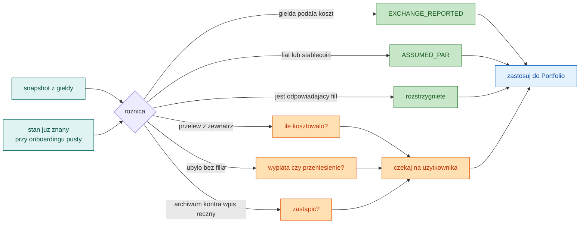
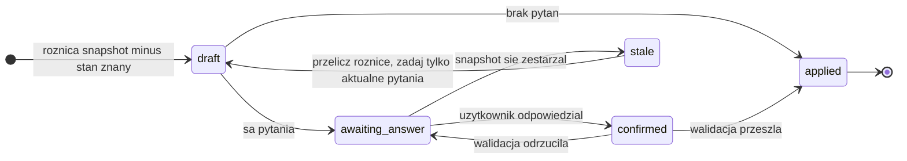
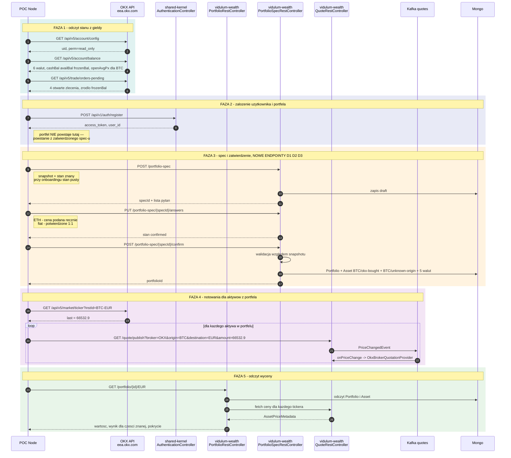
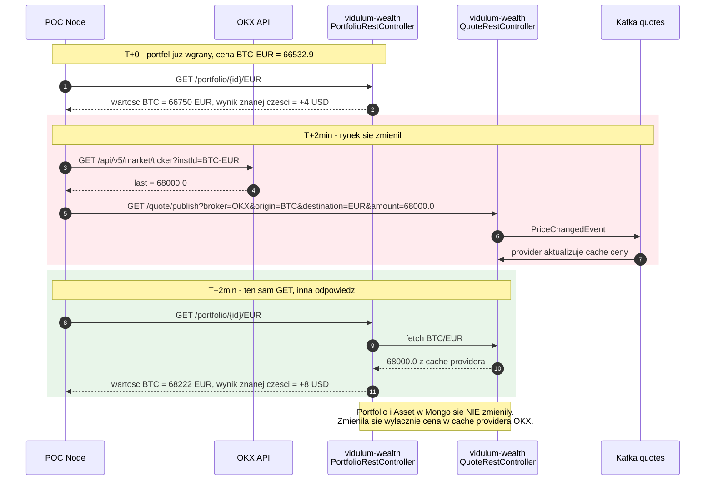
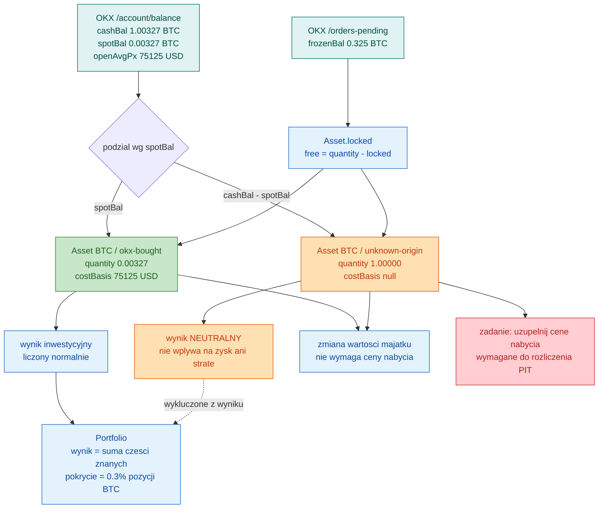

# Podłączenie giełdy OKX do backendu Vidulum

Analiza krok po kroku: od zarejestrowania brokera OKX, przez zmiany w modelu `Portfolio`/`Asset`,
po listę atomowych zadań. Punkt wyjścia to prototyp w `tools/okx/` (Node 22, read-only) — działający,
zweryfikowany na żywym koncie demo, ale kończący się na plikach i logu.

Dokumenty źródłowe: `tools/okx/PODSUMOWANIE.md` (ustalenia o API), `tools/okx/OKX-CONTEXT.md`
(fakty techniczne), `tools/okx/IMPROVEMENTS.md` (34 poprawki prototypu).

> **Decyzja architektoniczna:** dane z OKX **nie dostają osobnego read-modelu**. Przechodzą przez
> istniejące klasy domenowe `Portfolio` i `Asset`; zmieniamy te klasy tak, żeby lepiej opisywały
> rzeczywistość (koszt nabycia z własną ilością, pozycje znane i nieznane), zamiast omijać je
> równoległym modelem. Wszystkie zadania w tym dokumencie zakładają tę drogę.

---

## 1. Rola skryptu JS — POC, nie cel

Na tym etapie kod w `tools/okx/` pozostaje w Node i pełni rolę **proof of concept**, który po
zmianach w backendzie będzie z nim rozmawiał po HTTP:

1. łączy się z OKX (profil `demo`) i czyta stan konta,
2. woła backend, żeby **zarejestrować użytkownika**,
3. zakłada mu **portfolio ze snapshotu** danych z OKX,
4. publikuje **notowania** dla aktywów znajdujących się w tym portfelu,
5. pozwala pobrać portfel przez `GET` i zobaczyć **aktualną wycenę**.

To świadomie tymczasowe. Docelowo, zgodnie z planem w `OKX-CONTEXT.md`, połączenie należy do
backendu: poświadczenia zaszyfrowane w Mongo, jedno WS na użytkownika, publikacja na Kafkę.
POC ma udowodnić przepływ end-to-end, nie zostać architekturą.

Konsekwencja praktyczna: POC musi umieć **uwierzytelnić się w backendzie** (JWT z rejestracji),
bo chronione endpointy tego wymagają.

---

## 2. Co blokuje dzisiaj

Trzy rzeczy, każda potwierdzona w kodzie:

**Brak brokera OKX w wycenie.** `QuotationService.findBrokerOrRaiseException` rzuca
`BrokerNotFoundException`, jeśli dla `Broker("OKX")` nie ma zarejestrowanego providera.
Zarejestrowani są dziś: Degiro, PM, Binance, Exante.

**Brak drogi wprowadzenia aktywów.** Do `Portfolio` prowadzą tylko dwie ścieżki: `deposit`
(ograniczony do jednej `allowedDepositCurrency`) i trade (wymaga istniejącego `Order`).
Konto OKX ma sześć walut — pięciu nie da się wprowadzić.

**Jedna cena nabycia na aktywo.** OKX zna koszt nabycia **tylko dla części kupionej u nich**
(`spotBal`), a nie dla całego salda (`cashBal`). Na koncie testowym: `cashBal` 1,00327 BTC wobec
`spotBal` 0,00327 BTC. Wpisanie jednej ceny dla całości zawyża zainwestowaną kwotę ~300-krotnie.

---

## 3. Decyzja modelowa: dwie pozycje zamiast jednej

Aktywa są identyfikowane parą `(ticker, subName)` — `Portfolio.findAssetByTickerAndSubName`.
Model **już dopuszcza** kilka pozycji tego samego waloru; dziś `subName` jest wszędzie `none()`.

Wykorzystujemy to:

| pozycja | ilość | koszt nabycia | wynik |
|---|---|---|---|
| `BTC / okx-bought` | 0,00327 | 75 125 USD (z `openAvgPx`) | liczony normalnie |
| `BTC / unknown-origin` | 1,00000 | nieznany | **neutralny** |

Każda pozycja jest w całości znana albo w całości nieznana, więc istniejący wzór na wynik
(`cena_bieżąca × ilość − cena_nabycia × ilość`) pozostaje poprawny bez zmian w ~20 miejscach,
które go używają.

**Reguła wyniku:** zysk/strata liczony wyłącznie ze znanej części; część nieznana nie wpływa
ani na zysk, ani na stratę.

Trzy zastrzeżenia do tej reguły, obsługiwane osobnymi zadaniami:

- „Neutralna" nie znaczy „nie wpływa na majątek". Nieznana część realnie zyskuje i traci na
  wartości — stąd osobna miara **zmiany wartości majątku**, niewymagająca ceny nabycia (C5).
- Przy każdej liczbie wyniku musi być widoczne **pokrycie** — ilu procent pozycji dotyczy (C4).
- „Nieznane" to **zadanie do uzupełnienia**, nie stan docelowy. Bez tego użytkownik nie odliczy
  kosztów przy rozliczeniu (C8).

---

## 4. PortfolioSpec — onboarding jako pierwszy przypadek synchronizacji

Portfel **nie powstaje wprost ze snapshotu**. Powstaje ze specyfikacji, którą użytkownik zatwierdził.

### 4.1 Przeformułowanie

Kuszące jest zaprojektowanie tego jako jednorazowego kroku „podłącz giełdę". Byłby to błąd, bo za
miesiąc trzeba by zbudować drugi, bardzo podobny mechanizm dla synchronizacji — i utrzymywać dwa
komplety reguł, które muszą się zgadzać.

Właściwe ujęcie jest ogólniejsze:

> Za każdym razem, gdy giełda mówi coś, czego **nie umiemy zinterpretować sami**, powstaje zestaw
> pytań do użytkownika. `PortfolioSpec` to ten zestaw.

Silnik jest zawsze ten sam:

```
snapshot z giełdy  −  stan, który już znamy  =  różnica
różnica  →  reguły  →  {rozstrzygnięte automatycznie}  +  {pytania do użytkownika}
```

**Onboarding to po prostu przypadek, w którym „co już wiemy" jest puste** — dlatego pytań jest
wtedy dużo. Przy dziesiątej synchronizacji zwykle nie ma żadnego.

### 4.2 Kiedy pytanie jest potrzebne, a kiedy nie

To jest kluczowa tabela: pokazuje, że mechanizm **nie nęka użytkownika**, tylko pyta wtedy, gdy
jest on jedynym źródłem odpowiedzi.

| co pokazuje różnica | pytać? | proweniencja |
|---|---|---|
| pozycja urosła, OKX podał `openAvgPx` | **nie** | `EXCHANGE_REPORTED` |
| pozycja urosła, brak `openAvgPx` (przelew z zewnątrz) | **tak** — ile kosztowało? | `USER_PROVIDED` |
| pozycja zmalała, jest odpowiadający fill | **nie** | — |
| pozycja zmalała bez filla (przelew na zewnątrz) | **tak** — wypłata czy przeniesienie? | — |
| pojawiła się nowa waluta fiat | **nie** | `ASSUMED_PAR` |
| pojawiło się nowe krypto bez historii | **tak** | `USER_PROVIDED` |
| archiwum kwartalne ujawniło koszt pozycji wycenionej ręcznie | **tak** — zastąpić? | `DERIVED_FROM_FILLS` |
| nic się nie zmieniło | **nie** — spec w ogóle nie powstaje | — |



### 4.3 Oś czasu — realne konto

Liczby z konta demo, na którym prototyp był weryfikowany.

**Dzień 1 · podłączenie giełdy** → `Spec #1`, stan znany jest pusty

```
snapshot: BTC 1,00327 (0,00327 kupione) · ETH 1 · XRP 50000 · EUR 4386 · USD 5000 · USDC 5000
pytania:  BTC   — potwierdz podzial 0,00327 znane / 1,00000 nieznane
          ETH 1 — skad i ile kosztowalo?
          fiat  — przyjmujemy 1:1, potwierdz
wynik:    Portfolio powstaje po zatwierdzeniu
```

**Dzień 3 · kupno 0,01 BTC na OKX** → `Spec #2`

```
roznica:  BTC okx-bought 0,00327 -> 0,01327, OKX podal nowy openAvgPx
pytania:  BRAK
wynik:    zastosowane automatycznie, uzytkownik nic nie widzi
```

To jest przypadek rozstrzygający o sensie całej konstrukcji: **zwykły handel na giełdzie nie
generuje żadnego pytania**, bo giełda zna cenę.

**Dzień 10 · przelew 2 ETH z portfela sprzętowego** → `Spec #3`

```
roznica:  ETH 1 -> 3, brak openAvgPx dla nowej czesci
pytania:  2 ETH pojawily sie bez transakcji — ile kosztowaly?
wynik:    uzytkownik wpisuje 2 400 EUR, proweniencja USER_PROVIDED
```

**Dzień 15 · sprzedaż 0,5 ETH** → `Spec #4`

```
roznica:  ETH 3 -> 2,5, jest fill
pytania:  z ktorej pozycji? 1 ETH nieznane vs 2 ETH po 1 200 EUR
wynik:    pytanie ma skutek podatkowy, wiec musi pasc
```

**Dzień 40 · archiwum kwartalne dociągnęło starsze fille** → `Spec #5`

```
roznica:  znaleziono historie zakupu 1 ETH — 1 850 EUR
pytania:  masz tam reczna wycene. Zastapic danymi z gieldy?
wynik:    tu proweniencja robi robote
```

### 4.4 Dlaczego dzień 40 jest dowodem na sens proweniencji

Bez zapisanego „skąd to wiem" system ma w tym momencie dwie liczby i **żadnej podstawy do wyboru**.
Z proweniencją reguła jest oczywista i daje się zakodować:

| proweniencja istniejącej wartości | co zrobić z nowszymi danymi |
|---|---|
| `ASSUMED_PAR` | nadpisz po cichu — to było tylko założenie |
| `EXCHANGE_REPORTED` | nadpisz — nowsze dane giełdy są lepsze |
| `USER_PROVIDED` | **nigdy nie nadpisuj bez pytania** — użytkownik coś wiedział |

To różnica między systemem, który szanuje wiedzę użytkownika, a takim, który mu ją kasuje przy
nocnym jobie.

### 4.5 Cykl życia specyfikacji



Ścieżka `draft → applied` bez udziału człowieka to ta, którą pójdzie większość synchronizacji.

### 4.6 Co ta konstrukcja daje poza rozwiązaniem problemu ceny

- **Historia decyzji.** Ciąg spec-ów to zapis, *dlaczego* portfel wygląda tak, jak wygląda —
  z datą i źródłem. Przy kontroli albo reklamacji użytkownika masz odpowiedź.
- **Jedno miejsce na kolejne giełdy.** Binance nie daje `openAvgPx` wcale; u niego po prostu
  więcej różnic wpadnie w wiersze „tak, pytaj". Mechanizm bez zmian.
- **Bezpieczna automatyzacja.** Nocną synchronizację można włączyć bez obawy: wszystko, czego
  system nie umie rozstrzygnąć, **czeka** zamiast zgadywać.
- **Naturalne miejsce na cofnięcie.** Skoro spec jest trwały, „cofnij tę synchronizację" jest
  wykonalne — wiadomo, co i dlaczego zmieniła.

### 4.7 Granice, których trzeba pilnować

**Spec nie może stać się drugim modelem portfela.** Jeśli zacznie trzymać komplet pól każdego
aktywa, powstanie przypadkiem ten read-model, z którego świadomie zrezygnowaliśmy — tylko pod inną
nazwą. Granica: **spec trzyma decyzje i proweniencję**, referencję do snapshotu, a `quantity` co
najwyżej po to, żeby zwalidować, że użytkownik nie wymyślił salda.

**Spec musi być trwały, nie DTO.** Jako ciało requestu traci całą wartość w sekundzie utworzenia
portfela. Własna encja, własny cykl życia, `Portfolio` niesie referencję do spec-u, który go zrodził.

**Proweniencja to słownik zamknięty**, nie pole tekstowe. Wolne „dlaczego" jest bezużyteczne dla
późniejszej logiki w rodzaju „przelicz wszystko, co było tylko założone".

**Snapshot się starzeje** między pobraniem a zatwierdzeniem. Stan `stale` i przeliczenie różnicy od
nowa, zamiast stosowania nieaktualnych odpowiedzi.

**Spec jest niezaufanym wejściem, snapshot jest kotwicą.** Walidacja: ilości muszą zgadzać się ze
snapshotem, ilość objęta kosztem nie może przekraczać ilości pozycji, waluta musi być rozwiązywalna,
a pozycje bez ceny muszą być **jawnie potwierdzone jako nieznane**, nie pominięte milczeniem.

---

## 5. Inwentarz endpointów

Kto woła, co woła i z której części systemu to pochodzi.

### 4.1 OKX — czytane przez POC

Host REST: `eea.okx.com` (region EEA). Profil demo dokłada nagłówek `x-simulated-trading: 1`.
Wszystko wyłącznie `GET` — narzędzie w `tools/okx` nie ma metody POST.

| URL | co daje | użycie w przepływie |
|---|---|---|
| `GET /api/v5/account/config` | `uid`, `perm`, poziom konta | weryfikacja, że klucz jest `read_only` |
| `GET /api/v5/account/balance` | salda Trading: `cashBal`, `availBal`, `frozenBal`, **`spotBal`**, **`openAvgPx`** | źródło pozycji i kosztu nabycia |
| `GET /api/v5/asset/balances` | salda Funding | poza zakresem POC, patrz §10 |
| `GET /api/v5/trade/orders-pending` | otwarte zlecenia | uzasadnienie `frozenBal` → `Asset.locked` |
| `GET /api/v5/market/ticker?instId=` | `last` dla pary | publiczne, bez klucza — źródło notowań |

### 4.2 Vidulum — wołane przez POC

| URL | metoda | moduł | status |
|---|---|---|---|
| `/api/v1/auth/register` | POST | `vidulum-shared-kernel` · `AuthenticationController` | istnieje |
| `/portfolio` | POST | `vidulum-wealth` · `PortfolioRestController` | istnieje |
| `/portfolio-spec` | POST | `vidulum-wealth` · `PortfolioSpecRestController` | **do napisania (D1)** — tworzy draft z różnicy |
| `/portfolio-spec/{id}` | GET | `vidulum-wealth` · `PortfolioSpecRestController` | **do napisania (D1)** — czego brakuje |
| `/portfolio-spec/{id}/answers` | PUT | `vidulum-wealth` · `PortfolioSpecRestController` | **do napisania (D2)** — odpowiedzi użytkownika |
| `/portfolio-spec/{id}/confirm` | POST | `vidulum-wealth` · `PortfolioSpecRestController` | **do napisania (D3)** — walidacja i zastosowanie |
| `/portfolio/{id}/{currency}` | GET | `vidulum-wealth` · `PortfolioRestController` | istnieje |
| `/portfolio/asset/lock` | POST | `vidulum-wealth` · `PortfolioRestController` | istnieje, alternatywa dla D3 |
| `/quote/publish` | GET | `vidulum-wealth` · `QuoteRestController` | istnieje |
| `/quote/{broker}/{origin}/{destination}` | GET | `vidulum-wealth` · `QuoteRestController` | istnieje, do weryfikacji providera |

Uwaga do `/quote/publish`: jest to `GET` ze skutkiem ubocznym (publikuje na Kafkę). Wystarczy dla
POC, ale nie jest to API do produkcyjnej ingesty notowań.

### 4.3 Wewnętrzne — bez udziału POC

| kanał | zdarzenie | producent → konsument |
|---|---|---|
| Kafka `quotes` | `PriceChangedEvent` | `QuoteRestController` → `QuotationService.onPriceChange` → `OkxBrokerQuotationProvider` |

---

## 6. Przepływ HTTP — uruchomienie POC



### Case: przeszacowanie po dwóch minutach



To jest istotna własność: **snapshot zapisuje ilości, nie wartości**. Wycena powstaje dopiero przy
odczycie, z bieżących notowań. Dlatego ten sam `GET` dwie minuty później zwraca inną kwotę bez
żadnego zapisu do bazy.

---

## 7. Zmiany w modelu danych



### Punkty do poprawy znalezione po drodze

| obszar | problem | zadanie |
|---|---|---|
| `AggregatedPortfolio` | scala pozycje po samym `ticker`, więc obie pozycje BTC znów się zlepią i wróci rozcieńczenie średniej | C6 |
| `Quantity` | `double` przy stringach OKX z 8+ miejscami; `Price` i `Money` mają `BigDecimal` | F2 |
| `OriginTradeId` | istnieje, ale **zero** indeksów unikalności w `vidulum-wealth`; OKX powtarza komunikaty | F1 |
| `ErrorHttpHandler` | 7 obsłużonych wyjątków, **żaden z `vidulum-wealth`**; `CLAUDE.md` tego wymaga | A3 |
| `Price.one` / `Price.zero` | używane jako ukryte znaczniki „nie wiem" przy depozycie i agregacji | F3 |
| `websocket-gateway` | ma własny `pom.xml`, ale **nie ma go w `<modules>` roota** | F4 |
| `BrokerQuotationProvider` | fallback przyjmuje kurs USDT jako USD 1:1, bez przeliczenia | B4 |

---

## 8. Lista zadań

Priorytety: **P0** blokuje POC · **P1** potrzebne do poprawnych liczb · **P2** poprawność długoterminowa · **P3** dług techniczny.

### Ścieżka A — fundamenty modułu

| # | zadanie | opis | prio | status | zależy od |
|---|---|---|---|---|---|
| A1 | Decyzja o module Maven `okx` | Gdzie leży (`vidulum-wealth/okx` czy top-level), jak podlega regule `shared-kernel ← wealth ← app`. Repo ma precedens: `vidulum-cashflow` ma 2 submoduły. | P0 | open | — |
| A2 | Szkielet modułu + rejestracja w reaktorze | `pom.xml`, wpis w `<modules>`, pusty pakiet, build przechodzi. | P0 | open | A1 |
| A3 | `ErrorHttpHandler` + `ErrorCode` | Dodać obsługę `BrokerNotFoundException`, `OrderNotFoundException`, `QuoteNotFoundException` oraz nowych wyjątków OKX. Dziś żaden wyjątek z wealth nie jest obsłużony. | P1 | open | A2 |
| A4 | `DataCleaner` dla encji OKX | Każda nowa `@Document` musi trafić do cleanera modułu — wymóg z `CLAUDE.md`. | P1 | open | A2 |

### Ścieżka B — broker i notowania

| # | zadanie | opis | prio | status | zależy od |
|---|---|---|---|---|---|
| B1 | `OkxBrokerQuotationProvider` | Implementacja `BrokerQuotationProvider` dla `Broker("OKX")`: cache cen, `onPriceChange`, `fetch`. | P0 | open | A2 |
| B2 | Rejestracja providera | `QuotationService.registerBroker(...)` przy starcie. Bez tego `PriceChangedEvent` dla OKX wybucha przy konsumpcji z Kafki. | P0 | open | B1 |
| B3 | Weryfikacja ścieżki publikacji | Sprawdzić `GET /quote/publish?broker=OKX&...` end-to-end: REST → Kafka `quotes` → provider → `GET /quote/OKX/BTC/EUR`. | P0 | open | B2 |
| B4 | Łańcuch denominacji do PLN | `openAvgPx` jest w USD niezależnie od pary; OKX nie ma par PLN. Potrzebny kurs USD/PLN z NBP i rozszerzenie fallbacku (dziś tylko `X/USD → X/USDT` z założeniem 1:1). | P2 | open | B3 |

### Ścieżka C — model `Portfolio` i `Asset`

| # | zadanie | opis | prio | status | zależy od |
|---|---|---|---|---|---|
| C1 | Typ `CostBasis` | Koszt nabycia niosący **własną ilość, walutę i proweniencję**: `{quantity, avgPrice{amount, currency}, provenance}` albo `null`. Proweniencja ze słownika zamkniętego: `EXCHANGE_REPORTED`, `USER_PROVIDED`, `ASSUMED_PAR`, `DERIVED_FROM_FILLS`, `UNKNOWN`. Uniemożliwia pomnożenie ceny znanej części przez całe saldo i pozwala rozstrzygać, co wolno nadpisać. | P0 | open | — |
| C2 | Rozdzielenie pozycji po `subName` | `okx-bought` / `unknown-origin`. Model już wspiera `(ticker, subName)` — bez zmian w `findAssetByTickerAndSubName`. | P0 | open | C1 |
| C3 | Wynik tylko ze znanej części | Pozycja bez `costBasis` nie wnosi zysku ani straty. | P1 | open | C2 |
| C4 | Pokrycie wyniku | Przy każdej liczbie wyniku: ilu procent pozycji dotyczy. Przy niskim pokryciu liczba ustępuje komunikatowi. | P1 | open | C3 |
| C5 | Zmiana wartości majątku | Osobna miara, **niewymagająca ceny nabycia** — odpowiada na „o ile zmienił się mój majątek", gdzie część nieznana jest pełnoprawna. | P1 | open | C2 |
| C6 | Naprawa `AggregatedPortfolio` | Scalanie po `(ticker, subName)` zamiast po samym `ticker`, inaczej widok zbiorczy rozcieńcza średnią. | P1 | open | C2 |
| C7 | Reguła sprzedaży nieznanej części | Sprzedaż pozycji bez kosztu to zdarzenie podatkowe, którego nie policzymy. Zażądać ceny albo zapisać z jawnie brakującym kosztem — nigdy nie przyjmować zera. | P2 | open | C2 |
| C8 | „Nieznane" jako zadanie | Ekran/flaga „uzupełnij cenę nabycia". Bez tego użytkownik nie odliczy kosztów przy PIT. | P2 | open | C2 |

### Ścieżka D — PortfolioSpec

| # | zadanie | opis | prio | status | zależy od |
|---|---|---|---|---|---|
| D1 | Encja `PortfolioSpec` + silnik różnicy | Trwała encja z cyklem `draft → awaiting_answer → confirmed → applied → stale`. Powstaje z różnicy `snapshot − stan znany`; przy onboardingu stan znany jest pusty. Endpointy `POST /portfolio-spec` i `GET /portfolio-spec/{id}`. | P0 | open | C1, C2 |
| D2 | Odpowiedzi użytkownika | `PUT /portfolio-spec/{id}/answers`. Każda odpowiedź niesie **proweniencję** ze słownika zamkniętego. | P0 | open | D1 |
| D3 | Zatwierdzenie i utworzenie portfela | `POST /portfolio-spec/{id}/confirm` — walidacja względem snapshotu, potem utworzenie `Portfolio` z referencją do spec-u. | P0 | open | D2 |
| D4 | Reguły automatycznego rozstrzygania | Tabela z §4.2: `EXCHANGE_REPORTED`, `ASSUMED_PAR`, dopasowanie do filla. Decyduje, czy spec w ogóle wymaga człowieka. | P0 | open | D1 |
| D5 | Odwzorowanie locków | `frozenBal` → `Asset.locked`, `availBal` → `Asset.free`. Rozstrzygane automatycznie, bez pytania. | P1 | open | D3 |
| D6 | Reguły nadpisywania wg proweniencji | `ASSUMED_PAR` i `EXCHANGE_REPORTED` nadpisywalne po cichu, `USER_PROVIDED` **nigdy bez pytania**. | P1 | open | D2 |
| D7 | Obsługa zestarzałego snapshotu | Stan `stale`: przeliczyć różnicę od nowa, zadać tylko pytania nadal aktualne, nie stosować nieaktualnych odpowiedzi. | P2 | open | D1 |
| D8 | Idempotencja i brak pustych spec-ów | Synchronizacja bez zmian **nie tworzy spec-u**. Powtórne zatwierdzenie tego samego spec-u nie zmienia danych. | P2 | open | D3 |
| D9 | `DataCleaner` dla `PortfolioSpec` | Wymóg z `CLAUDE.md` dla każdej nowej encji `@Document`. | P1 | open | D1 |

### Ścieżka E — POC w Node

| # | zadanie | opis | prio | status | zależy od |
|---|---|---|---|---|---|
| E1 | Odczyt stanu z OKX | `account/config`, `account/balance`, `orders-pending`, `market/ticker`. | P0 | **finished** | — |
| E2 | Rejestracja użytkownika + JWT | `POST /api/v1/auth/register`, zapamiętanie tokenu do kolejnych wywołań. | P0 | open | A2 |
| E3 | Zebranie snapshotu do spec-u | Złożenie stanu z `account/balance` i `orders-pending` w kształt oczekiwany przez `POST /portfolio-spec`. | P0 | open | E2 |
| E4 | Przejście ścieżki spec-u | `POST /portfolio-spec` ze snapshotem, odpowiedzi na pytania, `confirm`. Podział na `okx-bought` / `unknown-origin` wg `spotBal` robi silnik różnicy, nie POC. | P0 | open | D3, E3 |
| E5 | Publikacja notowań | Tylko dla aktywów obecnych w świeżo założonym portfelu. | P1 | open | B3, E4 |
| E6 | Pętla odświeżania | Cykliczne pobranie tickerów i republikacja, żeby wycena żyła. | P1 | open | E5 |
| E7 | Odczyt i prezentacja wyceny | `GET /portfolio/{id}/EUR`, pokazanie wartości, wyniku i pokrycia. | P1 | open | E4 |

### Ścieżka F — dług techniczny

| # | zadanie | opis | prio | status | zależy od |
|---|---|---|---|---|---|
| F1 | Indeks unikalności `OriginTradeId` | Zero indeksów w `vidulum-wealth`; OKX powtarza komunikaty, Kafka ma redelivery. | P2 | open | — |
| F2 | `Quantity` na `BigDecimal` | Dziś `double` przy stringach OKX z 8+ miejscami; przy setkach filli powstanie dryf. | P3 | open | — |
| F3 | Usunięcie sentineli `Price.one`/`Price.zero` | Ukryte znaczniki „nie wiem" w depozycie i agregacji; do zastąpienia typem z C1. | P3 | open | C1 |
| F4 | `websocket-gateway` do reaktora | Ma własny `pom.xml`, ale nie ma go w `<modules>` roota — `./mvnw clean test` go nie buduje. | P3 | open | — |

---

## 9. Kolejność wykonania

Ścieżka krytyczna do działającego POC:

```
A1 → A2 → B1 → B2 → B3 ──────────────┐
                                     ↓
C1 → C2 → D1 → D2 → D3 → E4 → E5 → E7
           ↑              ↑
          D4         E2 → E3
```

`D4` (reguły automatycznego rozstrzygania) jest na ścieżce krytycznej, bo bez niego **każda**
różnica staje się pytaniem do użytkownika — łącznie ze zwykłym zakupem na giełdzie.

Zadania **P0** wystarczają, żeby zobaczyć portfel z aktualną wyceną. **P1** sprawia, że pokazywane
liczby są uczciwe. **P2** i **P3** można odłożyć, ale C7 i C8 muszą być gotowe, zanim ktokolwiek
użyje tych danych do rozliczenia.

## 10. Czego ta analiza nie rozstrzyga

- **Kiedy logika przenosi się z Node do Javy.** POC dowodzi przepływu; docelowa architektura
  z `OKX-CONTEXT.md` (poświadczenia w Mongo, WS per user, Kafka) to osobna decyzja.
- **Konsekwencje przejścia przez `Portfolio`.** Decyzja o braku osobnego read-modelu jest podjęta,
  ale jej koszt rośnie z czasem: prowizje pobierane w walucie bazowej, subkonta Funding/Trading,
  wielowalutowość i `investedBalance` jako pojedyncza liczba. Każde z nich będzie wymagało zmiany
  w `Portfolio`, a nie obejścia obok niego.
- **Konto Funding.** Żaden kanał WS go nie pokrywa; snapshot musi go dociągać osobno przez
  `GET /api/v5/asset/balances`. W POC pomijane.
