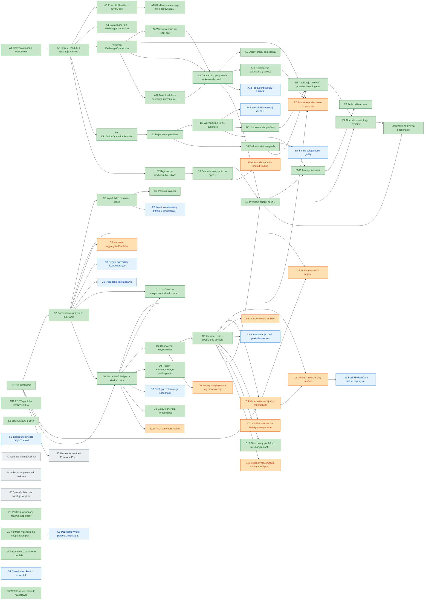

# OKX → Portfolio — tablica zadań

Lista robocza do śledzenia postępu. **Ten plik jest źródłem prawdy o statusach**; uzasadnienia,
diagramy i kontekst są w [analizie](2026-09-18-okx-exchange-backend-integration.md).

Aktualizując status, zmieniaj go **tutaj**, nie w analizie — a potem przelicz tablicę:

```bash
python3 tools/task-board/refresh.py
```

Sekcje **Postęp** i **Gotowe do wzięcia** są **wyprowadzane** z tabel poniżej i nie należy ich
edytować ręcznie. Skrypt sprawdza przy okazji spójność zależności: nieznane id, duplikaty oraz
wpisy w kolumnie „odblokowuje", którym po drugiej stronie nie odpowiada zależność.
Tryb `--check` (bez zapisu) nadaje się do CI.

## Legenda

| priorytet | znaczenie |
|---|---|
| **P0** | blokuje POC |
| **P1** | poprawność liczb |
| **P2** | poprawność długoterminowa |
| **P3** | dług techniczny |

| status | znaczenie |
|---|---|
| `open` | nierozpoczęte |
| `wip` | w toku |
| `blocked` | zablokowane, opisz czym |
| `finished` | zrobione |

## Postęp

| | P0 | P1 | P2 | P3 | razem |
|---|---|---|---|---|---|
| `finished` | 25 | 13 | 3 | 0 | **41** |
| `open` | 0 | 11 | 12 | 4 | **27** |
| **razem** | 25 | 24 | 15 | 4 | **68** |

## Gotowe do wzięcia

Zadania otwarte, których **wszystkie zależności są zrobione**.

| # | prio | zadanie | odblokowuje |
|---|---|---|---|
| **A7** | P1 | Ponowne podłączenie po przerwie | — |
| **C6** | P1 | Naprawa `AggregatedPortfolio` | — |
| **C9** | P1 | Model wkładów i jeden mechanizm | C5, C12 |
| **D10** | P1 | TTL i stany terminalne | — |
| **D11** | P1 | `confirm` zawsze na świeżym snapshocie | — |
| **D13** | P1 | Druga synchronizacja tworzy drugi portfel | — |
| **D5** | P1 | Odwzorowanie locków | — |
| **D6** | P1 | Reguły nadpisywania wg proweniencji | — |
| **E10** | P1 | Snapshot pomija konto Funding | — |
| **A12** | P2 | Producent statusu `ERROR` | — |
| **B4** | P2 | Łańcuch denominacji do PLN | — |
| **B7** | P2 | Sonda osiągalności giełdy | — |
| **C7** | P2 | Reguła sprzedaży nieznanej części | — |
| **C8** | P2 | „Nieznane" jako zadanie | — |
| **D7** | P2 | Obsługa zestarzałego snapshotu | — |
| **D8** | P2 | Idempotencja i brak pustych spec-ów | — |
| **F1** | P2 | Indeks unikalności `OriginTradeId` | — |
| **F6** | P2 | Wynik zrealizowany zniknął z podsumowania | — |
| **G4** | P2 | `Quantity` bez kontroli jednostek | — |
| **G6** | P2 | Pozostałe wyjątki portfela zwracają 500 zamiast swoich kodów | — |
| **F2** | P3 | `Quantity` na `BigDecimal` | — |
| **F3** | P3 | Usunięcie sentineli `Price.one`/`Price.zero` | — |
| **F4** | P3 | `websocket-gateway` do reaktora | — |
| **F5** | P3 | `/quote/publish` nie waliduje wejścia | — |

## Zadania według ścieżek

### A — Fundamenty modułu

| # | prio | status | zadanie | zależy od | odblokowuje |
|---|---|---|---|---|---|
| **A1** | P0 | **finished** | Decyzja o module Maven `okx` | — | A2 |
| **A2** | P0 | **finished** | Szkielet modułu + rejestracja w reaktorze | A1 | A3, A5, A4, B1, E2 |
| **A10** | P0 | **finished** | Moduł `vidulum-exchange` i przeniesienie modelu połączenia | A5 | A8 |
| **A3** | P1 | **finished** | `ErrorHttpHandler` + `ErrorCode` | A2 | — |
| **A5** | P0 | **finished** | Encja `ExchangeConnection` | A2 | A6, A7, A8, A10 |
| **A6** | P0 | **finished** | Walidacja `perm == read_only` | A5 | A8 |
| **A8** | P0 | **finished** | Onboarding połączenia — komendy i endpointy | A5, A6, A10 | E4, A9, A11, A12 |
| **A9** | P1 | **finished** | Odczyt stanu połączenia | A8 | — |
| **A4** | P1 | **finished** | `DataCleaner` dla `ExchangeConnection` | A2 | — |
| **A11** | P0 | **finished** | Rozłączenie połączenia (`revoke`) | A8 | A7 |
| **A13** | P2 | **finished** | Kod błędu recurring-rules odpowiadał na każdy brakujący parametr | A3 | — |
| **A12** | P2 | `open` | Producent statusu `ERROR` | A8 | — |
| **A7** | P1 | `open` | Ponowne podłączenie po przerwie | A5, A11, D1 | — |

### B — Broker i notowania

| # | prio | status | zadanie | zależy od | odblokowuje |
|---|---|---|---|---|---|
| **B1** | P0 | **finished** | `OkxBrokerQuotationProvider` | A2 | B2 |
| **B2** | P0 | **finished** | Rejestracja providera | B1 | B3, B6 |
| **B3** | P0 | **finished** | Weryfikacja ścieżki publikacji | B2 | B5, B4, E5 |
| **B5** | P0 | **finished** | Notowania dla gotówki | B3 | E8 |
| **B6** | P1 | **finished** | Endpoint statusu giełdy | B2 | E8, B7 |
| **B4** | P2 | `open` | Łańcuch denominacji do PLN | B3 | — |
| **B7** | P2 | `open` | Sonda osiągalności giełdy | B6 | — |

### C — Model Portfolio i Asset

| # | prio | status | zadanie | zależy od | odblokowuje |
|---|---|---|---|---|---|
| **C1** | P0 | **finished** | Typ `CostBasis` | — | C2, C9, D1, F3 |
| **C2** | P0 | **finished** | Rozdzielenie pozycji po `subName` | C1 | C3, C5, C6, C7, C8, D1 |
| **C10** | P0 | **finished** | Gotówka ze snapshotu trafia do `transferred-in`, nie do `none` | C2, D1 | — |
| **C3** | P1 | **finished** | Wynik tylko ze znanej części | C2 | C4 |
| **C4** | P1 | **finished** | Pokrycie wyniku | C3 | — |
| **C5** | P1 | `open` | Zmiana wartości majątku | C2, C9 | — |
| **C6** | P1 | `open` | Naprawa `AggregatedPortfolio` | C2 | — |
| **C7** | P2 | `open` | Reguła sprzedaży nieznanej części | C2 | — |
| **C9** | P1 | `open` | Model wkładów i jeden mechanizm | C1, D3 | C5, C12 |
| **C8** | P2 | `open` | „Nieznane" jako zadanie | C2 | — |
| **C12** | P1 | `open` | Wkład otwarcia przy `confirm` | C9, D3 | C13 |
| **C13** | P2 | `open` | Backfill wkładów z historii depozytów | C12 | — |
| **C11** | P2 | **finished** | `POST /portfolio` kończy się 500 | — | — |

### D — PortfolioSpec

| # | prio | status | zadanie | zależy od | odblokowuje |
|---|---|---|---|---|---|
| **D1** | P0 | **finished** | Encja `PortfolioSpec` + silnik różnicy | C1, C2 | D2, D4, D7, D10, D9, A7 |
| **D2** | P0 | **finished** | Odpowiedzi użytkownika | D1 | D3, D6 |
| **D3** | P0 | **finished** | Zatwierdzenie i utworzenie portfela | D2 | C9, C12, D5, D8, D11, D12, D13, E4 |
| **D4** | P0 | **finished** | Reguły automatycznego rozstrzygania | D1 | — |
| **D5** | P1 | `open` | Odwzorowanie locków | D3 | — |
| **D6** | P1 | `open` | Reguły nadpisywania wg proweniencji | D2 | — |
| **D7** | P2 | `open` | Obsługa zestarzałego snapshotu | D1 | — |
| **D8** | P2 | `open` | Idempotencja i brak pustych spec-ów | D3 | — |
| **D10** | P1 | `open` | TTL i stany terminalne | D1 | — |
| **D11** | P1 | `open` | `confirm` zawsze na świeżym snapshocie | D3 | — |
| **D9** | P1 | **finished** | `DataCleaner` dla `PortfolioSpec` | D1 | — |
| **D12** | P0 | **finished** | Osierocony portfel po nieudanym `confirm` połączenia | D3 | — |
| **D13** | P1 | `open` | Druga synchronizacja tworzy drugi portfel | D3 | — |

### E — POC w Node

| # | prio | status | zadanie | zależy od | odblokowuje |
|---|---|---|---|---|---|
| **E1** | P0 | **finished** | Odczyt stanu z OKX | — | — |
| **E2** | P0 | **finished** | Rejestracja użytkownika + JWT | A2 | E3 |
| **E3** | P0 | **finished** | Zebranie snapshotu do spec-u | E2 | E4, E10 |
| **E8** | P0 | **finished** | Publikacja notowań przed onboardingiem | B5, B6 | E7 |
| **E4** | P0 | **finished** | Przejście ścieżki spec-u | A8, D3, E3 | E5, E7, E9 |
| **E5** | P1 | **finished** | Publikacja notowań | B3, E4 | E6 |
| **E6** | P1 | **finished** | Pętla odświeżania | E5 | — |
| **E7** | P1 | **finished** | Odczyt i prezentacja wyceny | E4, E8 | E9 |
| **E9** | P1 | **finished** | Smoke na żywym backendzie | E4, E7 | — |
| **E10** | P1 | `open` | Snapshot pomija konto Funding | E3 | — |

### G — Portfel prowadzony ręcznie

| # | prio | status | zadanie | zależy od | odblokowuje |
|---|---|---|---|---|---|
| **G1** | P0 | **finished** | Portfel prowadzony ręcznie, bez giełdy | — | — |
| **G2** | P1 | **finished** | Kontrola własności na endpointach portfela i transakcji | — | G6 |
| **G3** | P1 | **finished** | Zaszyte `USD` w kliencie portfela i `Order.getTotal()` | — | — |
| **G5** | P2 | **finished** | Wpłata kasuje blokadę na gotówce | — | — |
| **G4** | P2 | `open` | `Quantity` bez kontroli jednostek | — | — |
| **G6** | P2 | `open` | Pozostałe wyjątki portfela zwracają 500 zamiast swoich kodów | G2 | — |

### F — Dług techniczny

| # | prio | status | zadanie | zależy od | odblokowuje |
|---|---|---|---|---|---|
| **F1** | P2 | `open` | Indeks unikalności `OriginTradeId` | — | — |
| **F5** | P3 | `open` | `/quote/publish` nie waliduje wejścia | — | — |
| **F6** | P2 | `open` | Wynik zrealizowany zniknął z podsumowania | C3 | — |
| **F2** | P3 | `open` | `Quantity` na `BigDecimal` | — | — |
| **F3** | P3 | `open` | Usunięcie sentineli `Price.one`/`Price.zero` | C1 | — |
| **F4** | P3 | `open` | `websocket-gateway` do reaktora | — | — |

## Graf zależności



Kolory odpowiadają priorytetom: czerwony **P0**, pomarańczowy **P1**, niebieski **P2**,
szary **P3**, zielony — zrobione.
